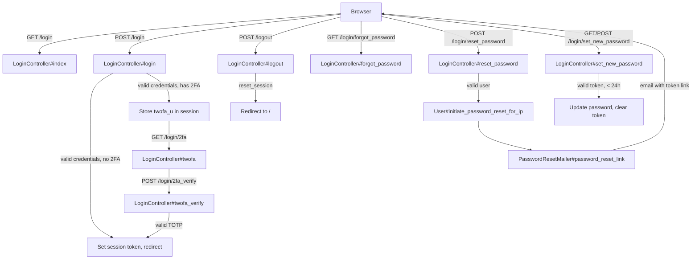
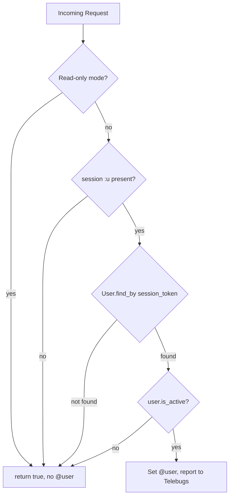

# Authentication

> **Status**: Active
> **Generated**: 2026-06-13T00:00:00Z
> **Last Updated**: 2026-06-13T00:00:00Z

---

## Overview

### What It Does
Handles user login (via email or username), logout, two-factor authentication (TOTP), and password reset flows for the Lobsters link aggregation site.

### Why It Exists
Lobsters is an invitation-only community. Authentication gates access to all write actions (submitting stories, commenting, voting) and ties activity to individual user accounts. The system supports TOTP-based two-factor authentication for additional security.

### Key Capabilities
- Login via email address or username with bcrypt password verification
- Session-based authentication using random session tokens (not user IDs)
- TOTP two-factor authentication (via the ROTP library) with clock drift tolerance
- Password reset via time-limited email tokens (24-hour expiry)
- Account reactivation through password reset flow (deleted users can come back)
- Automatic bcrypt cost rehashing on successful login
- Banned/deleted/wiped user login prevention with mod note logging
- Per-request session cookie clearing for unauthenticated users (enables CDN page caching)

---

## Architecture

### High-Level Design



### Session Authentication Flow (every request)



### Components

#### Backend Components
| Component | File Path | Purpose |
|-----------|-----------|---------|
| LoginController | `app/controllers/login_controller.rb` | Login, logout, 2FA verification, password reset flows |
| Authenticatable concern | `app/controllers/concerns/authenticatable.rb` | Session authentication and role-gating before_actions |
| PasswordResetMailer | `app/mailers/password_reset_mailer.rb` | Sends password reset email with token link |
| User model (auth methods) | `app/models/user.rb` | `has_secure_password`, TOTP, session tokens, password reset token generation |

#### Frontend Components (Views)
| Component | File Path | Purpose |
|-----------|-----------|---------|
| Login form | `app/views/login/index.html.erb` | Email/username + password form with referer support |
| 2FA form | `app/views/login/twofa.html.erb` | TOTP code entry form |
| Forgot password form | `app/views/login/forgot_password.html.erb` | Email/username entry for password reset |
| Set new password form | `app/views/login/set_new_password.html.erb` | New password + confirmation form |
| Password reset email | `app/views/password_reset_mailer/password_reset_link.text.erb` | Plain-text email with reset link |

### Technology Stack
- **Backend**: Ruby on Rails, BCrypt (`has_secure_password`), ROTP (TOTP)
- **Session storage**: Rails session store with random 60-char session tokens
- **Password hashing**: BCrypt with `BCrypt::Engine::DEFAULT_COST`
- **2FA**: ROTP::TOTP with one-interval drift tolerance in both directions
- **Error monitoring**: Telebugs (user context set on each authenticated request)

---

## Model Details

### User (authentication-related)

#### Password & Session Setup
```ruby
# Source: app/models/user.rb:80-83
# As of Rails 8.0, `has_secure_password` generates a `password_reset_token`
# method that shadows the explicit `password_reset_token` attribute.
# So we need to explictily disable that.
has_secure_password(reset_token: false)
```

The `totp_secret` is stored in the JSON `settings` column via `typed_store`:
```ruby
# Source: app/models/user.rb:85-100
typed_store :settings do |s|
  # ... other settings ...
  s.string :totp_secret
  # ...
end
```

#### Key Methods

| Method | Returns | Purpose | Notes |
|--------|---------|---------|-------|
| `authenticate(password)` | `User` or `false` | BCrypt password verification | Provided by `has_secure_password` |
| `authenticate_totp(code)` | truthy or `nil` | Verify TOTP code with drift tolerance | Uses ROTP library |
| `has_2fa?` | `Boolean` | Check if TOTP is enrolled | `totp_secret.present?` |
| `is_active?` | `Boolean` | Not deleted and not banned | `!(deleted_at? \|\| is_banned?)` |
| `is_banned?` | `Boolean` | Check if user is banned | `banned_at?` |
| `is_wiped?` | `Boolean` | Check if account was privacy-wiped | `password_digest == "*"` |
| `roll_session_token` | `String` | Generate new random 60-char session token | Invalidates all existing sessions |
| `check_session_token` | `void` | Ensure session token exists before save | `before_save` callback |
| `initiate_password_reset_for_ip(ip)` | `true` | Generate reset token and send email | Token format: `"#{timestamp}-#{random_30_chars}"` |
| `disable_2fa!` | `Boolean` | Remove TOTP secret and save | Sets `totp_secret = nil` |

#### Callbacks (authentication-related)
| Callback | Method | Purpose |
|----------|--------|---------|
| `before_save` | `:check_session_token` | Generates session token if blank |

#### Verbatim Method Implementations

```ruby
# Source: app/models/user.rb:239-242
def authenticate_totp(code)
  totp = ROTP::TOTP.new(totp_secret)
  totp.verify(code, drift_behind: totp.interval, drift_ahead: totp.interval)
end
```

```ruby
# Source: app/models/user.rb:474-478
def initiate_password_reset_for_ip(ip)
  self.password_reset_token = "#{Time.current.to_i}-#{Utils.random_str(30)}"
  save!

  PasswordResetMailer.password_reset_link(self, ip).deliver_now
end
```

```ruby
# Source: app/models/user.rb:481-496
def has_2fa?
  totp_secret.present?
end

def is_active?
  !(deleted_at? || is_banned?)
end

def is_banned?
  banned_at?
end

# user was deleted/banned before a server move, see lib/tasks/privacy_wipe
def is_wiped?
  password_digest == "*"
end
```

```ruby
# Source: app/models/user.rb:514-515
def roll_session_token
  self.session_token = Utils.random_str(60)
end
```

---

## Database Schema

### users (authentication-relevant columns)

> The `users` table has many columns; only the authentication-relevant columns are shown here. See the full schema in `db/schema.rb:481-520`.

| Column | Type | Default | Notes |
|--------|------|---------|-------|
| `id` | `bigint unsigned` | auto-increment | Primary key |
| `username` | `string(50)` | | Unique, used for login |
| `email` | `string(100)` | | Unique, used for login |
| `password_digest` | `string(75)` | | BCrypt hash; `"*"` for wiped accounts |
| `password_reset_token` | `string(75)` | | Time-prefixed token; unique index |
| `session_token` | `string(75)` | `""` | Random 60-char token; unique index; NOT NULL |
| `banned_at` | `datetime` | | Set when user is banned |
| `banned_by_user_id` | `bigint unsigned` | | FK to banning moderator |
| `banned_reason` | `string(256)` | | Displayed on banned login attempt |
| `deleted_at` | `datetime` | | Soft-delete timestamp |
| `settings` | `mediumtext` | | JSON; contains `totp_secret` among other settings |
| `token` | `string` | | NOT NULL, unique; user identification token |

#### Indexes (authentication-relevant)
| Index Name | Column(s) | Unique |
|------------|-----------|--------|
| `index_users_on_email` | `email` | Yes |
| `username` | `username` | Yes |
| `password_reset_token` | `password_reset_token` | Yes |
| `session_hash` | `session_token` | Yes |
| `index_users_on_token` | `token` | Yes |

---

## API Endpoints

| Method | Path | Action | Description | Notes |
|--------|------|--------|-------------|-------|
| `GET` | `/login` | `LoginController#index` | Display login form | Redirects if already logged in |
| `POST` | `/login` | `LoginController#login` | Authenticate credentials | Sets `session[:u]` on success |
| `POST` | `/logout` | `LoginController#logout` | Destroy session | Calls `reset_session` |
| `GET` | `/login/2fa` | `LoginController#twofa` | Display TOTP entry form | Requires `session[:twofa_u]` |
| `POST` | `/login/2fa_verify` | `LoginController#twofa_verify` | Verify TOTP code | Promotes `twofa_u` to `u` on success |
| `GET` | `/login/forgot_password` | `LoginController#forgot_password` | Display password reset request form | Redirects if already logged in |
| `POST` | `/login/reset_password` | `LoginController#reset_password` | Send password reset email | Blocks banned/wiped users |
| `GET`/`POST` | `/login/set_new_password` | `LoginController#set_new_password` | Display/process new password form | Token must be < 24 hours old |

---

## Authorization

Lobsters does not use Pundit. Authorization is handled through controller before_actions defined in the `Authenticatable` concern.

| Method | Purpose | Behavior |
|--------|---------|----------|
| `authenticate_user` | Load current user from session | Sets `@user` if valid session token exists; always returns `true` |
| `require_logged_in_user` | Gate actions to logged-in users | Redirects to `/login`; stores GET request path in `session[:redirect_to]` |
| `require_logged_in_moderator` | Gate actions to moderators | Calls `require_logged_in_user` first, then checks `is_moderator?` |
| `require_logged_in_admin` | Gate actions to admins | Calls `require_logged_in_user` first, then checks `is_admin?` |
| `require_logged_in_user_or_400` | Gate API-style actions | Returns 400 plain text instead of redirect |
| `require_no_user_or_redirect` | Prevent logged-in access to login/reset pages | Defined in `ApplicationController`; redirects to `/` if already authenticated |

### LoginController Before Actions

```ruby
# Source: app/controllers/login_controller.rb:16-21
before_action :authenticate_user
before_action :check_for_read_only_mode, except: [:index]
before_action :require_no_user_or_redirect,
  only: [:index, :login, :forgot_password, :reset_password]
before_action :show_title_h1
skip_after_action :clear_session_cookie
```

The `skip_after_action :clear_session_cookie` is significant: `ApplicationController` normally deletes the session cookie for unauthenticated users to enable CDN page caching. The login controller skips this because the session is needed for the login flow (e.g., storing `redirect_to`, `twofa_u`).

---

## Configuration

### Environment Variables
No authentication-specific environment variables. Configuration is handled through:
- `Rails.application.name` -- used in password reset email subject
- `Rails.application.domain` -- used for referer validation during login redirect
- `Rails.application.read_only?` -- disables login form and write actions
- `BCrypt::Engine::DEFAULT_COST` -- controls password hashing cost; passwords are rehashed on login if cost has changed

### Session Configuration
- Session key: `"lobster_trap"` (set in `config/session_options`)
- Session token: 60-character random string stored in `users.session_token`
- 2FA session key: `session[:twofa_u]` (temporary, cleared after TOTP verification)

---

## Usage Examples

### Login Flow (with 2FA)

```ruby
# Source: app/controllers/login_controller.rb:36-118
def login
  @title = "Login"
  user = if /@/.match?(params[:email].to_s)
    User.where(email: params[:email]).first
  else
    User.where(username: params[:email]).first
  end

  fail_reason = nil

  begin
    if !user
      raise LoginFailedError
    end

    if user.is_wiped?
      raise LoginWipedError
    end

    # BCrypt accepts a max of 72 bytes (not characters!), bug #1277
    if params[:password].to_s.bytesize > 72
      raise LoginPasswordTooLong
    end

    if !user.authenticate(params[:password].to_s)
      raise LoginFailedError
    end

    if user.is_banned?
      raise LoginBannedError
    end

    if !user.is_active?
      raise LoginDeletedError
    end

    if !user.password_digest.to_s.match(/^\$2a\$#{BCrypt::Engine::DEFAULT_COST}\$/o)
      user.password = user.password_confirmation = params[:password].to_s
      user.save!
    end

    if user.has_2fa? && !Rails.env.development?
      session[:twofa_u] = user.session_token
      return redirect_to "/login/2fa"
    end

    session[:u] = user.session_token

    if (rd = session[:redirect_to]).present?
      session.delete(:redirect_to)
      return redirect_to rd
    elsif params[:referer].present?
      begin
        ru = URI.parse(params[:referer])
        if ru.host == Rails.application.domain
          return redirect_to ru.to_s
        end
      rescue => e
        # Rails.logger.error "error parsing referer: #{e}"
      end
    end

    return redirect_to "/"
  rescue LoginFailedError
    fail_reason = "Invalid e-mail address and/or password."
  rescue LoginWipedError
    fail_reason = "Your account was banned or deleted before the site changed admins. " \
      "Your email and password hash were wiped for privacy."
  rescue LoginPasswordTooLong
    fail_reason = "BCrypt passwords need to be less than 72 bytes, you'll have to reset to set a shorter one, sorry for the hassle."
  rescue LoginBannedError
    fail_reason = "Your account has been banned. Log: #{user.banned_reason}"
    ModNote.tattle_on_banned_login(user)
  rescue LoginDeletedError
    fail_reason = "You deleted your account."
    ModNote.tattle_on_deleted_login(user)
  rescue LoginTOTPFailedError
    fail_reason = "Your TOTP code was invalid."
  end

  flash.now[:error] = fail_reason
  @referer = params[:referer]
  render "index"
end
```

### Password Reset Token Validation

```ruby
# Source: app/controllers/login_controller.rb:152-197
def set_new_password
  @title = "Set New Password"

  if (m = params[:password_reset_token].to_s.match(/^(\d+)-/)) &&
      (Time.current - Time.zone.at(m[1].to_i)) < 24.hours
    @reset_user = User.where(password_reset_token: params[:password_reset_token].to_s).first
  end

  if @reset_user && !@reset_user.is_banned?
    if params[:password].present?
      @reset_user.password = params[:password]
      @reset_user.password_confirmation = params[:password_confirmation]
      @reset_user.password_reset_token = nil
      @reset_user.roll_session_token

      reactivated = false
      if !@reset_user.is_active? && !@reset_user.is_banned?
        @reset_user.deleted_at = nil
        reactivated = true
      end

      if @reset_user.save && @reset_user.is_active?
        if reactivated
          Moderation.create!(
            moderator: nil,
            user: @reset_user,
            action: "reactivated"
          )
        end
        if @reset_user.has_2fa?
          flash[:success] = "Your password has been reset."
          redirect_to "/login"
        else
          session[:u] = @reset_user.session_token
          redirect_to "/"
        end
      else
        flash[:error] = "Could not reset password."
      end
    end
  else
    flash[:error] = "Invalid reset token.  It may have already been " \
      "used or you may have copied it incorrectly."
    redirect_to forgot_password_path
  end
end
```

### Authenticatable Concern (session authentication on every request)

```ruby
# Source: app/controllers/concerns/authenticatable.rb:1-72
module Authenticatable
  extend ActiveSupport::Concern

  included do
    before_action :authenticate_user
  end

  def authenticate_user
    # eagerly evaluate, in case this triggers an IpSpoofAttackError
    request.remote_ip

    if Rails.application.read_only?
      return true
    end

    if session[:u] &&
        (user = User.find_by(session_token: session[:u].to_s)) &&
        user.is_active?
      @user = user
      Telebugs.user id: @user.token, username: @user.username, email: @user.email, ip_address: request.remote_ip
    end

    true
  end

  def require_logged_in_moderator
    require_logged_in_user

    if @user
      if @user.is_moderator?
        true
      else
        flash[:error] = "You are not authorized to access that resource."
        redirect_to "/"
      end
    end
  end

  def require_logged_in_user
    if @user
      true
    else
      if request.get?
        session[:redirect_to] = request.original_fullpath
      end

      redirect_to "/login"
    end
  end

  def require_logged_in_admin
    require_logged_in_user

    if @user
      if @user.is_admin?
        true
      else
        flash[:error] = "You are not authorized to access that resource."
        redirect_to "/"
      end
    end
  end

  def require_logged_in_user_or_400
    if @user
      true
    else
      render plain: "not logged in", status: 400
      false
    end
  end
end
```

---

## Testing

### Test Files
- `spec/requests/login_spec.rb` -- 16 test cases covering login, password reset, and set new password flows
- `spec/requests/authenticatable_spec.rb` -- 3 test cases covering mod-only route access control
- `spec/support/authentication_helper.rb` -- `sign_in` helper used across all request specs

### Key Test Cases

**Login flow:**
- Login with email + correct password
- Login with username + correct password
- Reject wrong password, blank password, missing password
- Reject banned users (creates ModNote)
- Reject deleted users (creates ModNote)
- Reject wiped accounts (banned+wiped, deleted+wiped)
- Redirect already-logged-in users away from login form

**Password reset flow:**
- Starts reset process for active users
- Starts reset process for deleted users (allows reactivation)
- Blocks reset for banned users
- Blocks reset for wiped users
- Token matching and password update
- Rejects wrong, missing, or expired (>24h) tokens
- Rejects reset for banned users even with valid token

**Authenticatable concern:**
- Mod routes redirect non-mods with error
- Mod routes work for moderators
- Mod routes redirect visitors to login

---

## Known Issues & Caveats

| Issue | Location | Description |
|-------|----------|-------------|
| BCrypt 72-byte limit | `login_controller.rb:56` | BCrypt silently truncates passwords longer than 72 bytes. The controller explicitly checks `bytesize > 72` and returns a user-friendly error referencing bug #1277 |
| 2FA skipped in development | `login_controller.rb:77` | `if user.has_2fa? && !Rails.env.development?` -- TOTP verification is bypassed entirely in development mode |
| TOTP secret in JSON column | `user.rb:100` | The `totp_secret` is stored in the `settings` JSON text column, not a dedicated encrypted column. It is not encrypted at rest beyond database-level encryption |
| LoginTOTPFailedError unused | `login_controller.rb:4,112` | The `LoginTOTPFailedError` exception class is defined and rescued in the `login` method, but it is never raised anywhere in the codebase. TOTP failures are handled in `twofa_verify` via redirect with flash message instead |
| Password rehashing on login | `login_controller.rb:72-75` | On every successful login, if the stored bcrypt cost differs from `DEFAULT_COST`, the password is re-hashed and saved. This silently upgrades password security when the cost factor is increased |
| Account reactivation via reset | `login_controller.rb:168-179` | Deleted (non-banned) users can reactivate their accounts by completing a password reset. This creates a `Moderation` record with `action: "reactivated"` and `moderator: nil` |
| Referer parsing error silenced | `login_controller.rb:93-95` | Errors parsing the referer URL during login redirect are caught and silently ignored |
| `clear_session_cookie` skip | `login_controller.rb:21` | The login controller explicitly skips the after_action that clears session cookies for unauthenticated users. Without this skip, the login flow would break because session data (redirect_to, twofa_u) would be lost |

---

## Performance

### Database Optimization
- **Unique index on `session_token`** (`session_hash`): Every request performs `User.find_by(session_token: ...)`, so this index is critical for performance
- **Unique index on `email`**: Login by email uses `User.where(email: ...)` with index lookup
- **Unique index on `username`**: Login by username uses `User.where(username: ...)` with index lookup
- **Unique index on `password_reset_token`**: Token lookup during password reset is indexed

### Caching
- **CDN page caching**: `ApplicationController` deletes the session cookie for unauthenticated users so Caddy can serve cached pages. The login controller opts out of this via `skip_after_action :clear_session_cookie`

---

## Troubleshooting

### Common Issues

#### Issue: User cannot log in despite correct password
**Symptoms:**
- "Invalid e-mail address and/or password" error with correct credentials

**Cause:**
Password exceeds 72 bytes (BCrypt truncation limit). This is more likely with non-ASCII characters since they use multiple bytes per character.

**Solution:**
Use the "Forgot Password" flow to reset to a shorter password. The controller surfaces this as: "BCrypt passwords need to be less than 72 bytes, you'll have to reset to set a shorter one, sorry for the hassle."

#### Issue: 2FA prompt not appearing in development
**Symptoms:**
- User with TOTP enrolled can log in without entering a TOTP code in development

**Cause:**
2FA is intentionally skipped in development mode (`!Rails.env.development?` check in `login_controller.rb:77`).

**Solution:**
This is by design. To test 2FA locally, temporarily remove the `!Rails.env.development?` guard.

#### Issue: Password reset token "invalid" immediately after requesting
**Symptoms:**
- User clicks reset link but gets "Invalid reset token" error

**Cause:**
The token embeds a Unix timestamp and expires after 24 hours. If the server clock is wrong, tokens may appear expired immediately. Also, tokens are single-use (cleared on successful reset).

**Solution:**
Verify server clock synchronization. Check that `password_reset_token` column in the database matches the token in the URL.

---

## Related Features

- **[Signup & Invitations](signup-invitations.md)** -- New user registration; the login page links to signup/invitation flows based on site configuration
- **[Settings](settings.md)** -- 2FA enrollment/management is handled in the settings controller (`/settings/2fa_*` routes), not in the login controller
- **[Users](users.md)** -- The User model contains all authentication methods; user banning and deletion affect login eligibility
- **[Moderation](moderation.md)** -- Banned/deleted user login attempts create ModNotes via `ModNote.tattle_on_banned_login` and `ModNote.tattle_on_deleted_login`

---

**Generated:** 2026-06-13T00:00:00Z
**Last Updated:** 2026-06-13T00:00:00Z
**Status:** Active
