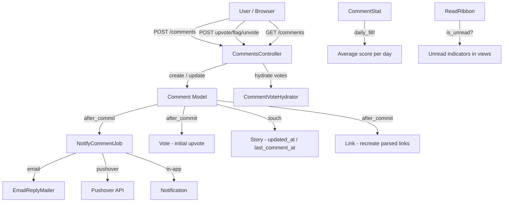
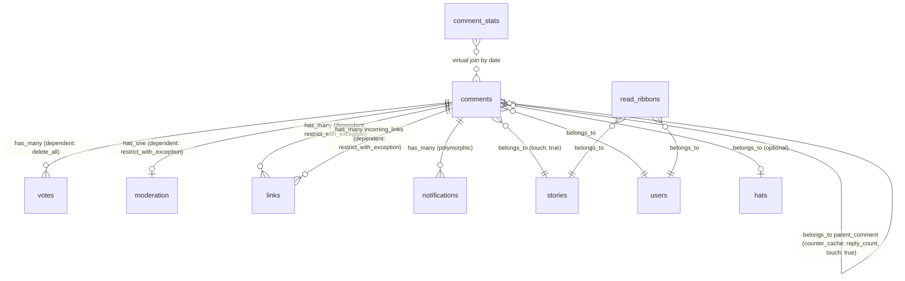
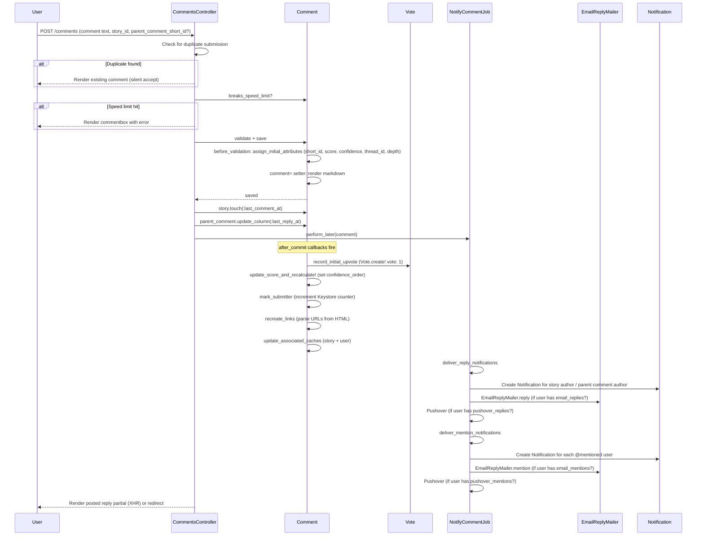

# Comments

> **Status**: Active
> **Generated**: 2026-06-13T00:00:00Z
> **Last Updated**: 2026-06-13T00:00:00Z

---

## Overview

### What It Does
The comments feature provides threaded commenting on stories. Users can post comments, reply to existing comments (forming nested threads), edit their own comments, upvote/flag other comments, preview markdown before posting, and receive notifications (in-app, email, and Pushover) when someone replies to or @mentions them.

### Why It Exists
Lobsters is a community-driven link aggregation site. Comments are the primary mechanism for discussion. Threaded display, confidence-based sorting, flagging, rate-limiting in heated threads, and maximum depth limits all work together to promote constructive conversation and give moderators tools to manage abuse.

### Key Capabilities
- Threaded (nested) commenting with confidence-based sort order within threads
- Markdown rendering with live preview
- Upvoting, flagging (with reasons: Off-topic, Me-too, Troll, Unkind, Spam), and unvoting
- Speed-limiting in flagged/heated reply chains
- Maximum reply depth of 18 levels
- Edit window of 6 hours; delete window of 14 days; disown for older comments
- Email and Pushover notifications for replies and @mentions
- RSS feeds for newest and upvoted comments
- Hat (flair) support on comments
- Read tracking via ReadRibbon for unread indicators
- "Newest Comments" page with last-read marker
- Per-user thread view showing recent threads a user participated in
- Auto-collapse of low-score comments (score <= -5)
- Score hiding on recent/near-zero comments to discourage meta-discussion about voting

---

## Architecture

### High-Level Design



### Components

#### Backend Components
| Component | File Path | Purpose |
|-----------|-----------|---------|
| CommentsController | `app/controllers/comments_controller.rb` | All comment CRUD, voting, flagging, listing, threads |
| Comment | `app/models/comment.rb` | Core model: validations, threading, confidence scoring, markdown |
| CommentStat | `app/models/comment_stat.rb` | Stores daily average comment scores for the `above_average` scope |
| CommentVoteHydrator | `app/models/comment_vote_hydrator.rb` | Batch-loads current user's votes/reply status onto comment collections |
| ReadRibbon | `app/models/read_ribbon.rb` | Tracks per-user read state per story for unread comment indicators |
| EmailReplyMailer | `app/mailers/email_reply_mailer.rb` | Sends reply and mention notification emails |
| NotifyCommentJob | `app/jobs/notify_comment_job.rb` | Async job: delivers reply + mention notifications via email, Pushover, and in-app |

#### View Templates
| Component | File Path | Purpose |
|-----------|-----------|---------|
| index.html.erb | `app/views/comments/index.html.erb` | Newest/upvoted comments listing with pagination and last-read marker |
| index.rss.builder | `app/views/comments/index.rss.builder` | RSS feed for comments |
| user_threads.html.erb | `app/views/comments/user_threads.html.erb` | Per-user thread listing page |
| _comment.html.erb | `app/views/comments/_comment.html.erb` | Single comment partial: score, byline, actions, body |
| _commentbox.html.erb | `app/views/comments/_commentbox.html.erb` | Comment form (create/edit) with hat selector and preview |
| _threads.html.erb | `app/views/comments/_threads.html.erb` | Renders threaded comment tree with nested `<ol>` elements |
| _preview.html.erb | `app/views/comments/_preview.html.erb` | Preview container for markdown rendering |
| _postedreply.html.erb | `app/views/comments/_postedreply.html.erb` | XHR response after successful comment post |
| _too_deep.html.erb | `app/views/comments/_too_deep.html.erb` | Max depth reached message |
| reply.text.erb | `app/views/email_reply_mailer/reply.text.erb` | Reply notification email body |
| mention.text.erb | `app/views/email_reply_mailer/mention.text.erb` | Mention notification email body |

### Technology Stack
- **Backend**: Ruby on Rails (ApplicationRecord, ApplicationMailer, ApplicationJob with ActiveJob)
- **Markdown**: `Markdowner.to_html` (custom library in `extras/`)
- **Database**: MySQL (utf8mb4), with recursive CTEs for thread ordering
- **Caching**: Rails.cache for RSS feeds (2 min TTL), page caching on index/threads
- **Notifications**: Email (ActionMailer), Pushover (via `User#pushover!`), in-app (Notification model)
- **Sorting**: Wilson confidence interval (80%) for comment ordering within threads

---

## Model Details

### Comment

#### Associations
```ruby
# Source: app/models/comment.rb
belongs_to :user
belongs_to :story,
  inverse_of: :comments,
  touch: true
has_many :votes,
  dependent: :delete_all
belongs_to :parent_comment,
  class_name: "Comment",
  inverse_of: false,
  optional: true,
  counter_cache: :reply_count,
  touch: true
has_one :moderation,
  class_name: "Moderation",
  inverse_of: :comment,
  dependent: :restrict_with_exception
belongs_to :hat,
  optional: true
has_many :taggings, through: :story
has_many :links, inverse_of: :from_comment, dependent: :restrict_with_exception
has_many :incoming_links,
  class_name: "Link",
  inverse_of: :to_comment,
  dependent: :restrict_with_exception
has_many :notifications, as: :notifiable
```

#### Concerns
| Concern | Purpose |
|---------|---------|
| `Token` | Generates a unique token for the comment (used for email threading, Action Mailbox inbound routing) |

#### Callbacks
| Callback | Method | Purpose |
|----------|--------|---------|
| `before_validation` (on: :create) | `:assign_initial_attributes` | Sets short_id, initial score/confidence, confidence_order placeholder, thread_id, and depth |
| `after_save` | `:log_hat_use` | Creates a Moderation record if the hat has `modlog_use` enabled |
| `after_commit` (on: :create) | `:mark_submitter` | Increments `user:<id>:comments_posted` in Keystore |
| `after_commit` (on: :create) | `:record_initial_upvote` | Creates the author's automatic +1 Vote and triggers `update_score_and_recalculate!` |
| `after_commit` | `:recreate_links` | Re-parses comment HTML for `<a>` tags, updates Link records |
| `after_commit` | `:update_associated_caches` | Calls `story.update_cached_columns` and `user.refresh_counts!` |

#### Virtual Attributes
```ruby
# Source: app/models/comment.rb:33
attr_accessor :current_vote, :current_reply, :previewing, :vote_summary
```

#### Constants
| Constant | Value | Purpose |
|----------|-------|---------|
| `FLAGGABLE_DAYS` | 7 | Comments older than 7 days cannot be flagged |
| `DELETEABLE_DAYS` | 14 | Comments older than 14 days cannot be deleted (but can be disowned) |
| `FLAGGABLE_MIN_SCORE` | -10 | Lowest score at which flagging is still allowed |
| `COLLAPSE_SCORE` | -5 | Comments at or below this score are auto-collapsed |
| `MAX_EDIT_MINS` | 360 (6 hours) | Edit window after last edit timestamp |
| `COP_LENGTH` | 93 (31 * 3) | Max length of confidence_order_path in recursive CTE |
| `MAX_DEPTH` | 18 | Maximum nesting depth for replies |
| `SCORE_RANGE_TO_HIDE` | -2..4 | Score range where scores are hidden from non-moderators on recent comments |

#### Scopes
| Scope | Purpose |
|-------|---------|
| `deleted` | `where(is_deleted: true)` |
| `not_deleted` | `where(is_deleted: false)` |
| `not_moderated` | `where(is_moderated: false)` |
| `active` | Combines `not_deleted` and `not_moderated` |
| `accessible_to_user(user)` | Returns `all` for moderators, `active` for everyone else |
| `recent` | Comments from the last 6 months |
| `above_average` | Joins CommentStat to find comments scoring above the daily average |
| `on_stories_not_authored_by(user)` | Excludes comments on stories authored by the given user |
| `for_presentation` | Eager-loads `:user, :hat, moderation: :moderator, story: :user, votes: :user` |
| `filter_tags(tags)` | Excludes comments on stories with the given tag IDs |
| `filter_tags_for(user)` | Excludes comments on stories matching the user's tag filters |
| `not_on_story_hidden_by(user)` | Excludes comments on stories the user has hidden |

#### Key Methods
| Method | Returns | Purpose | Notes |
|--------|---------|---------|-------|
| `self.story_threads(story)` | `ActiveRecord::Relation` | Returns all comments for a story in threaded confidence order using recursive CTE | Handles merged stories |
| `self.recent_threads(user)` | `ActiveRecord::Relation` | Returns last 20 threads a user participated in, confidence-ordered | Uses recursive CTE |
| `calculated_confidence` | `BigDecimal` | Wilson score confidence interval (80%) | Based on Reddit's algorithm; returns 0 for deleted/moderated |
| `update_score_and_recalculate!(score_delta, flag_delta)` | `nil` | Recalculates score/flags/confidence and updates confidence_order in SQL | Race condition noted in source |
| `breaks_speed_limit?` | `Boolean` | Rate-limits replies in heated threads based on flag count | Delay = (2 + total_flags + user_flags) minutes |
| `parents` | `ActiveRecord::Relation` | All direct ancestors via recursive CTE, oldest first | |
| `delete_for_user(user, reason)` | `true` | Sets `is_deleted = true` | Saves without validation |
| `delete_by_moderator(user, reason)` | `true` | Sets `is_deleted` and `is_moderated`, creates Moderation record, deducts karma | |
| `undelete_for_user(user)` | `true` | Restores comment; moderators can undelete any comment | Creates Moderation record if mod undeleting another's comment |
| `is_editable_by_user?(user)` | `Boolean` | True if own comment, not gone, within edit window | |
| `is_deletable_by_user?(user)` | `Boolean` | True if own comment within DELETEABLE_DAYS | |
| `is_disownable_by_user?(user)` | `Boolean` | True if own comment older than DELETEABLE_DAYS | Transfers authorship to InactiveUser |
| `is_flaggable?(user)` | `Boolean` | True if not gone, not own, within FLAGGABLE_DAYS, score above min | |
| `depth_permits_reply?` | `Boolean` | True if depth < MAX_DEPTH and comment is persisted | |
| `show_score_to_user?(u)` | `Boolean` | Hides score on recent near-zero comments and when user has flagged | Moderators always see scores |
| `gone_text` | `String` | Explanation text for deleted/moderated/banned comments | |
| `parsed_links` | `Array<Link>` | Extracts URLs from rendered markdown HTML | |
| `as_json` | `Hash` | JSON API representation with short_id, score, flags, user, URLs | |

#### Validations
```ruby
# Source: app/models/comment.rb
validates :short_id, presence: true, uniqueness: {case_sensitive: false}
validates :short_id, length: {maximum: 10}, presence: true
validates :markeddown_comment, length: {maximum: 16_777_215}
validates :comment,
  presence: {with: true, message: "cannot be empty."},
  length: {maximum: 16_777_215}
validates :confidence, :confidence_order, :flags, :score, presence: true
validates :is_deleted, :is_moderated, :is_from_email, inclusion: {in: [true, false]}
validates :last_edited_at, presence: true
validate :validate_commenter_hasnt_flagged_parent, on: :create
```

Custom validate block also rejects:
- Replies to deleted/moderated parent comments
- Replies beyond MAX_DEPTH
- Low-effort comments: "this", "tl;dr", quote-only, "bump", spaced-out caps ("D O N ' T"), "me too"/"nice"/"+1", emoji-only
- Invalid hats (not wearable by user)
- Comments on stories no longer accepting comments

### CommentStat

#### Associations
No explicit associations (virtual join to comments by date).

#### Key Methods
| Method | Returns | Purpose | Notes |
|--------|---------|---------|-------|
| `self.daily_fill!` | `nil` | Inserts/updates average comment scores for last 30 days | Uses `INSERT ... ON DUPLICATE KEY UPDATE` |

### CommentVoteHydrator

A non-ActiveRecord Enumerable wrapper that batch-loads vote data for a collection of comments. It pre-fetches:
- The current user's votes on the comments
- Vote summaries (flag reasons with counts/usernames)
- Which comments the current user has replied to

```ruby
# Source: app/models/comment_vote_hydrator.rb
class CommentVoteHydrator
  include Enumerable
  delegate :size, :length, :empty?, :any?, to: :@comments

  def initialize(comments, user)
    @comments = comments
    @user = user
    if @user.nil? || comments.empty?
      @votes = {}
      @vote_summaries = {}
      @current_user_reply_parents = {}
    else
      comment_ids = comments.map(&:id)
      @votes = Vote.comment_votes_by_user_for_comment_ids_hash(@user.id, comment_ids)
      @vote_summaries = Vote.comment_vote_summaries(comment_ids)
      @current_user_reply_parents = @user.ids_replied_to(comment_ids)
    end
  end
end
```

### ReadRibbon

#### Associations
```ruby
# Source: app/models/read_ribbon.rb
belongs_to :user
belongs_to :story
```

#### Key Methods
| Method | Returns | Purpose | Notes |
|--------|---------|---------|-------|
| `is_unread?(comment)` | `Boolean` | True if comment is newer than ribbon's `updated_at` and not by the user | |
| `unread_count(comments)` | `Integer` | Count of unread comments in the collection | Memoized |
| `self.expire_old_ribbons!` | `Integer` | Deletes ribbons not updated in over a year | |
| `self.hide_replies_for(story_id, user_id)` | `nil` | Sets `is_following = false` to stop reply notifications | |
| `self.unhide_replies_for(story_id, user_id)` | `nil` | Sets `is_following = true` to re-enable notifications | |
| `bump` | `true` | Lightweight timestamp update without callbacks/validation | |

---

## Database Schema

### comments

| Column | Type | Default | Notes |
|--------|------|---------|-------|
| `id` | `bigint unsigned` | auto | Primary key |
| `created_at` | `datetime` | — | Not null |
| `updated_at` | `datetime` | — | Nullable |
| `short_id` | `varchar(10)` | `""` | Not null, unique |
| `story_id` | `bigint unsigned` | — | Not null, FK to stories |
| `confidence_order` | `binary(3)` | — | Not null; 2 bytes inverted confidence + 1 byte tiebreaker |
| `user_id` | `bigint unsigned` | — | Not null, FK to users |
| `parent_comment_id` | `bigint unsigned` | NULL | FK to comments (self-referential) |
| `thread_id` | `bigint unsigned` | NULL | Groups comments into threads |
| `comment` | `mediumtext` | — | Not null; raw markdown source |
| `score` | `int` | `1` | Not null; net upvotes minus flags |
| `flags` | `int unsigned` | `0` | Not null; count of flag votes |
| `confidence` | `decimal(20,19)` | `0.0` | Not null; Wilson confidence interval |
| `markeddown_comment` | `mediumtext` | NULL | Rendered HTML |
| `is_deleted` | `boolean` | `false` | Not null |
| `is_moderated` | `boolean` | `false` | Not null |
| `is_from_email` | `boolean` | `false` | Not null |
| `hat_id` | `bigint unsigned` | NULL | FK to hats |
| `depth` | `int` | `0` | Not null; nesting level (0 = top-level) |
| `reply_count` | `int` | `0` | Not null; counter cache from parent_comment |
| `last_reply_at` | `datetime` | NULL | Timestamp of most recent direct reply |
| `last_edited_at` | `datetime` | — | Not null; used for edit window calculation |
| `token` | `varchar` | — | Not null, unique |

**Indexes:**
- `short_id` (unique)
- `index_comments_on_comment` (fulltext)
- `confidence_idx` on `confidence`
- `index_comments_on_score` on `score`
- `story_id_short_id` on `(story_id, short_id)`
- `thread_id` on `thread_id`
- `index_comments_on_token` (unique)
- `index_comments_on_user_id` on `user_id`
- `comments_hat_id_fk` on `hat_id`
- `comments_parent_comment_id_fk` on `parent_comment_id`

**Foreign keys:**
- `comments.parent_comment_id` -> `comments.id`

### comment_stats

| Column | Type | Default | Notes |
|--------|------|---------|-------|
| `id` | `bigint` | auto | Primary key |
| `date` | `date` | — | Not null, unique |
| `average` | `int` | — | Not null; daily average comment score |

**Indexes:**
- `index_comment_stats_on_date` (unique)

### read_ribbons

| Column | Type | Default | Notes |
|--------|------|---------|-------|
| `id` | `bigint unsigned` | auto | Primary key |
| `is_following` | `boolean` | `true` | Not null; controls reply notification delivery |
| `created_at` | `datetime` | — | Not null |
| `updated_at` | `datetime` | — | Not null; compared to comment.created_at for unread detection |
| `user_id` | `bigint unsigned` | — | Not null, FK to users |
| `story_id` | `bigint unsigned` | — | Not null, FK to stories |

**Indexes:**
- `index_read_ribbons_on_story_id`
- `index_read_ribbons_on_user_id`

### Relationships



---

## API Endpoints

| Method | Path | Action | Description | Notes |
|--------|------|--------|-------------|-------|
| `GET` | `/comments` | `index` | List newest comments (paginated, HTML + RSS) | Page-cached |
| `GET` | `/comments/page/:page` | `index` | Paginated newest comments | |
| `GET` | `/upvoted/comments` | `upvoted` | List comments upvoted by current user (HTML + RSS) | Requires login |
| `GET` | `/upvoted/comments/page/:page` | `upvoted` | Paginated upvoted comments | |
| `GET` | `/threads` | `user_threads` | Current user's threads | Redirects to /active if not logged in |
| `GET` | `/~:user/threads` | `user_threads` | Specific user's threads | |
| `POST` | `/comments` | `create` | Create a new comment | Requires login; handles dedup, speed limit, preview |
| `GET` | `/comments/:id` | `show` | Show single comment for editing (HTML partial) | Returns edit form if editable, else redirects |
| `GET` | `/comments/:id/edit` | `edit` | Edit form for a comment | Requires ownership + edit window |
| `PATCH` | `/comments/:id` | `update` | Update comment text and/or hat | Requires ownership + edit window |
| `GET` | `/comments/:id/reply` | `reply` | Reply form for a comment | Requires login; checks depth limit |
| `POST` | `/comments/:id/upvote` | `upvote` | Upvote a comment | Requires login |
| `POST` | `/comments/:id/flag` | `flag` | Flag a comment with a reason | Requires login + can_flag? |
| `POST` | `/comments/:id/unvote` | `unvote` | Remove vote on a comment | Requires login |
| `POST` | `/comments/:id/delete` | `delete` | Soft-delete own comment | Requires ownership + within DELETEABLE_DAYS |
| `POST` | `/comments/:id/undelete` | `undelete` | Restore a deleted comment | Owner or moderator |
| `POST` | `/comments/:id/disown` | `disown` | Transfer comment to InactiveUser | Own comment older than DELETEABLE_DAYS |
| `GET` | `/c/:id.json` | `show_short_id` | JSON API for a single comment by short_id | |
| `GET` | `/c/:id` | `redirect_from_short_id` | Redirect short_id to full comment URL | Cached in Rails.cache |
| `GET` | `/s/:story_id/:title/comments/:id` | `redirect_from_short_id` | Legacy path redirect | |

---

## Comment Lifecycle Flow



---

## Confidence Scoring Algorithm

Comments within a thread are sorted by a Wilson score confidence interval (80% confidence level), adapted from Reddit's algorithm. The implementation is in `Comment#calculated_confidence`:

```ruby
# Source: app/models/comment.rb:232-251
# http://evanmiller.org/how-not-to-sort-by-average-rating.html
# https://github.com/reddit/reddit/blob/master/r2/r2/lib/db/_sorts.pyx
def calculated_confidence
  return 0 if is_deleted? || is_moderated?
  ups = self.score + flags
  downs = flags
  n = BigDecimal(ups + downs)
  return 0 if n == 0
  raise ArgumentError, "n should count number of upvotes + flags; that can't be a negative number" if n < 0

  z = BigDecimal("1.281551565545") # 80% confidence
  p = BigDecimal(ups) / n

  left = p + (1 / (2 * n) * z * z)
  right = z * Math.sqrt((p * ((1 - p) / n)) + (z * z / (4 * n * n)))
  under = 1.0 + ((1.0 / n) * z * z)

  confidence = (left - right) / under
  confidence.clamp(0..1)
end
```

The `confidence_order` column is a 3-byte binary value: the first 2 bytes are the inverted confidence (high confidence = low value for ascending sort), and the third byte is `id & 0xff` as a stable tiebreaker. Thread ordering uses a recursive CTE that concatenates `confidence_order` values along the tree path into a `confidence_order_path` for lexicographic sorting.

---

## Notification System

`NotifyCommentJob` handles two notification paths:

### Reply Notifications
Recipients: story author (if `user_is_following`) + parent comment author (if active).
- In-app `Notification` created for each recipient
- Email via `EmailReplyMailer#reply` if `user.email_replies?`
- Pushover if `user.pushover_replies?`
- Users who have hidden the story are excluded from email/pushover (but still get in-app notification)

### Mention Notifications
Scans comment text for `@username` or `~username` patterns.
- Excludes the comment author and users already notified via reply
- In-app `Notification` for all matched active users
- Email via `EmailReplyMailer#mention` if `user.email_mentions?` (note: `email_replies` trumps `email_mentions` -- if reply notification is off, @mention does not generate email either)
- Pushover if `user.pushover_mentions?`

### Email Threading
Emails include RFC-compliant headers for threading:
- `Message-Id`: `comment.<short_id>.<email|nil>.<created_at_unix>@<domain>`
- `References`: story message ID + all parent comment message IDs
- `In-Reply-To`: parent comment (or story if top-level)

---

## Speed Limiting

The `breaks_speed_limit?` method rate-limits users in heated threads:

```ruby
# Source: app/models/comment.rb:255-278
def breaks_speed_limit?
  return false unless parent_comment_id
  return false if user.is_moderator?

  parent_comment_ids = parent_comment.parents.ids.append(parent_comment.id)
  flag_count = Vote.comments_flags(parent_comment_ids).count
  commenter_flag_count = Vote.comments_flags(parent_comment_ids, user).count
  delay = (2 + flag_count + commenter_flag_count).minutes

  recent = Comment.where("created_at >= ?", delay.ago)
    .find_by(user: user, thread_id: parent_comment.thread_id)

  return false if recent.blank?
  # ... adds error with wait time
end
```

The delay increases with the number of flags in the ancestor chain. The user's own flags are double-counted, further slowing users who flagged and then continue replying.

---

## Flag Reasons

From `Vote::COMMENT_REASONS`:
| Code | Reason |
|------|--------|
| `"O"` | Off-topic |
| `"M"` | Me-too |
| `"T"` | Troll |
| `"U"` | Unkind |
| `"S"` | Spam |
| `""` | Cancel (remove flag) |

`Vote::ALL_COMMENT_REASONS` adds `"I"` (Incorrect) for display purposes.

---

## Authorization

There is no Pundit policy. Authorization is handled inline in the controller and model:

| Check | Location | Rule |
|-------|----------|------|
| Create comment | `CommentsController#create` | `before_action :require_logged_in_user_or_400` |
| Edit comment | `Comment#is_editable_by_user?` | Own comment, not deleted/moderated, within 6-hour edit window |
| Delete comment | `Comment#is_deletable_by_user?` | Own comment, within 14 days |
| Undelete comment | `Comment#is_undeletable_by_user?` | Own comment (if not moderated) OR any moderator |
| Disown comment | `Comment#is_disownable_by_user?` | Own comment, older than 14 days |
| Flag comment | `Comment#is_flaggable?` + `User#can_flag?` | Not own, not gone, within 7 days, score > -10 |
| Upvote/unvote | `CommentsController#upvote/unvote` | Logged in, comment not gone |
| Reply | `Comment#depth_permits_reply?` | Depth < 18, comment persisted |
| View deleted | `accessible_to_user` scope | Moderators see all; others see only active |
| Mod delete | `Comment#delete_by_moderator` | `user.is_moderator?` |
| View score | `Comment#show_score_to_user?` | Moderators always; others only if old enough or outside -2..4 range and not flagged |

---

## Configuration

### Page Caching
```ruby
# Source: app/controllers/comments_controller.rb:6
caches_page :index, :threads, if: CACHE_PAGE
```

### RSS Caching
```ruby
# Source: app/controllers/comments_controller.rb:325
Rails.cache.fetch("comments.rss", expires_in: (60 * 2))
```

### Pagination
```ruby
# Source: app/controllers/comments_controller.rb:4
COMMENTS_PER_PAGE = 20
```

---

## Testing

### Test Files
- `spec/models/comment_spec.rb` — Model unit tests
- `spec/models/comment_stat_spec.rb` — CommentStat unit tests
- `spec/controllers/comments_controller_spec.rb` — Controller tests
- `spec/requests/comments_spec.rb` — Request/integration tests
- `spec/jobs/notify_comment_job_spec.rb` — Notification job tests
- `spec/features/comment_spec.rb` — Feature/integration tests
- `spec/factories/comment.rb` — Factory definitions

---

## Known Issues & Caveats

| Issue | Location | Description |
|-------|----------|-------------|
| Race condition on scoring | `comment.rb:337` | Source comment: "if two votes arrive at the same time, the second one won't take the first's score change into effect for calculated_confidence" |
| Duplicate `short_id` validation | `comment.rb:35,113` | `validates :short_id, presence: true` appears twice (line 35 with uniqueness, line 113 with length) |
| `record_timestamps` not reset on error | `comment.rb:321` | `delete_by_moderator` sets `Comment.record_timestamps = true` at the end, but if `save!` raises, it won't be reset (class-level state leak) |
| `record_timestamps` not reset on error | `comment.rb:540-558` | Same issue in `undelete_for_user` — sets `record_timestamps = false` then `true`, but `save!` could raise between them |
| TODO: hidden stories in upvoted | `comments_controller.rb:363` | `# TODO: respect hidden stories` — upvoted comments view does not filter out hidden stories |
| Dead branch in _comment.html.erb | `_comment.html.erb:97` | `elsif !comment.is_gone? && comment.is_disownable_by_user?(@user)` is unreachable because the preceding `elsif !comment.is_gone?` block already handles non-gone comments |
| Commented-out has_many | `comment_stat.rb:5` | `# has_many :comments` is commented out — the join is done manually in SQL |
| Heinous inline partial | `_threads.html.erb:43-200` | `_comment.html.erb` is copy-pasted inline into `_threads.html.erb` for performance, with markers `heinous_inline_partial` — must be kept in sync manually |

---

## Performance

### Optimization Strategies
- **Recursive CTE** for thread ordering instead of N+1 parent lookups
- **Confidence order in binary**: 3-byte `confidence_order` column enables efficient lexicographic sort of `confidence_order_path` in the recursive CTE
- **CommentVoteHydrator**: Batch-loads all vote data in 3 queries instead of N+1 per comment
- **Heinous inline partial**: `_threads.html.erb` inlines `_comment.html.erb` to avoid per-comment partial render overhead
- **Page caching**: `caches_page :index, :threads` for anonymous users
- **ReadRibbon#bump**: Uses `update_column` to skip callbacks/validation for lightweight read tracking
- **Counter cache**: `reply_count` on parent_comment avoids COUNT queries
- **Touch chain**: `belongs_to :parent_comment, touch: true` and `belongs_to :story, touch: true` propagate updated_at up the chain for cache invalidation

### Caching
- **Page cache**: Index and threads actions (when `CACHE_PAGE` is truthy)
- **RSS cache**: `comments.rss` key, 2-minute TTL
- **Short ID redirect cache**: `c_<short_id>` key, no expiration (`expires_in: nil`)

### Database Indexes
- Fulltext index on `comment` for search
- `confidence` index for score-based queries
- `score` index for score-based filtering
- `(story_id, short_id)` composite for story comment lookups
- `thread_id` for thread queries
- `user_id` for per-user queries
- Unique indexes on `short_id` and `token`

---

## Troubleshooting

### Common Issues

#### Issue: Comment form shows speed limit error
**Symptoms:**
- User sees "Thread speed limit reached, next comment allowed in X minutes"

**Cause:**
The user recently posted in the same thread and the delay period hasn't elapsed. The delay is `(2 + flags_in_ancestor_chain + user_flags_in_ancestor_chain)` minutes. Heated threads with many flags produce longer delays.

**Solution:**
Wait for the delay to pass. Moderators are exempt from speed limits.

#### Issue: Reply button missing on deep comment
**Symptoms:**
- No "reply" link on a deeply nested comment

**Cause:**
The comment is at depth 18 (MAX_DEPTH). The `_too_deep.html.erb` partial explains this is by design.

**Solution:**
Start a new top-level comment or blog about it and submit the link.

#### Issue: Edited comment shows wrong timestamp
**Symptoms:**
- Comment shows "edited" but the link timestamp looks like the last edit time, not creation time

**Cause:**
The byline always renders `how_long_ago_link` using `comment.last_edited_at`, not `created_at`. The "edited" label appears when `last_edited_at - created_at > 1.minute`.

---

## Related Features

- **[Stories](./catalog.md)** — Comments belong to stories; story controls `accepting_comments?` and `comments_closing_soon?`
- **[Moderation](./catalog.md)** — Moderators can delete/undelete comments, view deleted content, and see flag details with usernames
- **[Inbox/Notifications](./catalog.md)** — Comment reply and mention notifications appear in the unified inbox
- **[Search](./catalog.md)** — Fulltext index on `comment` column enables comment search
- **[Users](./catalog.md)** — User model provides `can_flag?`, `email_replies?`, `pushover_replies?`, `is_moderator?`
- **[Hats](./catalog.md)** — Comments can be posted wearing a hat; modlog-flagged hats create Moderation records

---

**Generated:** 2026-06-13T00:00:00Z
**Last Updated:** 2026-06-13T00:00:00Z
**Status:** Active
