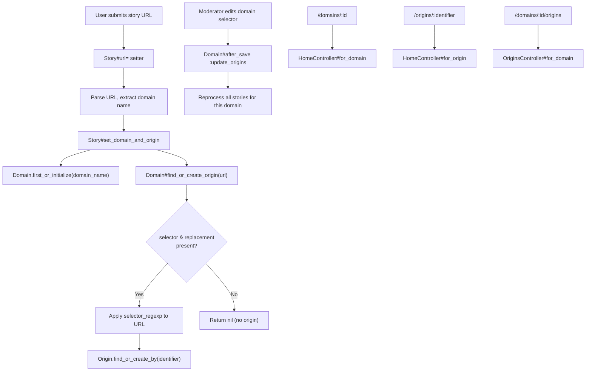
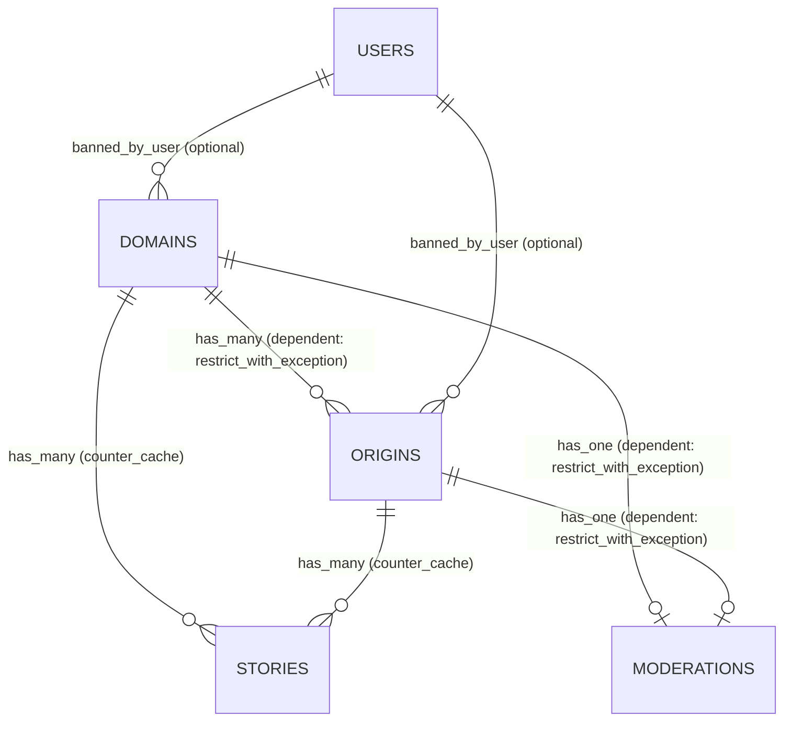
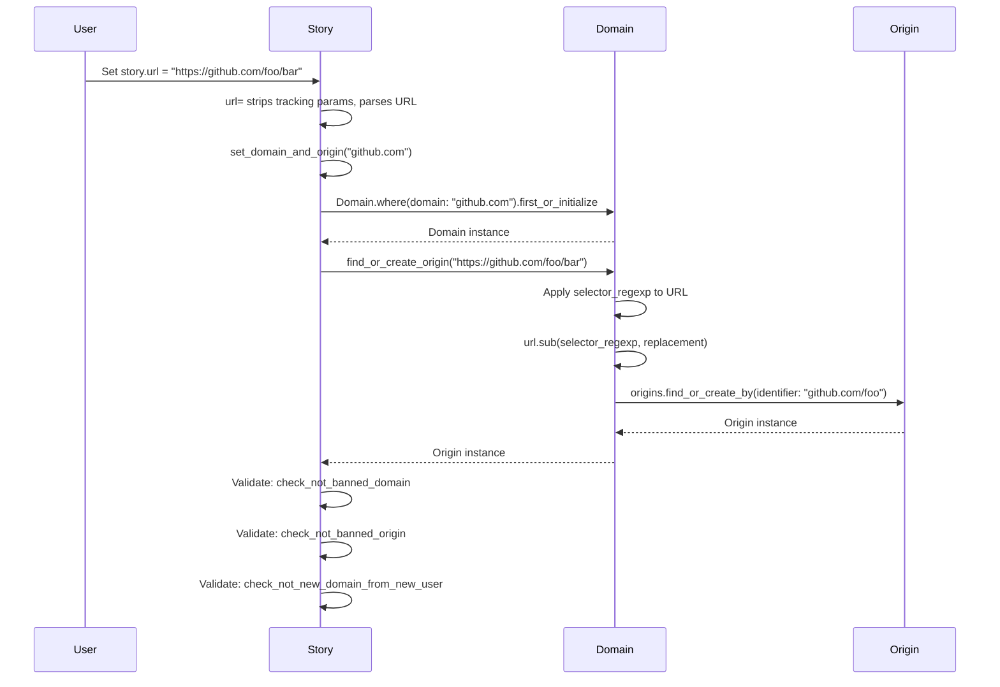

# Domains & Origins

> **Status**: Active
> **Generated**: 2026-06-13T00:00:00Z
> **Last Updated**: 2026-06-13T00:00:00Z

---

## Overview

### What It Does
The domains-origins feature tracks and groups submitted story URLs by their domain (e.g. `github.com`) and origin (e.g. `github.com/torvalds`). Domains are automatically extracted from story URLs on submission. Origins are a finer-grained grouping derived from domains via configurable regex selector/replacement rules. Both domains and origins can be independently banned by moderators to block future submissions from specific sources.

### Why It Exists
A link aggregation site needs to identify where content comes from. Domains provide a coarse grouping (all links from `github.com`), while origins provide sub-domain grouping (e.g. distinguishing `github.com/user-a` from `github.com/user-b`). This enables per-source browsing feeds, submission statistics, and moderation controls to ban spam or low-quality sources at either the domain or origin level.

### Key Capabilities
- Automatic domain extraction from story URLs on submission (strips `www` prefixes)
- Origin derivation from URLs via configurable regex selector/replacement on each domain
- Cross-domain origin sharing (e.g. `foo.github.io` and `github.com/foo` can map to the same origin)
- Domain and origin banning with moderation log entries
- Per-domain and per-origin story listing pages with RSS feeds
- Domain and origin story/submitter counts via counter caches
- Moderator UI for editing domain selectors/replacements and banning/unbanning

---

## Architecture

### High-Level Design



### Components

#### Backend Components
| Component | File Path | Purpose |
|-----------|-----------|---------|
| OriginsController | `app/controllers/origins_controller.rb` | Lists origins for a given domain |
| Domain model | `app/models/domain.rb` | Represents a URL domain with selector/replacement rules and banning |
| Origin model | `app/models/origin.rb` | Represents a sub-domain content source derived from domain rules |
| Mod::DomainsController | `app/controllers/mod/domains_controller.rb` | Moderator CRUD for domain selector/replacement configuration |
| Mod::DomainsBanController | `app/controllers/mod/domains_ban_controller.rb` | Moderator ban/unban for domains |
| Mod::OriginsController | `app/controllers/mod/origins_controller.rb` | Moderator ban/unban for origins |
| HomeController (partial) | `app/controllers/home_controller.rb` | `for_domain` and `for_origin` actions for story listing feeds |
| Story model (partial) | `app/models/story.rb` | `url=` setter and `set_domain_and_origin` trigger domain/origin assignment |

#### Frontend Components (Views)
| Component | File Path | Purpose |
|-----------|-----------|---------|
| Origins listing | `app/views/origins/for_domain.html.erb` | Lists all origins for a domain |
| Domain header partial | `app/views/home/_for_domain.html.erb` | Domain info banner on domain story pages |
| Origin header partial | `app/views/home/_for_origin.html.erb` | Origin info banner on origin story pages |
| Mod domain edit | `app/views/mod/domains/edit.html.erb` | Domain selector/replacement config + ban form |
| Mod origin edit | `app/views/mod/origins/edit.html.erb` | Origin ban/unban form |

---

## Model Details

### Domain

**File**: `app/models/domain.rb`

#### Associations
```ruby
has_many :stories
belongs_to :banned_by_user,
  class_name: "User",
  inverse_of: false,
  optional: true
has_many :origins, dependent: :restrict_with_exception
has_one :moderation, dependent: :restrict_with_exception
```

#### Concerns
| Concern | Purpose |
|---------|---------|
| `Token` | Auto-generates an immutable `token` via TypeID on initialization; validates presence and uniqueness |

#### Validations
```ruby
validates :banned_reason, length: {maximum: 200}
validates :domain, presence: true, length: {maximum: 255}, uniqueness: {case_sensitive: false}
validates :selector, length: {maximum: 255}
validates :replacement, length: {maximum: 255}
validates :stories_count, numericality: {only_integer: true, greater_than_or_equal_to: 0}, presence: true
validate :valid_selector
```

#### Callbacks
| Callback | Method | Purpose |
|----------|--------|---------|
| `after_save` | `:update_origins` | When `selector` or `replacement` changes, reprocesses all stories for this domain to update their `origin_id` |

#### Key Methods

| Method | Returns | Purpose | Notes |
|--------|---------|---------|-------|
| `self./(domain)` | `Domain` | Shortcut finder: `Domain / "github.com"` | Raises `ActiveRecord::RecordNotFound` |
| `selector=(s)` | `String` | Auto-wraps selector with `\A` and `\z` anchors if missing | Strips whitespace first |
| `selector_regexp` | `Regexp` | Compiles `selector` to case-insensitive Regexp with 0.1s timeout | Used for URL matching |
| `valid_selector` | N/A | Custom validation: rejects newlines, tests Regexp compilation | Called as `validate` |
| `find_or_create_origin(url)` | `Origin` or `nil` | Applies selector regex to URL, substitutes replacement, finds/creates Origin by identifier | Returns `nil` if selector or replacement is blank |
| `update_origins` | N/A | Iterates all stories via `find_each`, re-derives origin for each | Only runs when `selector` or `replacement` changed |
| `ban_by_user_for_reason!(banner, reason)` | N/A | Sets `banned_at`, `banned_by_user_id`, `banned_reason`; creates Moderation log entry | |
| `unban_by_user_for_reason!(banner, reason)` | N/A | Clears ban fields; creates Moderation log entry | |
| `banned?` | `Boolean` | Delegates to `banned_at?` | |
| `n_submitters` | `Integer` | `stories.count("distinct user_id")` | |
| `to_param` | `String` | Returns `domain` (the domain name string) for URL generation | |

#### Origin Derivation Logic (find_or_create_origin)

```ruby
# Source: app/models/domain.rb:60-78
def find_or_create_origin(url)
  return nil if selector.blank? || replacement.blank?
  valid?
  raise ArgumentError, "Domain not valid: #{errors.full_messages.join(", ")}" if errors.any?
  raise ArgumentError, "Can't create Origin until Domain is persisted" if new_record?

  # github.com/foo -> github.com/foo
  # github.com/foo/bar -> github.com/foo
  identifier = if url.match?(selector_regexp)
    url.sub(selector_regexp, replacement)
  else
    # if the URL isn't matched, the identifier is the bare domain (handles root + partial regexps)
    domain
  end.downcase

  # because of rails associations, `origins` is scoped to current domain object
  # create_or_find_by returns the new origin record
  origins.find_or_create_by(identifier: identifier)
end
```

### Origin

**File**: `app/models/origin.rb`

The class-level comment explains the key design decision:

> The unique value to identify an Origin is 'identifier', not the tuple (domain, identifier).
> Origin.domain is set from the identifier to support sharing an Origin between Domains. The URLs
> foo.github.io and github.com/foo have two different Domains that both produce the Origin with
> identifier github.com/foo. That Origin's domain is set to github.com.

#### Associations
```ruby
belongs_to :domain
has_many :stories
belongs_to :banned_by_user,
  class_name: "User",
  inverse_of: false,
  optional: true
has_one :moderation, dependent: :restrict_with_exception
```

#### Concerns
| Concern | Purpose |
|---------|---------|
| `Token` | Auto-generates an immutable `token` via TypeID on initialization; validates presence and uniqueness |

#### Validations
```ruby
validates :identifier, presence: true, length: {maximum: 255}, uniqueness: {case_sensitive: false}
validates :stories_count, numericality: {only_integer: true, greater_than_or_equal_to: 0}, presence: true
validates :banned_reason, length: {maximum: 200}
```

#### Callbacks
| Callback | Method | Purpose |
|----------|--------|---------|
| `after_create` | (inline block) | `Origin.reset_counters(id, :stories)` — resets counter cache for new records |

#### Key Methods

| Method | Returns | Purpose | Notes |
|--------|---------|---------|-------|
| `self./(identifier)` | `Origin` | Shortcut finder: `Origin / "github.com/user"` | Raises `ActiveRecord::RecordNotFound` |
| `ban_by_user_for_reason!(banner, reason)` | N/A | Sets ban fields; creates Moderation log with `m.origin = self` | Same pattern as Domain |
| `unban_by_user_for_reason!(banner, reason)` | N/A | Clears ban fields; creates Moderation log | |
| `banned?` | `Boolean` | Delegates to `banned_at?` | |
| `n_submitters` | `Integer` | `stories.count("distinct user_id")` | |
| `to_param` | `String` | Returns `identifier` for URL generation | |

---

## Database Schema

### domains

| Column | Type | Default | Notes |
|--------|------|---------|-------|
| `id` | `bigint` | auto-increment | Primary key |
| `domain` | `string` | — | NOT NULL; the domain name (e.g. `github.com`) |
| `created_at` | `datetime` | — | NOT NULL |
| `updated_at` | `datetime` | — | NOT NULL |
| `banned_at` | `datetime` | NULL | Set when domain is banned |
| `banned_by_user_id` | `bigint` (unsigned) | NULL | FK to `users` |
| `banned_reason` | `string(200)` | NULL | Moderator-provided reason |
| `selector` | `string` | NULL | Regexp for extracting origin from URL |
| `replacement` | `string` | NULL | Replacement pattern for origin identifier |
| `stories_count` | `integer` | `0` | NOT NULL; counter cache |
| `token` | `string` | — | NOT NULL; TypeID immutable token |

**Indexes:**
- `index_domains_on_banned_by_user_id` on `banned_by_user_id`
- `index_domains_on_domain` on `domain` (UNIQUE)
- `index_domains_on_token` on `token` (UNIQUE)

### origins

| Column | Type | Default | Notes |
|--------|------|---------|-------|
| `id` | `bigint` | auto-increment | Primary key |
| `domain_id` | `bigint` | — | NOT NULL; FK to `domains` |
| `identifier` | `string` | — | NOT NULL; derived origin identifier (e.g. `github.com/torvalds`) |
| `stories_count` | `integer` | `0` | NOT NULL; counter cache |
| `banned_at` | `datetime` | NULL | Set when origin is banned |
| `banned_by_user_id` | `bigint` (unsigned) | NULL | FK to `users` |
| `banned_reason` | `string(200)` | NULL | Moderator-provided reason |
| `created_at` | `datetime` | — | NOT NULL |
| `updated_at` | `datetime` | — | NOT NULL |
| `token` | `string` | — | NOT NULL; TypeID immutable token |

**Indexes:**
- `index_origins_on_banned_by_user_id` on `banned_by_user_id`
- `index_origins_on_domain_id` on `domain_id`
- `index_origins_on_identifier` on `identifier` (UNIQUE)
- `index_origins_on_token` on `token` (UNIQUE)

### Relationships



---

## API Endpoints

### Public Routes

| Method | Path | Action | Description | Notes |
|--------|------|--------|-------------|-------|
| `GET` | `/domains/:id` | `HomeController#for_domain` | List stories for a domain | Supports `.rss` and `.json` formats |
| `GET` | `/domains/:id/page/:page` | `HomeController#for_domain` | Paginated domain stories | |
| `GET` | `/domains/:id/origins` | `OriginsController#for_domain` | List all origins for a domain | |
| `GET` | `/origins/:identifier` | `HomeController#for_origin` | List stories for an origin | Supports `.rss` and `.json` formats |

### Legacy Redirects

| Method | Path | Redirects To |
|--------|------|-------------|
| `GET` | `/domain/:id` | `/domains/:id` |
| `GET` | `/domain/:id/page/:page` | `/domains/:id/page/:page` |
| `GET` | `/domains/:id/:author` | `/origins/:id/:author` |
| `GET` | `/domain/:domain/:identifier` | `/domains/:domain/:identifier` |
| `GET` | `/domain/:domain/:identifier/page/:page` | `/domains/:domain/:identifier/page/:page` |

### Moderator Routes (under `/mod`)

| Method | Path | Action | Description | Notes |
|--------|------|--------|-------------|-------|
| `GET` | `/mod/domains/:id/edit` | `Mod::DomainsController#edit` | Edit domain selector/replacement and ban form | |
| `POST` | `/mod/domains` | `Mod::DomainsController#create` | Create a new domain with selector/replacement | |
| `PATCH` | `/mod/domains/:id` | `Mod::DomainsController#update` | Update domain selector/replacement | |
| `PATCH` | `/mod/domains_ban/:id` | `Mod::DomainsBanController#update` | Ban or unban a domain (toggles based on current state) | Requires reason |
| `POST` | `/mod/domains_ban/:id` | `Mod::DomainsBanController#create_and_ban` | Create domain and immediately ban it | |
| `GET` | `/mod/origins/:identifier/edit` | `Mod::OriginsController#edit` | Edit/ban/unban origin form | |
| `PATCH` | `/mod/origins/:identifier` | `Mod::OriginsController#update` | Ban or unban an origin | Button text determines action |

### Route Constraints

Routes use custom regex constraints to handle dots and slashes in domain/origin identifiers:

```ruby
# Source: config/routes.rb:3-4
DOMAINS_IDENTIFIER = /([^\/]+?)(?=\.json|\.rss|$|\/)/ # match example.com but not example.com.rss
ORIGINS_IDENTIFIER = /(.+)(?=\.json|\.rss|$|\/)/ # match github.com/user but not github.com/user.rss
```

---

## Authorization

There is no Pundit policy for domains or origins. Access control is handled via controller inheritance:

| Controller | Base Class | Access Control |
|-----------|-----------|----------------|
| `OriginsController` | `ApplicationController` | Public (no authentication required) |
| `HomeController` | `ApplicationController` | Public (no authentication required) |
| `Mod::DomainsController` | `Mod::ModController` | Moderator-only (via `Mod::ModController` base class) |
| `Mod::DomainsBanController` | `Mod::ModController` | Moderator-only |
| `Mod::OriginsController` | `Mod::ModController` | Moderator-only |

The views conditionally show "Edit" links only when `@user&.is_moderator?` is true.

---

## Story Integration: Domain/Origin Assignment

When a story URL is set, the `Story#url=` setter triggers automatic domain and origin assignment:

```ruby
# Source: app/models/story.rb:1060-1068
def set_domain_and_origin(domain_name)
  domain_name&.sub!(/\Awww\d*\.(.+?\..+)/, '\1') # remove www\d* from domain if the url is not like www10.org
  if domain_name.present?
    self.domain = Domain.where(domain: domain_name).first_or_initialize
    self.origin = domain&.find_or_create_origin(url)
  else
    self.domain = nil
    self.origin = nil
  end
end
```

This is called from the `url=` setter after URL parsing:

```ruby
# Source: app/models/story.rb:1106
set_domain_and_origin(match&.[](:domain))
```

### Story Submission Validation

Stories are validated against banned domains and origins:

```ruby
# Source: app/models/story.rb:353-366
def check_not_banned_domain
  return unless url.present? && new_record? && domain
  if domain.banned?
    ModNote.tattle_on_story_domain!(self, "banned")
    errors.add(:url, "is from banned domain #{domain.domain}: #{domain.banned_reason}")
  end
end

def check_not_banned_origin
  return unless url.present? && new_record? && origin
  if origin.banned?
    ModNote.tattle_on_story_origin!(self, "banned")
    # ...
  end
end
```

Additionally, new users cannot submit URLs from unseen domains:

```ruby
# Source: app/models/story.rb:333-341
def check_not_new_domain_from_new_user
  return unless url.present? && new_record? && domain
  if user&.is_new? && domain.stories.not_deleted(nil).count == 0
    errors.add :url, "is an unseen domain from a new user."
  end
end
```

### Flow Diagram: Story Submission with Domain/Origin



---

## Configuration

### Selector/Replacement Configuration

Each domain can have a `selector` (regex) and `replacement` (substitution string) configured by moderators. These define how URLs are mapped to origins.

**Example** (from the mod domain edit view):
- **Selector**: `\Ahttps?://github.com/+([^/]+).*\z`
- **Replacement**: `github.com/\1`

This maps `https://github.com/torvalds/linux/blob/master/README` to origin `github.com/torvalds`.

The selector is auto-anchored: `\A` is prepended and `\z` is appended if not already present. The regex is compiled as case-insensitive with a 0.1-second timeout to prevent ReDoS.

---

## Usage Examples

### Browsing Stories by Domain

Visit `/domains/github.com` to see all stories submitted from `github.com`, with story count and submitter count displayed. If the domain has origins configured, a link to `/domains/github.com/origins` shows the origin breakdown.

### Browsing Stories by Origin

Visit `/origins/github.com/torvalds` to see stories from that specific origin, with its story count, submitter count, and parent domain link.

### Moderator: Configuring Origin Extraction

1. Visit `/mod/domains/github.com/edit`
2. Set **Origin selector** to: `\Ahttps?://github.com/+([^/]+).*\z`
3. Set **Origin replacement** to: `github.com/\1`
4. Click "Save"
5. The `after_save` callback reprocesses all existing stories for `github.com` to assign their origins

### Moderator: Banning a Domain

1. Visit `/mod/domains/github.com/edit`
2. Enter a reason in the "Ban Reason" field
3. Click "Ban"
4. All future submissions from `github.com` will be rejected with the ban reason

---

## Testing

### Test Files

No dedicated test files exist for domains or origins at the paths `test/models/domain*`, `test/models/origin*`, `test/controllers/origins*`, `spec/models/domain*`, or `spec/models/origin*`.

Domain and origin behavior may be covered indirectly through story submission tests.

---

## Known Issues & Caveats

| Issue | Location | Description |
|-------|----------|-------------|
| `restrict_with_exception` on origins | `domain.rb:9` | `has_many :origins, dependent: :restrict_with_exception` means a domain cannot be destroyed if it has any origins. There is no destroy action in the controllers, so this is consistent but means cleanup requires manual origin deletion first. |
| Ban toggle via button text | `mod/origins_controller.rb:9-13` | The `update` action determines whether to ban or unban based on `params[:commit]` (the submit button text), not on a separate action or parameter. If button text changes, logic breaks. |
| `update_origins` iterates all stories | `domain.rb:52-57` | When selector/replacement changes, `stories.find_each` reprocesses every story for that domain. For high-volume domains, this could be slow and runs synchronously in the request. |
| `first_or_initialize` without save | `story.rb:1063` | `Domain.where(domain: domain_name).first_or_initialize` may return an unsaved Domain. The `find_or_create_origin` method raises `ArgumentError` if the domain is a `new_record?`, but the story can still be saved with a domain that has no origin. |
| Counter cache reset on create | `origin.rb:23` | The `after_create` comment says "weird that this isn't automatic for new records" — manually calls `reset_counters` to initialize the counter cache. |
| `path_of_form` helper references undefined route | `mod/domains_controller.rb:41-42` | References `unban_domain_path` and `update_domain_path` which are not standard resource routes; this helper method appears to be dead code not used by the current `edit.html.erb` template (which builds its own form URLs). |

---

## Performance

### Counter Caches
- `domains.stories_count` — maintained by `Story belongs_to :domain, counter_cache: true`
- `origins.stories_count` — maintained by `Story belongs_to :origin, counter_cache: true`

### Database Indexes
- **domains**: unique index on `domain`, index on `banned_by_user_id`, unique index on `token`
- **origins**: unique index on `identifier`, index on `domain_id`, index on `banned_by_user_id`, unique index on `token`
- **stories**: index on `domain_id`, index on `origin_id`

### Regex Safety
The `selector_regexp` method compiles with a 0.1-second timeout (`Regexp.new(selector, Regexp::IGNORECASE, timeout: 0.1)`) to prevent catastrophic backtracking / ReDoS attacks from malformed selectors.

### Caching
The `HomeController#for_domain` and `HomeController#for_origin` actions use `get_from_cache` to cache paginated story results.

---

## Related Features

- **[stories](./catalog.md)** — Stories belong to domains and origins; domain/origin assignment happens in `Story#url=`
- **[moderation](./catalog.md)** — Domain and origin bans create Moderation log entries; mod controllers inherit from `Mod::ModController`
- **[home-feed](./catalog.md)** — `HomeController` serves domain and origin story listing pages

---

**Generated:** 2026-06-13T00:00:00Z
**Last Updated:** 2026-06-13T00:00:00Z
**Status:** Active
