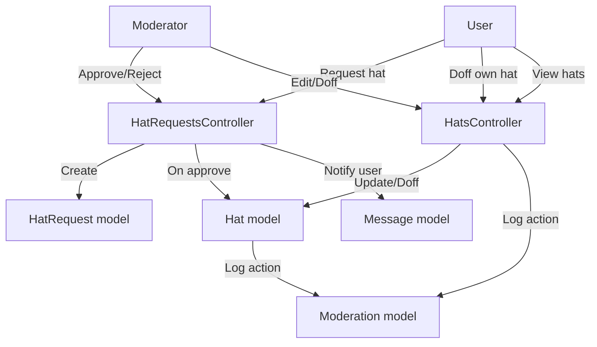
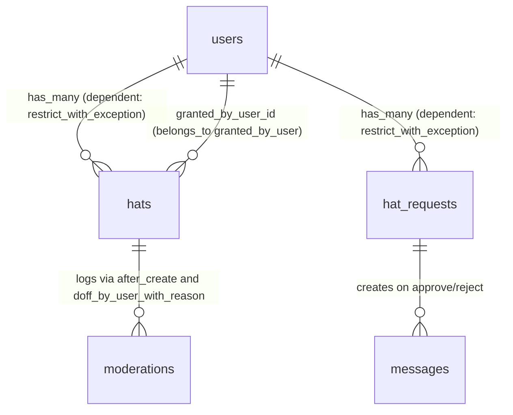
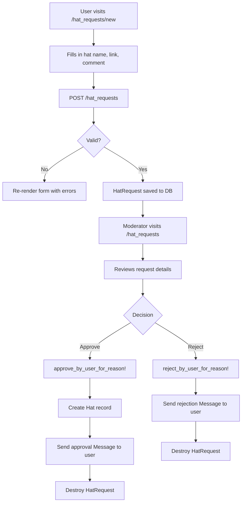
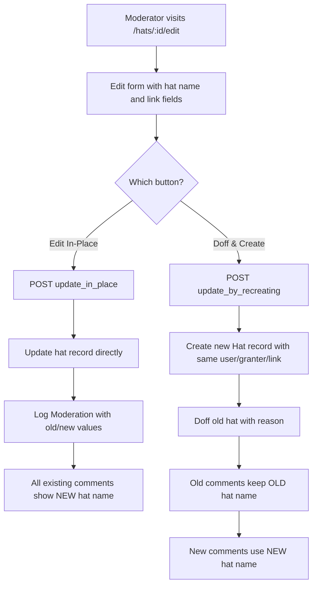

# Hats

> **Status**: Active
> **Generated**: 2026-06-13T00:00:00Z
> **Last Updated**: 2026-06-13T00:00:00Z

---

## Overview

### What It Does
Hats are a formal, verified flair system that allows Lobsters users to post comments or send private messages while officially speaking on behalf of a project, organization, or company. Each user may hold multiple hats but can only wear one at a time on a given comment or message. Hats can be requested by users, approved or rejected by moderators, and "doffed" (retired) when no longer applicable.

### Why It Exists
Lobsters is a community discussion site where credibility and transparency matter. Hats provide a verified way for users to identify themselves as official representatives (e.g., "OpenBSD Developer", "Mozilla Employee") so the community knows when someone is speaking in an official capacity rather than as a private individual.

### Key Capabilities
- Users can request a new hat via a form, providing a hat name, verification link, and private comment for moderators
- Moderators can approve or reject hat requests; approval creates the hat and sends a notification message, rejection sends a message with the reason
- Users and moderators can "doff" (retire) a hat with a reason, which is logged in the moderation log
- Moderators can edit hats in-place (renaming/relinking) or doff-and-recreate them (preserving history on old comments)
- All hat grants, doffs, and edits are recorded as moderation actions
- The public hats index page lists all active hats grouped by hat name, with email addresses sanitized for logged-out visitors

---

## Architecture

### High-Level Design



### Components

#### Backend Components
| Component | File Path | Purpose |
|-----------|-----------|---------|
| HatsController | `app/controllers/hats_controller.rb` | Listing, doffing, and editing hats |
| HatRequestsController | `app/controllers/hat_requests_controller.rb` | Creating, approving, and rejecting hat requests |
| Hat | `app/models/hat.rb` | Hat data model with doffing and moderation logging |
| HatRequest | `app/models/hat_request.rb` | Hat request model with approve/reject workflow |
| HatsHelper | `app/helpers/hats_helper.rb` | View helper for rendering styled hat badges |

#### Views
| Component | File Path | Purpose |
|-----------|-----------|---------|
| Hats Index | `app/views/hats/index.html.erb` | Public listing of all active hats |
| Doff Form | `app/views/hats/doff.html.erb` | Form to doff a hat with a reason |
| Edit Form | `app/views/hats/edit.html.erb` | Moderator form to edit or replace a hat |
| Hat Requests Index | `app/views/hat_requests/index.html.erb` | Moderator view to approve/reject pending requests |
| New Hat Request | `app/views/hat_requests/new.html.erb` | User form to request a new hat |

### Technology Stack
- **Backend**: Ruby on Rails (controllers, models, ERB views)
- **Database**: MySQL (utf8mb4, bigint unsigned PKs)
- **External Services**: None

---

## Model Details

### Hat

**File**: `app/models/hat.rb`

#### Associations
```ruby
belongs_to :user
belongs_to :granted_by_user, class_name: "User", inverse_of: false
```

The `User` model defines the inverse associations:
```ruby
has_many :hats, dependent: :restrict_with_exception
has_many :wearable_hats, -> { where(doffed_at: nil) },
  class_name: "Hat",
  inverse_of: :user
```

#### Concerns
| Concern | Purpose |
|---------|---------|
| `Token` | Auto-assigns an immutable `token` field (via `TypeID`) on `after_initialize` for new records. Validates presence, uniqueness, and max length of 255. Raises `ArgumentError` if token is reassigned. |

#### Callbacks
| Callback | Method | Purpose |
|----------|--------|---------|
| `before_validation` (on: :create) | `:assign_short_id` | Generates a unique `short_id` using `ShortId.new(self.class).generate` |
| `after_create` | `:log_moderation` | Creates a `Moderation` record logging "Granted hat" with optional link |

#### Scopes
| Scope | Definition | Purpose |
|-------|------------|---------|
| `active` | `joins(:user).where(doffed_at: nil).merge(User.active)` | Returns hats that have not been doffed and belong to active users |

#### Validations
```ruby
validates :hat, presence: true
validates :hat, :link, length: {maximum: 255}
validates :modlog_use, inclusion: {in: [true, false]}
validates :short_id, length: {maximum: 10}, presence: true
```

#### Key Methods
| Method | Returns | Purpose | Notes |
|--------|---------|---------|-------|
| `assign_short_id` | `String` | Generates unique short_id for URL use | Called before_validation on create |
| `doff_by_user_with_reason(user, reason)` | `true` | Sets `doffed_at` to current time, creates Moderation log entry | Sets `moderator_user_id` to nil if user is not a moderator |
| `to_txt` | `String` | Returns hat name in parentheses, e.g. `"(OpenBSD) "` | Used for text-only rendering |
| `log_moderation` | `true` | Creates Moderation record for hat grant | Includes link in action text if present |
| `sanitized_link` | `String` | Strips username from email links, returns domain only | Uses `Mail::Address` for email parsing |
| `to_param` | `String` | Returns `short_id` for URL generation | Overrides default `id`-based param |

### HatRequest

**File**: `app/models/hat_request.rb`

#### Associations
```ruby
belongs_to :user
```

The `User` model defines the inverse:
```ruby
has_many :hat_requests, dependent: :restrict_with_exception
```

#### Concerns
| Concern | Purpose |
|---------|---------|
| `Token` | Same as Hat -- auto-assigns immutable token via TypeID |

#### Validations
```ruby
validates :hat, presence: true, length: {maximum: 255}
validates :link, presence: true, length: {maximum: 255}
validates :comment, presence: true, length: {maximum: 65_535}
```

#### Virtual Attributes
```ruby
attr_accessor :rejection_comment
```
Note: `rejection_comment` is declared but not referenced anywhere in the model logic. The rejection reason is passed directly via controller params.

#### Key Methods
| Method | Returns | Purpose | Notes |
|--------|---------|---------|-------|
| `approve_by_user_for_reason!(user, reason)` | N/A | Wraps in transaction: creates Hat, sends approval Message to user, destroys the request | Pads reason body with 20 spaces as a kludge to meet Message minimum character count |
| `reject_by_user_for_reason!(user, reason)` | N/A | Wraps in transaction: sends rejection Message to user, destroys the request | No Hat is created |

---

## Database Schema

### hat_requests

| Column | Type | Default | Null | Notes |
|--------|------|---------|------|-------|
| `id` | `bigint unsigned` | auto-increment | NO | Primary key |
| `created_at` | `datetime` | — | YES | |
| `updated_at` | `datetime` | — | YES | |
| `user_id` | `bigint unsigned` | — | NO | FK to users |
| `hat` | `string` | — | NO | Requested hat name |
| `link` | `string` | — | NO | Verification link or email |
| `comment` | `text` | — | NO | Private comment for moderators |
| `token` | `string` | — | NO | Immutable unique token (TypeID) |

**Indexes:**
- `index_hat_requests_on_token` (unique) on `token`
- `hat_requests_user_id_fk` on `user_id`

### hats

| Column | Type | Default | Null | Notes |
|--------|------|---------|------|-------|
| `id` | `bigint unsigned` | auto-increment | NO | Primary key |
| `created_at` | `datetime` | — | YES | |
| `updated_at` | `datetime` | — | YES | |
| `user_id` | `bigint unsigned` | — | NO | FK to users (hat owner) |
| `granted_by_user_id` | `bigint unsigned` | — | NO | FK to users (moderator who granted) |
| `hat` | `string` | — | NO | Display name of the hat |
| `link` | `string` | — | YES | Verification URL or email |
| `modlog_use` | `boolean` | `false` | NO | Whether hat is for moderation log use |
| `doffed_at` | `datetime` | — | YES | Timestamp when doffed; NULL = active |
| `short_id` | `string(10)` | — | NO | URL-friendly identifier |
| `token` | `string` | — | NO | Immutable unique token (TypeID) |

**Indexes:**
- `hats_granted_by_user_id_fk` on `granted_by_user_id`
- `index_hats_on_token` (unique) on `token`
- `hats_user_id_fk` on `user_id`

### Relationships



---

## API Endpoints

### HatsController

| Method | Path | Action | Description | Auth | Notes |
|--------|------|--------|-------------|------|-------|
| `GET` | `/hats` | `index` | List all active hats grouped by hat name | Public | |
| `GET` | `/hats/:id/edit` | `edit` | Show edit form for a hat | Moderator only | |
| `GET` | `/hats/:id/doff` | `doff` | Show doff confirmation form | Hat owner or moderator | |
| `POST` | `/hats/:id/doff_by_user` | `doff_by_user` | Doff the hat with a reason | Hat owner or moderator | Requires non-blank reason |
| `POST` | `/hats/:id/update_in_place` | `update_in_place` | Rename hat and/or change link in-place | Moderator only | Updates existing record, logs changes |
| `POST` | `/hats/:id/update_by_recreating` | `update_by_recreating` | Doff old hat and create replacement | Moderator only | Old comments keep old hat; new hat is a new record |

### HatRequestsController

| Method | Path | Action | Description | Auth | Notes |
|--------|------|--------|-------------|------|-------|
| `GET` | `/hat_requests` | `index` | List all pending hat requests | Moderator only (via route definition) | |
| `GET` | `/hat_requests/new` | `new` | Show hat request form | Logged-in user | |
| `POST` | `/hat_requests` | `create` | Submit a hat request | Logged-in user | |
| `POST` | `/hat_requests/:id/approve` | `approve` | Approve a request (creates hat + message) | Moderator only | Allows moderator to edit hat/link before approving |
| `POST` | `/hat_requests/:id/reject` | `reject` | Reject a request (sends message) | Moderator only | |

---

## Authorization

Lobsters does not use Pundit. Authorization is handled via `before_action` callbacks in controllers.

### HatsController
| Filter | Actions | Logic |
|--------|---------|-------|
| `require_logged_in_user` | All except `index` | Redirects unauthenticated users |
| `only_hat_user_or_moderator` | `doff`, `doff_by_user` | Checks `@hat.user == @user \|\| @user&.is_moderator?` |
| `require_logged_in_moderator` | `edit`, `update_in_place`, `update_by_recreating` | Only moderators can edit hats |

### HatRequestsController
| Filter | Actions | Logic |
|--------|---------|-------|
| `require_logged_in_user` | All | Must be logged in |
| `require_logged_in_moderator` | `approve`, `reject` | Only moderators can approve/reject |

### Hat Lookup (`find_hat!`)
```ruby
# Source: app/controllers/hats_controller.rb:90-95
def find_hat!
  @hat = if @user.is_moderator?
    Hat.find_by(short_id: params[:id])
  else
    @user.wearable_hats.find_by(short_id: params[:id])
  end
end
```
Moderators can look up any hat; regular users can only look up their own undoffed hats.

---

## Workflows

### Hat Request Lifecycle



### Hat Edit by Moderator (Two Options)



---

## Configuration

No environment variables or config files are specific to the hats feature. Hat behavior is entirely driven by database records and controller logic.

---

## Usage Examples

### Styled Hat Rendering in Views
```ruby
# Source: app/helpers/hats_helper.rb:4-14
def styled_hat(hat)
  hl = hat.link.present? && hat.link.match(/^https?:\/\//)

  if !hl && hat.link.present?
    sanitized_link = " - #{ERB::Util.html_escape(hat.sanitized_link)}"
  end

  content_tag(:span, class: "hat hat_#{hat.hat.gsub(/[^A-Za-z0-9]/, "_").downcase}", title: "Granted #{hat.created_at.strftime("%Y-%m-%d")}#{sanitized_link if sanitized_link}") do
    concat hat_text(hat, hl)
  end
end
```

### Approving a Hat Request (Transaction)
```ruby
# Source: app/models/hat_request.rb:14-31
def approve_by_user_for_reason!(user, reason)
  transaction do
    h = Hat.new
    h.user_id = user_id
    h.granted_by_user_id = user.id
    h.hat = hat
    h.link = link
    h.save!

    m = Message.new
    m.author_user_id = user.id
    m.recipient_user_id = user_id
    m.subject = "Your hat \"#{hat}\" has been approved"
    m.body = reason + (" " * 20) # kludge to ensure there are 20 characters
    m.save!

    destroy!
  end
end
```

### Doffing a Hat
```ruby
# Source: app/models/hat.rb:23-33
def doff_by_user_with_reason(user, reason)
  m = Moderation.new
  m.user_id = user_id
  m.moderator_user_id = user.is_moderator? ? user : nil
  m.action = "Doffed hat \"#{hat}\""
  m.reason = reason
  m.save!

  self.doffed_at = Time.current
  save!
end
```

---

## Testing

### Test Files
- `spec/models/hat_spec.rb` -- Validates presence/length of hat and link fields, tests `sanitized_link` for email addresses
- `spec/models/hat_request_spec.rb` -- Validates length limits on hat, link, and comment fields
- `spec/features/hats_spec.rb` -- Integration tests: logged-out users see sanitized emails, logged-in users see full links
- `spec/features/hat_request_spec.rb` -- Integration tests: moderator approving and rejecting hat requests, verifies Hat/Message creation
- `spec/features/doff_hat_spec.rb` -- Integration test: user doffs own hat with reason, verifies Moderation log entry
- `spec/features/edit_hat_spec.rb` -- Integration tests: moderator edits hat in-place and doff-and-recreate, verifies comment hat association preservation
- `spec/factories/hat.rb` -- Factory for Hat model
- `spec/factories/hat_request.rb` -- Factory for HatRequest model

---

## Known Issues & Caveats

| Issue | Location | Description |
|-------|----------|-------------|
| Unused virtual attribute | `app/models/hat_request.rb:12` | `attr_accessor :rejection_comment` is declared but never used in model logic; rejection reason flows through controller params directly |
| Message body padding kludge | `app/models/hat_request.rb:27` | `reason + (" " * 20)` -- pads the approval message body with 20 spaces to meet an assumed minimum character count on Message |
| `moderator_user_id` set to User object | `app/controllers/hats_controller.rb:43` | `m.moderator_user_id = @user` assigns a User object rather than an integer ID; relies on Rails implicit conversion |
| No CSRF-safe HTTP method for mutations | `config/routes.rb:229-232` | `update_in_place` and `update_by_recreating` use `POST` rather than `PATCH`/`PUT`; functional but unconventional |
| Email link shown to logged-in users | `app/views/hats/index.html.erb:33` | Logged-in users see raw email addresses in hat links; only logged-out visitors get sanitized domain-only display |

---

## Performance

### Database Optimization
- **Indexes on `hats`**: `hats_user_id_fk`, `hats_granted_by_user_id_fk`, `index_hats_on_token` (unique)
- **Indexes on `hat_requests`**: `hat_requests_user_id_fk`, `index_hat_requests_on_token` (unique)
- The `active` scope uses `joins(:user)` and `includes(:user)` is called in the controller's `index` action for eager loading
- `find_each` is used in the index action to batch-load hats, avoiding loading all records into memory at once

---

## Troubleshooting

### Common Issues

#### Issue: User cannot see their hat on the doff page
**Symptoms:**
- User navigates to `/hats/:id/doff` but gets redirected to their profile

**Cause:**
The `find_hat!` method scopes non-moderator lookups to `wearable_hats` (where `doffed_at: nil`). If the hat is already doffed, it cannot be found.

**Solution:**
Only active (undoffed) hats can be doffed. If the hat is already doffed, no action is needed.

#### Issue: Hat request approval message appears to have trailing whitespace
**Symptoms:**
- The approval notification message body has trailing spaces

**Cause:**
`approve_by_user_for_reason!` pads the reason with 20 spaces (`reason + (" " * 20)`) to satisfy a minimum character validation on the Message model.

**Solution:**
This is intentional behavior (documented as a "kludge" in source). No fix needed unless the Message model validation is changed.

---

## Related Features

- **[moderation](./catalog.md)** -- All hat grants, doffs, and edits create Moderation log entries
- **[messages](./catalog.md)** -- Hat request approvals and rejections send Messages to the requesting user
- **[users](./catalog.md)** -- Hats belong to users; wearable hats appear on user profiles and can be selected when posting comments

---

**Generated:** 2026-06-13T00:00:00Z
**Last Updated:** 2026-06-13T00:00:00Z
**Status:** Active
