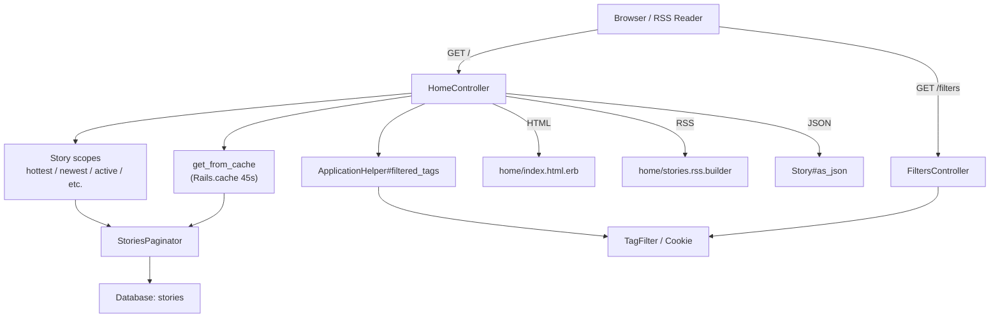
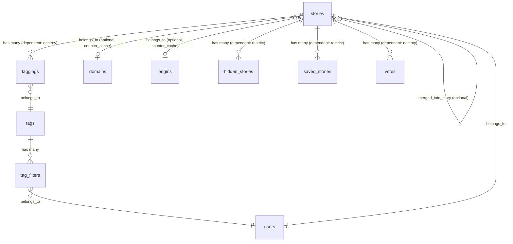
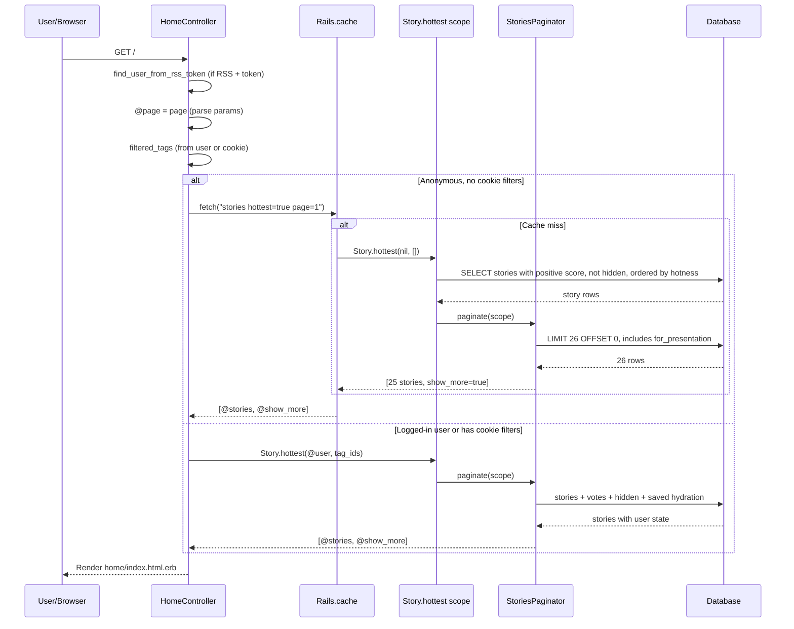

# Home Feed

> **Status**: Active
> **Generated**: 2026-06-13T00:00:00Z
> **Last Updated**: 2026-06-13T00:00:00Z

---

## Overview

### What It Does
The home feed is the primary content consumption surface of Lobsters. It serves multiple curated views of submitted stories: hottest (the homepage default), newest, active discussions, recent (stories that have not yet reached the front page), top (by time interval), saved, hidden, upvoted, filtered by tag, filtered by category, filtered by domain, and filtered by origin. Each feed applies tag filtering (either from the logged-in user's persisted tag filters or from a cookie for anonymous visitors) and supports HTML, JSON, and RSS output formats.

### Why It Exists
Users need different lenses for browsing content. The hottest feed surfaces high-quality stories via a hotness algorithm; the newest feed shows chronological submissions; the active feed highlights ongoing discussions; the recent feed catches stories that missed the front page; and the top feed allows time-bounded ranking. Tag filtering lets users hide topics they do not want to see.

### Key Capabilities
- Multiple feed algorithms: hottest, newest, active, recent, top (configurable time window), by-tag, by-category, by-domain, by-origin, by-user
- Per-user tag filtering persisted in `tag_filters` table; cookie-based filtering for anonymous visitors
- RSS feeds with optional private token-based authentication
- Page caching for anonymous visitors without tag filters (via `caches_page`)
- In-memory Rails cache (45-second TTL) for story lists when no user session
- Pagination at 25 stories per page with "show more" detection
- "Last Read" marker on the newest feed tracking where the user left off

---

## Architecture

### High-Level Design



### Components

#### Backend Components

| Component | File Path | Purpose |
|-----------|-----------|---------|
| HomeController | `app/controllers/home_controller.rb` | Serves all feed endpoints (index, newest, active, recent, top, saved, hidden, upvoted, single_tag, multi_tag, category, for_domain, for_origin, newest_by_user) |
| FiltersController | `app/controllers/filters_controller.rb` | Displays and updates user tag filters |
| StoryFinder concern | `app/controllers/concerns/story_finder.rb` | Finds a story by short_id (used by other controllers, listed in catalog for completeness) |
| Keystore model | `app/models/keystore.rb` | Key-value store used for caching counters and readthrough caching on the hot path |
| StoriesPaginator | `app/models/stories_paginator.rb` | Paginates story scopes (25 per page), hydrates current user votes/hidden/saved state |
| Story model (scopes) | `app/models/story.rb` | Defines all feed query scopes: `hottest`, `newest`, `active`, `recent`, `top`, `tagged`, `categories`, `saved`, `hidden`, `newest_by_user`, `base`, `for_presentation` |
| TagFilter model | `app/models/tag_filter.rb` | Join model between users and tags for persistent tag filtering |
| IntervalHelper | `app/helpers/interval_helper.rb` | Parses and validates time interval parameters for the `/top` feed |
| ApplicationHelper#filtered_tags | `app/helpers/application_helper.rb` | Resolves filtered tags from user record or cookie |

#### View Components

| Component | File Path | Purpose |
|-----------|-----------|---------|
| index.html.erb | `app/views/home/index.html.erb` | Main story list template with inline partial for story detail rendering |
| stories.rss.builder | `app/views/home/stories.rss.builder` | RSS 2.0 feed builder |
| _active.html.erb | `app/views/home/_active.html.erb` | Header partial for active discussions feed |
| _category.html.erb | `app/views/home/_category.html.erb` | Header partial for category-filtered feed |
| _for_domain.html.erb | `app/views/home/_for_domain.html.erb` | Header partial for domain-filtered feed |
| _for_origin.html.erb | `app/views/home/_for_origin.html.erb` | Header partial for origin-filtered feed |
| _multi_tag.html.erb | `app/views/home/_multi_tag.html.erb` | Header partial for multi-tag filtered feed |
| _newest_by_user.html.erb | `app/views/home/_newest_by_user.html.erb` | Header partial for per-user newest feed |
| _recent.html.erb | `app/views/home/_recent.html.erb` | Footer partial explaining recent feed |
| _single_tag.html.erb | `app/views/home/_single_tag.html.erb` | Header partial for single-tag filtered feed with related tags |
| _top.html.erb | `app/views/home/_top.html.erb` | Footer partial with URL-editing hint for time intervals |
| filters/index.html.erb | `app/views/filters/index.html.erb` | Tag filter management UI with checkboxes |

### Technology Stack
- **Backend**: Ruby on Rails, ActiveRecord scopes for query composition
- **Frontend**: Server-rendered ERB templates, RSS XML builder
- **Database**: MySQL/MariaDB (utf8mb4)
- **Caching**: Rails page caching (`caches_page`) + `Rails.cache` (45s TTL for story lists) + `Rails.cache` (2min TTL for public RSS) + `Rails.cache` (1 day for related tags)

---

## Model Details

### Story (feed-relevant scopes only)

The Story model defines all the query scopes that power every feed. Each scope composes from `base`, which handles deletion filtering, merge filtering, and moderator preloading.

#### Key Scopes

```ruby
# Source: app/models/story.rb:61-204

scope :base, ->(user, unmerged: true) {
  q = includes(:hidings, :story_text, :user).not_deleted(user).mod_preload?(user)
  q = q.unmerged if unmerged
  q
}
scope :for_presentation, -> {
  includes(:domain, :origin, :hidings, :user, :tags, taggings: :tag)
}
scope :hottest, ->(user = nil, exclude_tags = nil) {
  base(user).not_hidden_by(user)
    .filter_tags(exclude_tags || [])
    .positive_ranked
    .order(:hotness)
}
scope :newest, ->(user, exclude_tags = nil) {
  base(user, unmerged: false)
    .filter_tags(exclude_tags || [])
    .order(id: :desc)
}
scope :active, ->(user, exclude_tags = []) {
  base(user)
    .where.not(id: hidden_by(user).select(:id))
    .filter_tags(exclude_tags)
    .order(last_comment_at: :desc)
}
scope :recent, ->(user = nil, exclude_tags = nil, unmerged: true) {
  base(user, unmerged: unmerged).not_hidden_by(user)
    .filter_tags(exclude_tags || [])
    .low_scoring
    .where("created_at >= ?", 10.days.ago)
    .where.not(id: front_page.ids)
    .order("stories.created_at DESC")
}
scope :top, ->(user, length, exclude_tags = nil) {
  raise ArgumentError, "Invalid interval" unless IntervalHelper::TIME_INTERVALS.value?(length[:intv].capitalize)

  top = base(user)
    .where("created_at >= (NOW() - INTERVAL ? #{length[:intv].upcase})", length[:dur])
    .filter_tags(exclude_tags || [])
  top.order(score: :desc)
}
scope :saved, ->(user, exclude_tags = []) {
  base(user)
    .saved_by(user)
    .filter_tags(exclude_tags)
    .order(:hotness)
}
scope :hidden, ->(user, exclude_tags = nil) {
  base(user)
    .hidden_by(user)
    .filter_tags(exclude_tags || [])
    .order(:hotness)
}
scope :tagged, ->(user, tags) {
  base(user)
    .positive_ranked
    .where(
      Tagging
        .where("story_id = stories.id")
        .where(tag_id: tags)
        .arel.exists
    )
    .order(created_at: :desc)
}
scope :categories, ->(user, categories) {
  base(user)
    .positive_ranked
    .where(
      Tagging
        .joins(:tag)
        .where("story_id = stories.id")
        .where(tag: {category_id: categories})
        .arel.exists
    )
    .order(created_at: :desc)
}
scope :newest_by_user, ->(user, submitter) {
  where(user: submitter)
    .includes(:tags)
    .not_deleted(user)
    .mod_preload?(user)
    .order(id: :desc)
}
```

#### Hotness Algorithm

```ruby
# Source: app/models/story.rb:547-577
def calculated_hotness
  # take each tag's hotness modifier into effect, and give a slight bump to
  # stories submitted by the author
  base = tags.sum(:hotness_mod) + ((user_is_author? && url.present?) ? 0.25 : 0.0)

  # give a story's comment votes some weight, ignoring submitter's comments
  cpoints = if base < 0
    0
  else
    merged_comments.where.not(user_id: user_id).sum("comments.score + 1").to_f * 0.5
  end

  # mix in any stories this one cannibalized
  cpoints += merged_stories.map(&:score).inject(&:+).to_f

  # if a story has many comments but few votes, it's probably a bad story, so
  # cap the comment points at the number of upvotes
  cpoints = [self.score, cpoints].min

  # don't immediately kill stories at 0 by bumping up score by one
  order = Math.log([(score + 1).abs + cpoints, 1].max, 10)
  sign = if score > 0
    1
  elsif score < 0
    -1
  else
    0
  end

  -((order * sign) + base + ((created_at || Time.current).to_f / HOTNESS_WINDOW)).round(7)
end
```

The hotness value is stored negated so that `ORDER BY hotness ASC` returns the hottest stories first. `HOTNESS_WINDOW` is `60 * 60 * 22` (22 hours).

### StoriesPaginator

```ruby
# Source: app/models/stories_paginator.rb:1-50
class StoriesPaginator
  attr_accessor :per_page

  STORIES_PER_PAGE = 25

  def initialize(scope, page = 1, user = nil)
    @scope = scope
    @page = page
    @user = user
    @per_page = STORIES_PER_PAGE
  end

  def get
    with_pagination_info @scope.limit(per_page + 1)
      .offset((@page - 1) * per_page)
      .for_presentation
  end

  private

  def with_pagination_info(scope)
    scope = scope.to_a
    show_more = scope.count > per_page
    scope.pop if show_more

    [cache_votes(scope), show_more]
  end

  def cache_votes(scope)
    if @user
      votes = Vote.votes_by_user_for_stories_hash(@user.id, scope.map(&:id))

      hs = HiddenStory.where(user_id: @user.id, story_id: scope.map(&:id)).map(&:story_id)
      ss = SavedStory.where(user_id: @user.id, story_id: scope.map(&:id)).map(&:story_id)

      scope.each do |s|
        s.current_vote = votes[s.id]
        if hs.include?(s.id)
          s.is_hidden_by_cur_user = true
        end
        if ss.include?(s.id)
          s.is_saved_by_cur_user = true
        end
      end
    end
    scope
  end
end
```

Fetches `per_page + 1` rows to detect whether a "next page" exists, then pops the extra row. For logged-in users, it batch-loads votes, hidden status, and saved status in three queries to avoid N+1.

### Keystore

#### Associations
None. `Keystore` is a standalone key-value store with `key` as the primary key.

#### Key Methods

| Method | Returns | Purpose | Notes |
|--------|---------|---------|-------|
| `.get(key)` | `Keystore` or `nil` | Find record by key | |
| `.value_for(key)` | `Integer` or `nil` | Pluck value column | |
| `.put(key, value)` | `true` | Upsert a key-value pair | |
| `.increment_value_for(key, amount)` | `Integer` | Atomic increment via upsert | |
| `.readthrough_cache(key, &blk)` | value | Read-through cache without locking | Deliberately no lock/transaction -- on hot path |

### TagFilter

```ruby
# Source: app/models/tag_filter.rb:1-6
class TagFilter < ApplicationRecord
  belongs_to :tag
  belongs_to :user
end
```

### IntervalHelper

```ruby
# Source: app/helpers/interval_helper.rb:1-30
module IntervalHelper
  PLACEHOLDER = {param: "1w", dur: 1, intv: "Week", human: "week", placeholder: true}
  TIME_INTERVALS = {"h" => "Hour",
                    "d" => "Day",
                    "w" => "Week",
                    "m" => "Month",
                    "y" => "Year"}.freeze

  def time_interval(param)
    if (m = param.to_s.match(/\A(\d+)([#{TIME_INTERVALS.keys.join}])\z/))
      dur = m[1].to_i
      return PLACEHOLDER unless dur > 0
      return PLACEHOLDER unless TIME_INTERVALS.include? m[2]
      intv = TIME_INTERVALS[m[2]]
      {
        param: "#{dur}#{m[2]}",
        dur: dur,
        intv: intv,
        human: "#{dur unless dur == 1} #{intv}".downcase.pluralize(dur).chomp,
        placeholder: false
      }
    else
      PLACEHOLDER
    end
  end
end
```

---

## Database Schema

### stories

| Column | Type | Default | Notes |
|--------|------|---------|-------|
| `id` | `bigint unsigned` | auto | Primary key |
| `created_at` | `datetime` | | |
| `user_id` | `bigint unsigned` | | NOT NULL, FK to users |
| `url` | `varchar(250)` | `""` | |
| `normalized_url` | `varchar(255)` | | For duplicate detection |
| `title` | `varchar(150)` | `""` | NOT NULL |
| `description` | `text` | | |
| `short_id` | `varchar(6)` | `""` | NOT NULL, unique |
| `is_deleted` | `boolean` | `false` | NOT NULL |
| `score` | `integer` | `1` | NOT NULL |
| `flags` | `integer unsigned` | `0` | NOT NULL |
| `is_moderated` | `boolean` | `false` | NOT NULL |
| `hotness` | `decimal(20,10)` | `0.0` | NOT NULL, indexed |
| `markeddown_description` | `mediumtext` | | |
| `comments_count` | `integer` | `0` | NOT NULL, cached counter |
| `merged_story_id` | `bigint unsigned` | | FK to stories (self-referential) |
| `unavailable_at` | `datetime` | | |
| `twitter_id` | `varchar(20)` | | |
| `user_is_author` | `boolean` | `false` | NOT NULL |
| `user_is_following` | `boolean` | `false` | NOT NULL |
| `domain_id` | `bigint` | | FK to domains |
| `mastodon_id` | `varchar(25)` | | |
| `origin_id` | `bigint` | | FK to origins |
| `last_comment_at` | `datetime` | | Used by `active` scope ordering |
| `stories_count` | `integer` | `0` | NOT NULL, merged stories counter cache |
| `updated_at` | `datetime` | | NOT NULL |
| `last_edited_at` | `datetime` | | NOT NULL |
| `token` | `varchar` | | NOT NULL, unique |

**Indexes:** `created_at`, `domain_id`, `hotness` (hotness_idx), `(id, is_deleted)`, `last_comment_at`, `mastodon_id`, `merged_story_id`, `normalized_url`, `origin_id`, `score`, `short_id` (unique), `token` (unique), `url` (length: 191), `user_id`

### keystores

| Column | Type | Default | Notes |
|--------|------|---------|-------|
| `id` | `bigint unsigned` | auto | NOT NULL (explicit validation) |
| `key` | `varchar(50)` | `""` | NOT NULL, unique, primary key |
| `value` | `bigint` | | |

### tag_filters

| Column | Type | Default | Notes |
|--------|------|---------|-------|
| `id` | `bigint unsigned` | auto | Primary key |
| `created_at` | `datetime` | | NOT NULL |
| `updated_at` | `datetime` | | NOT NULL |
| `user_id` | `bigint unsigned` | | NOT NULL, FK to users |
| `tag_id` | `bigint unsigned` | | NOT NULL, FK to tags |

**Indexes:** `tag_id`, `(user_id, tag_id)` (user_tag_idx)

### Relationships



---

## API Endpoints

| Method | Path | Action | Description | Auth Required | Formats |
|--------|------|--------|-------------|---------------|---------|
| `GET` | `/` | `home#index` | Hottest stories (homepage) | No | HTML, RSS, JSON |
| `GET` | `/page/:page` | `home#index` | Hottest stories paginated | No | HTML |
| `GET` | `/rss` | `home#index` | Hottest stories RSS | No | RSS |
| `GET` | `/hottest` | `home#index` | Hottest stories JSON | No | JSON |
| `GET` | `/newest` | `home#newest` | Newest stories | No | HTML, RSS, JSON |
| `GET` | `/newest/page/:page` | `home#newest` | Newest stories paginated | No | HTML |
| `GET` | `/active` | `home#active` | Active discussions | No | HTML, JSON |
| `GET` | `/active/page/:page` | `home#active` | Active discussions paginated | No | HTML |
| `GET` | `/recent` | `home#recent` | Recent stories not on front page | No | HTML |
| `GET` | `/recent/page/:page` | `home#recent` | Recent stories paginated | No | HTML |
| `GET` | `/top(/:length)` | `home#top` | Top stories by time interval | No | HTML, RSS |
| `GET` | `/top(/:length)/rss` | `home#top` | Top stories RSS | No | RSS |
| `GET` | `/hidden` | `home#hidden` | User's hidden stories | Yes | HTML |
| `GET` | `/hidden/page/:page` | `home#hidden` | Hidden stories paginated | Yes | HTML |
| `GET` | `/saved` | `home#saved` | User's saved stories | Yes | HTML, RSS, JSON |
| `GET` | `/saved/page/:page` | `home#saved` | Saved stories paginated | Yes | HTML |
| `GET` | `/upvoted/stories` | `home#upvoted` | User's upvoted stories | Yes | HTML, RSS, JSON |
| `GET` | `/upvoted/stories/page/:page` | `home#upvoted` | Upvoted stories paginated | Yes | HTML |
| `GET` | `/t/:tag` | `home#single_tag` | Stories with a single tag | No | HTML, RSS, JSON |
| `GET` | `/t/:tag/page/:page` | `home#single_tag` | Single tag paginated | No | HTML |
| `GET` | `/t/:tag` (comma-separated) | `home#multi_tag` | Stories matching any of multiple tags | No | HTML, RSS, JSON |
| `GET` | `/t/:tag/page/:page` (comma) | `home#multi_tag` | Multi-tag paginated | No | HTML |
| `GET` | `/categories/:category` | `home#category` | Stories in category(ies) | No | HTML, RSS, JSON |
| `GET` | `/domains/:id` | `home#for_domain` | Stories from a domain | No | HTML, RSS, JSON |
| `GET` | `/domains/:id/page/:page` | `home#for_domain` | Domain stories paginated | No | HTML |
| `GET` | `/origins/:identifier` | `home#for_origin` | Stories from an origin | No | HTML, RSS, JSON |
| `GET` | `/~:user/stories` | `home#newest_by_user` | Newest stories by a specific user | No | HTML, RSS, JSON |
| `GET` | `/filters` | `filters#index` | Show tag filter UI | No (cookie) / Yes (DB) | HTML |
| `POST` | `/filters` | `filters#update` | Save tag filters | No (cookie) / Yes (DB) | HTML |

---

## Request Flow

### Homepage Request (Hottest Feed)



---

## Caching Strategy

### Page-Level Caching
```ruby
# Source: app/controllers/home_controller.rb:6
caches_page :active, :category, :for_domain, :for_origin, :index, :multi_tag, :newest, :newest_by_user, :recent, :single_tag, :top, if: CACHE_PAGE
```

The `CACHE_PAGE` proc (defined in `ApplicationController`) only allows page caching when there is no logged-in user AND no tag filter cookie:
```ruby
# Source: app/controllers/application_controller.rb:19
CACHE_PAGE = proc { @user.blank? && cookies[TAG_FILTER_COOKIE].blank? }
```

### Application-Level Caching
```ruby
# Source: app/controllers/home_controller.rb:373-386
def get_from_cache(opts = {}, &)
  # don't cache if there's a user because they can have hidden stories; visitors can filter tags by cookie
  if Rails.env.development? || @user || filtered_tags.any?
    yield
  else
    key = opts.merge(page: page).sort.map { |k, v| "#{k}=#{v.to_param}" }.join(" ")
    begin
      Rails.cache.fetch("stories #{key}", expires_in: 45, &)
    rescue Errno::ENOENT => e
      # Rails.logger.error "error fetching stories #{key}: #{e}"
      yield
    end
  end
end
```

- **Story lists**: 45-second TTL, only for anonymous visitors without tag filters
- **Public RSS**: 2-minute TTL (`Rails.cache.fetch("rss", expires_in: (60 * 2))`)
- **Related tags**: 1-day TTL (`Rails.cache.fetch("related_#{@tag.tag}", expires_in: 1.day)`)

---

## Tag Filtering

### How Filtered Tags Are Resolved

```ruby
# Source: app/helpers/application_helper.rb:85-93
def filtered_tags
  @_filtered_tags ||= if @user
    @user.tag_filter_tags
  else
    Tag.where(
      tag: cookies[ApplicationController::TAG_FILTER_COOKIE].to_s.split(",")
    )
  end
end
```

For logged-in users, filtered tags come from the `tag_filters` join table. For anonymous visitors, they come from a comma-separated permanent cookie named `:tag_filters`.

### FiltersController

```ruby
# Source: app/controllers/filters_controller.rb:1-38
class FiltersController < ApplicationController
  before_action :authenticate_user
  before_action :show_title_h1

  # Keep session alive until `update` for CSRF token verification to succeed
  skip_after_action :clear_session_cookie, only: [:index]

  def index
    @title = "Filtered Tags"

    @categories = Category.includes(:tags)
      .where(tags: {active: true})
      .order([categories: {category: :asc}, tags: {tag: :asc}])

    # perf: three queries is much faster than joining, grouping on tags.id for counts
    @story_counts = Tagging.group(:tag_id).count
    @filter_counts = TagFilter.group(:tag_id).count

    @filtered_tags = filtered_tags.index_by(&:id)
  end

  def update
    new_tags = Tag.active.where(tag: (params[:tags] || {}).keys).to_a
    new_tags.keep_if { |t| t.user_can_filter? @user }

    if @user
      @user.tag_filter_tags = new_tags
    else
      cookies.permanent[TAG_FILTER_COOKIE] = new_tags.map(&:tag).join(",")
    end

    flash[:success] = "Your filters have been updated."

    redirect_to filters_path
  end
end
```

---

## Authorization

No Pundit policies are used. Authorization is handled directly via `before_action` callbacks:

| Endpoint | Requirement | Mechanism |
|----------|-------------|-----------|
| `hidden`, `saved`, `upvoted` | Logged-in user | `before_action :require_logged_in_user` |
| `filters#index`, `filters#update` | Logged-in user (for DB persistence; cookie fallback for anonymous) | `before_action :authenticate_user` |
| All other feeds | Public access | No auth required |
| RSS with token | Optional user identification | `before_action :find_user_from_rss_token` |

---

## Configuration

### Constants

| Constant | Location | Value | Purpose |
|----------|----------|-------|---------|
| `STORIES_PER_PAGE` | `StoriesPaginator` | `25` | Stories per page across all feeds |
| `HOTNESS_WINDOW` | `Story` | `79200` (22 hours) | Time decay window for hotness calculation |
| `TAG_FILTER_COOKIE` | `ApplicationController` | `:tag_filters` | Cookie name for anonymous tag filters |
| `CACHE_PAGE` | `ApplicationController` | proc | Condition for full-page caching |
| `TIME_INTERVALS` | `IntervalHelper` | `{"h"=>"Hour","d"=>"Day","w"=>"Week","m"=>"Month","y"=>"Year"}` | Allowed time intervals for `/top` |

---

## Testing

### Test Files
- `spec/controllers/home_controller_spec.rb`

### Key Test Cases
- `#for_domain` -- returns stories for a given domain
- `#upvoted` -- redirects unauthenticated users; supports session-based and token-based RSS access
- `#hidden` -- redirects unauthenticated users; does not list non-hidden stories; lists hidden stories
- `#active` -- shows recent unhidden stories, excludes hidden stories
- `#index` -- includes positive-score non-hidden stories, excludes hidden and negative-score stories
- `#newest_by_user` -- includes stories from the specified user
- `#saved` -- includes only saved stories
- `#single_tag` -- includes only stories with the specified tag
- `#multi_tag` -- includes stories with any of the specified tags, excludes untagged stories
- `#top` -- redirects `/top` to `/top/1w`; redirects `/top/rss` to `/top/1w.rss`; serves HTML and RSS for `/top/1w`; paginates correctly
- `#category` -- shows stories for specified categories; raises RecordNotFound for unknown categories
- `/recent.rss` -- returns 404 (format not supported)

---

## Known Issues & Caveats

| Issue | Location | Description |
|-------|----------|-------------|
| Commented-out error logging | `home_controller.rb:382` | `Rails.logger.error` for cache fetch failures is commented out |
| Race condition in hotness | `story.rb:688-689` | Comment documents a race condition: if two votes arrive simultaneously, the second may not account for the first's score change in `calculated_hotness` |
| `recent` feed excludes front page IDs in-memory | `story.rb:129` | `where.not(id: front_page.ids)` executes a subquery to get current front page IDs, which means the recent feed definition is sensitive to concurrent front page changes |
| `Errno::ENOENT` rescue in cache | `home_controller.rb:381` | Cache fetches rescue `Errno::ENOENT` and silently fall through to a fresh query -- indicates potential file-based cache reliability issues |
| `StoryFinder` concern mapped but unused by HomeController | `app/controllers/concerns/story_finder.rb` | Listed in the catalog for `home-feed` but is actually `include`d by `StoriesController` and `CommentsController`, not by `HomeController` |

---

## Performance

### Optimization Strategies
- **Page caching** for anonymous visitors without filters (served directly by web server, bypasses Rails)
- **In-memory story cache** (45s TTL) for anonymous visitors with no cookie filters
- **Batch vote/hidden/saved hydration** in `StoriesPaginator#cache_votes` avoids N+1 queries
- **Eager loading** via `for_presentation` scope includes domain, origin, user, tags, taggings
- **`Keystore.readthrough_cache`** deliberately avoids locking for hot-path reads

### Database Optimization
- `hotness_idx` on `stories.hotness` -- critical for the default homepage sort
- `index_stories_on_created_at` -- used by newest, recent, top scopes
- `index_stories_on_last_comment_at` -- used by active scope ordering
- `index_stories_on_score` -- used by top scope ordering
- `(id, is_deleted)` composite index -- used by `not_deleted` scope
- `user_tag_idx` on `tag_filters(user_id, tag_id)` -- fast tag filter lookups

---

## Related Features

- **[stories](./catalog.md)** -- Story submission, display, and the Story model that defines all feed scopes
- **[comments](./catalog.md)** -- Comments drive the `active` feed ordering and `comments_count` display
- **[tags-categories](./catalog.md)** -- Tags and categories power tag-filtered and category-filtered feeds
- **[domains-origins](./catalog.md)** -- Domain and origin models power the `for_domain` and `for_origin` feeds

---

**Generated:** 2026-06-13T00:00:00Z
**Last Updated:** 2026-06-13T00:00:00Z
**Status:** Active
