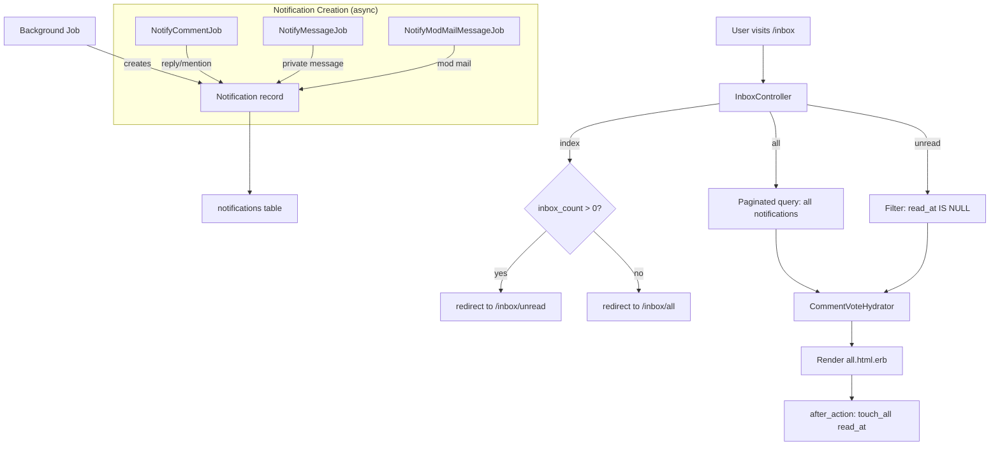
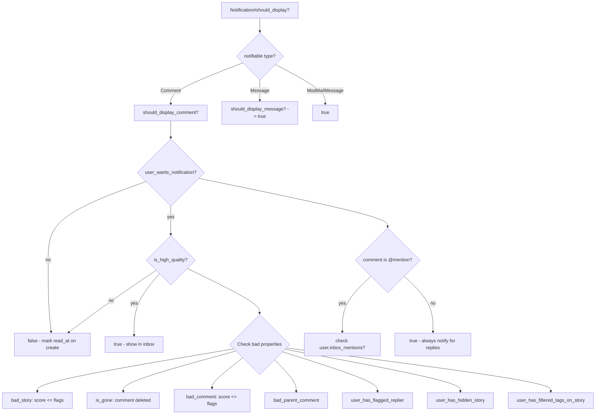
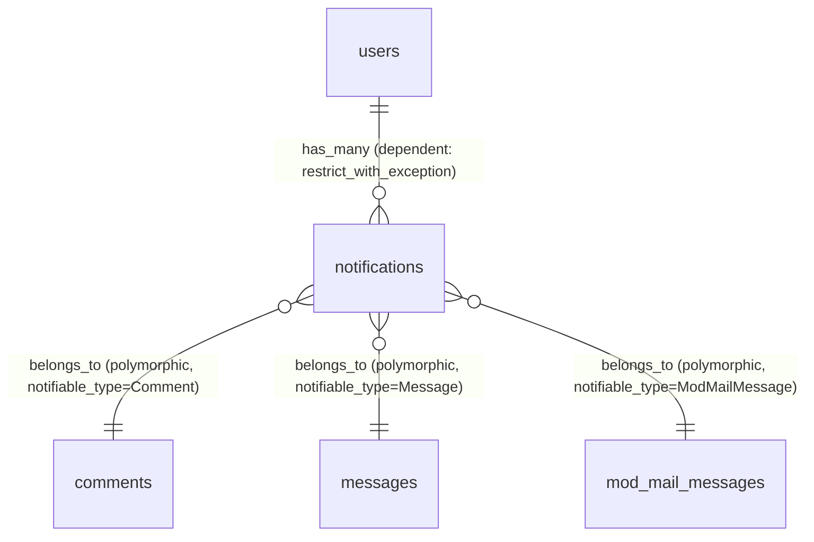

# Inbox Notifications

> **Status**: Active
> **Generated**: 2026-06-13T00:00:00Z
> **Last Updated**: 2026-06-13T00:00:00Z

---

## Overview

### What It Does
The inbox-notifications feature provides a unified inbox where logged-in users can view all their notifications in one place. Notifications are polymorphic -- they can represent comment replies, @-mentions, private messages, or moderator mail messages. The inbox supports paginated "all" and "unread" views, automatically marks notifications as read when viewed, and filters out low-quality or unwanted notifications before display.

### Why It Exists
Users need a single location to track all interactions directed at them: replies to their comments, mentions of their username, private messages, and mod mail. Without a unified inbox, users would have to check multiple separate pages to stay current.

### Key Capabilities
- Unified inbox aggregating Comment, Message, and ModMailMessage notifications
- Unread notification count displayed in the site header (badge)
- Automatic read-tracking: viewing the inbox marks all displayed notifications as read via `touch_all(:read_at)`
- Smart filtering: notifications are suppressed for low-quality content (flagged stories/comments, hidden stories, filtered tags, flagged repliers)
- User preference for mention notifications (`inbox_mentions` setting)
- Pagination (25 notifications per page) on the "all" view
- JSON API responses for both `all` and `unread` endpoints
- Vote hydration on comment notifications for consistent vote display
- Backstop mailbox that bounces unroutable inbound emails

---

## Architecture

### High-Level Design



### Notification Quality Filter Flow



### Components

#### Backend Components
| Component | File Path | Purpose |
|-----------|-----------|---------|
| InboxController | `app/controllers/inbox_controller.rb` | Handles inbox routing, pagination, read-tracking |
| Notification | `app/models/notification.rb` | Polymorphic notification model with quality filtering |
| BackstopMailbox | `app/mailboxes/backstop_mailbox.rb` | Catches unroutable inbound emails and bounces them |
| NotifyCommentJob | `app/jobs/notify_comment_job.rb` | Creates notifications for comment replies and @-mentions |
| NotifyMessageJob | `app/jobs/notify_message_job.rb` | Creates notifications for private messages |
| NotifyModMailMessageJob | `app/jobs/notify_mod_mail_message_job.rb` | Creates notifications for mod mail messages |
| CommentVoteHydrator | `app/models/comment_vote_hydrator.rb` | Batch-loads vote data for comment notifications |
| User#inbox_count | `app/models/user.rb` (line 625) | Memoized count of unread notifications |

#### View Components
| Component | File Path | Purpose |
|-----------|-----------|---------|
| all.html.erb | `app/views/inbox/all.html.erb` | Main inbox view (used for both "all" and "unread") |
| _message.html.erb | `app/views/inbox/_message.html.erb` | Partial for rendering Message notifications |
| _mod_mail_message.html.erb | `app/views/inbox/_mod_mail_message.html.erb` | Partial for rendering ModMailMessage notifications |
| _subnav.html.erb | `app/views/messages/_subnav.html.erb` | Shared sub-navigation (Inbox, Unread, Messages, Sent, ModMail) |

### Technology Stack
- **Backend**: Ruby on Rails (ActionController, ActiveRecord, ActiveJob, Action Mailbox)
- **Frontend**: Server-rendered ERB templates
- **Database**: MySQL (utf8mb4)
- **Background Jobs**: ActiveJob (queue: `default`)
- **Inbound Email**: Action Mailbox with backstop routing

---

## Model Details

### Notification

#### Associations
```ruby
# Source: app/models/notification.rb
belongs_to :user
belongs_to :notifiable, polymorphic: true
```

#### Concerns
| Concern | Purpose |
|---------|---------|
| `Token` | Auto-generates an immutable TypeID-based token on `after_initialize`; validates presence, uniqueness, and max length (255) |

#### Callbacks
| Callback | Method | Purpose |
|----------|--------|---------|
| `before_validation` (on: :create) | inline block | Sets `read_at` to `Time.current` if `should_display?` returns false, effectively pre-marking unwanted notifications as read |

#### Validations
```ruby
# Source: app/models/notification.rb
validates :user_id, uniqueness: {scope: [:notifiable_type, :notifiable_id]}
validates :notifiable_type, presence: true, length: {maximum: 255}
```

#### Scopes
```ruby
# Source: app/models/notification.rb
scope :of_comments, -> { where(notifiable_type: "Comment") }
scope :of_messages, -> { where(notifiable_type: "Message") }
scope :of_mod_mail_messages, -> { where(notifiable_type: "ModMailMessage") }
scope :read, -> { where.not(read_at: nil) }
scope :unread, -> { where(read_at: nil) }
```

#### Key Methods
| Method | Returns | Purpose | Notes |
|--------|---------|---------|-------|
| `should_display?` | `Boolean` | Dispatches to type-specific display checks | Returns `true` for ModMailMessage, delegates for Comment and Message |
| `should_display_message?` | `Boolean` | Checks if a Message notification should display | Always returns `true` |
| `should_display_comment?` | `Boolean` | Checks if a Comment notification should display | Returns false if user doesn't want it OR if low quality |
| `user_wants_notification?` | `Boolean` | Checks user preferences for mentions | For @-mentions, checks `user.inbox_mentions?`; for replies, always true |
| `is_high_quality?` | `Boolean` | Checks 7 "bad properties" that would suppress display | See quality filter flow diagram above |

#### Quality Filter: `is_high_quality?` Bad Properties
The method checks for these conditions (any one suppresses the notification):

| Property | Condition |
|----------|-----------|
| `bad_story` | `story.score <= story.flags` |
| `is_gone` | `comment.is_gone?` (deleted/moderated) |
| `bad_comment` | `comment.score <= comment.flags` |
| `bad_parent_comment` | Parent comment score <= flags OR parent is gone |
| `user_has_flagged_replier` | User has downvoted the replier's other comments in the same story |
| `user_has_hidden_story` | User has hidden the story |
| `user_has_filtered_tags_on_story` | Story has tags matching user's tag filters |

---

### User (inbox-related)

#### Association
```ruby
# Source: app/models/user.rb:63
has_many :notifications, dependent: :restrict_with_exception
```

#### Settings (stored_attributes)
```ruby
# Source: app/models/user.rb:95
s.boolean :inbox_mentions, default: true
```

#### Key Method
```ruby
# Source: app/models/user.rb:625-627
def inbox_count
  @inbox_count ||= notifications.where(read_at: nil).count
end
```

---

### BackstopMailbox

```ruby
# Source: app/mailboxes/backstop_mailbox.rb
class BackstopMailbox < ApplicationMailbox
  def process
    bounced!
  end
end
```

The `ApplicationMailbox` routes emails matching `/^#{Rails.application.shortname}-/` to the `:inbox` mailbox (for handling message replies), and routes everything else to `:backstop`, which immediately marks the inbound email as bounced.

---

### CommentVoteHydrator

```ruby
# Source: app/models/comment_vote_hydrator.rb
class CommentVoteHydrator
  include Enumerable

  delegate :size, :length, :empty?, :any?, to: :@comments

  def initialize(comments, user)
    @comments = comments
    @user = user
    if @user.nil? || comments.empty?
      @votes = {}
      @vote_summaries = {}
      @current_user_reply_parents = {}
    else
      comment_ids = comments.map(&:id)
      @votes = Vote.comment_votes_by_user_for_comment_ids_hash(@user.id, comment_ids)
      @vote_summaries = Vote.comment_vote_summaries(comment_ids)
      @current_user_reply_parents = @user.ids_replied_to(comment_ids)
    end
  end
end
```

Used by `InboxController` to batch-load the current user's votes and vote summaries for all comment-type notifications, avoiding N+1 queries.

---

## Database Schema

### notifications

| Column | Type | Default | Notes |
|--------|------|---------|-------|
| `id` | `bigint unsigned` | auto-increment | Primary key |
| `user_id` | `bigint unsigned` | — | NOT NULL, foreign key to `users` |
| `notifiable_type` | `string` | — | NOT NULL, polymorphic type (`Comment`, `Message`, `ModMailMessage`) |
| `notifiable_id` | `bigint unsigned` | — | NOT NULL, polymorphic ID |
| `read_at` | `datetime` | `NULL` | NULL = unread; set by `touch_all` or pre-set on create for filtered notifications |
| `token` | `string` | — | NOT NULL, auto-generated TypeID |
| `created_at` | `datetime` | — | NOT NULL |
| `updated_at` | `datetime` | — | NOT NULL |

### Indexes

| Index Name | Columns | Unique |
|------------|---------|--------|
| `index_notifications_on_notifiable` | `[notifiable_type, notifiable_id]` | No |
| `index_notifications_on_token` | `[token]` | Yes |
| `idx_on_user_id_notifiable_type_notifiable_id_ffac34041e` | `[user_id, notifiable_type, notifiable_id]` | Yes |

### Foreign Keys
- `notifications.user_id` references `users.id`

### Relationships


---

## API Endpoints

| Method | Path | Action | Description | Notes |
|--------|------|--------|-------------|-------|
| `GET` | `/inbox` | `inbox#index` | Smart redirect based on unread count | Redirects to `/inbox/unread` if `inbox_count > 0`, else `/inbox/all` |
| `GET` | `/inbox/all(/page/:page)` | `inbox#all` | Paginated list of all notifications (25/page) | Supports HTML and JSON. Named route: `inbox_all_path` |
| `GET` | `/inbox/unread` | `inbox#unread` | List of unread notifications only | Supports HTML and JSON. Renders `all.html.erb` template |

### Legacy Redirects
All legacy `/replies/*` paths redirect to the new `/inbox/*` paths:

| Legacy Path | Redirects To |
|-------------|-------------|
| `/replies` | `/inbox/all` |
| `/replies/page/:page` | `/inbox/all` |
| `/replies/comments` | `/inbox/all` |
| `/replies/comments/page/:page` | `/inbox/all` |
| `/replies/stories` | `/inbox/all` |
| `/replies/stories/page/:page` | `/inbox/all` |
| `/replies/unread` | `/inbox/unread` |
| `/replies/unread/page/:page` | `/inbox/unread` |

### Authentication
All inbox actions require a logged-in user (`before_action :require_logged_in_user`).

---

## Authorization

Lobsters does not use Pundit. Authorization is handled via `before_action :require_logged_in_user` in the controller. All inbox actions are restricted to authenticated users, and each user can only see their own notifications (queries are scoped to `@user.notifications`).

---

## Notification Creation

Notifications are not created by the InboxController. They are created asynchronously by background jobs:

### NotifyCommentJob (replies and mentions)
```ruby
# Source: app/jobs/notify_comment_job.rb:10-13
def deliver_comment_notifications(comment)
  notified = deliver_reply_notifications(comment)
  deliver_mention_notifications(comment, notified)
end
```

**Reply notifications** go to:
1. The story author (if they are "following" the story and are not the commenter)
2. The parent comment author (if they exist, are not the commenter, and are active)

**Mention notifications** go to: any `@username` or `~username` found in the comment text, excluding the comment author and anyone already notified via reply.

### NotifyMessageJob (private messages)
```ruby
# Source: app/jobs/notify_message_job.rb:10-12
def deliver_message_notifications(message)
  read_at = message.notification&.read_at
  message.recipient.notifications.create(notifiable: message, read_at: read_at)
  # ...
end
```

### NotifyModMailMessageJob (moderator mail)
```ruby
# Source: app/jobs/notify_mod_mail_message_job.rb:12-15
def deliver_mod_mail_message_notifications(mod_mail_message, recipient)
  read_at = mod_mail_message.notifications.find_by(user: recipient)&.read_at
  # TODO: Should this be a find or create by??
  recipient.notifications.create(notifiable: mod_mail_message, read_at: read_at)
  # ...
end
```

---

## Configuration

### User Settings
| Setting | Type | Default | Purpose |
|---------|------|---------|---------|
| `inbox_mentions` | boolean | `true` | Whether @-mention notifications appear in the inbox |

No environment variables are required for the inbox-notifications feature itself. Email delivery, Pushover integration, and related notification channels are configured in the messaging and comments features.

---

## Usage Examples

### Controller: Smart Index Redirect
```ruby
# Source: app/controllers/inbox_controller.rb:8-14
def index
  if @user.inbox_count > 0
    redirect_to inbox_unread_path
  else
    redirect_to inbox_all_path
  end
end
```

### Controller: Read-Tracking After Action
```ruby
# Source: app/controllers/inbox_controller.rb:51-53
def update_read_at
  @notifications.where(read_at: nil).touch_all(:read_at)
end
```

### View: Polymorphic Notification Rendering
```erb
<%# Source: app/views/inbox/all.html.erb:6-24 %>
<% @notifications.filter { |n| n.should_display? }.each do |notification| %>
  <% case notification.notifiable %>
  <% when Comment %>
  <% comment = notification.notifiable %>
    <li class="comments_subtree">
      <%= render "comments/comment", comment: comment, show_story: true, is_unread: notification.read_at.nil?, show_tree_lines: false, show_folder_control: false %>
      <ol class="comments"></ol>
    </li>
  <% when Message %>
  <% message = notification.notifiable %>
    <li class="comments_subtree">
      <%= render "message", message: message, is_unread: notification.read_at.nil? %>
    </li>
  <% when ModMailMessage %>
    <li class="comments_subtree">
      <%= render "mod_mail_message", mod_mail_message: notification.notifiable, is_unread: notification.read_at.nil? %>
    </li>
  <% end %>
<% end %>
```

### Model: Quality Filter
```ruby
# Source: app/models/notification.rb:56-73
def is_high_quality?
  comment = notifiable
  story = comment.story
  parent_comment = comment.parent_comment
  replier_comment_ids = comment.user.comments.filter_map { |c| c.id if c.story_id == story.id }

  bad_properties = {
    bad_story: story.score <= story.flags,
    is_gone: comment.is_gone?,
    bad_comment: comment.score <= comment.flags,
    bad_parent_comment: parent_comment.nil? ? false : parent_comment.score <= parent_comment.flags || parent_comment.is_gone?,
    user_has_flagged_replier: !user.votes.filter { |v| v.story_id == story.id && v.vote == -1 && replier_comment_ids.include?(v.comment_id) }.empty?,
    user_has_hidden_story: !user.hidings.filter { |h| h.story_id == story.id }.empty?,
    user_has_filtered_tags_on_story: !(story.tags & user.tag_filter_tags).empty?
  }.compact_blank

  bad_properties.empty?
end
```

---

## Testing

### Test Files
Test files could not be confirmed due to repository search constraints. Expected locations:
- `test/models/notification_test.rb`
- `test/controllers/inbox_controller_test.rb`
- `test/jobs/notify_comment_job_test.rb`
- `test/jobs/notify_message_job_test.rb`
- `test/jobs/notify_mod_mail_message_job_test.rb`

---

## Known Issues & Caveats

| Issue | Location | Description |
|-------|----------|-------------|
| TODO comment about find_or_create_by | `app/jobs/notify_mod_mail_message_job.rb:14` | Developer left a `# TODO: Should this be a find or create by??` comment, indicating potential duplicate notification creation for mod mail |
| Double filter on display | `app/views/inbox/all.html.erb:7` and `app/models/notification.rb:14-16` | Notifications are filtered twice: once on create (setting `read_at` for non-displayable items) and again in the view template via `.filter { \|n\| n.should_display? }`. This is intentional -- the create-time filter is a performance optimization, while the view filter handles state changes (e.g., a story being unhidden reveals previously hidden notifications) |
| Swallowed email exceptions | `app/jobs/notify_comment_job.rb:35-37`, `notify_message_job.rb:17-19` | Email delivery errors are rescued with commented-out logging, making email failures silent |
| N+1 potential in is_high_quality? | `app/models/notification.rb:60` | `comment.user.comments.filter_map` loads ALL comments by the replier, then filters in Ruby. This could be expensive for prolific commenters |
| Memoized inbox_count not invalidated | `app/models/user.rb:625-627` | `@inbox_count` is memoized with `||=` but never reset within a request. If notifications are marked read in the same request, the count stays stale until the next request |
| restrict_with_exception on delete | `app/models/user.rb:63` | `has_many :notifications, dependent: :restrict_with_exception` means a user cannot be deleted if they have any notifications |
| Unread view has no pagination | `app/controllers/inbox_controller.rb:35-47` | The `unread` action loads ALL unread notifications without any limit or pagination. Users with many unread notifications could trigger a large query |

---

## Performance

### Optimization Strategies
- **Eager loading**: Both `all` and `unread` actions use `.preload()` to batch-load associated records: `user: [:hidings, :votes], notifiable: {story: [:tags, :user], user: [:comments], author: [], parent_comment: []}`
- **CommentVoteHydrator**: Batch-loads votes, vote summaries, and reply status for all comment notifications in a single pass, avoiding N+1 on vote data
- **Pre-marking read_at on create**: The `before_validation` callback sets `read_at` on notifications that would not display, so the `unread` query naturally excludes them without re-evaluating display logic
- **touch_all for read tracking**: Uses a single UPDATE query to mark all viewed notifications as read, rather than individual saves

### Database Optimization
- **Unique compound index**: `[user_id, notifiable_type, notifiable_id]` ensures no duplicate notifications and supports efficient per-user queries
- **Polymorphic index**: `[notifiable_type, notifiable_id]` supports lookups by notifiable
- **Token index**: Unique index on `token` for direct lookups

---

## Troubleshooting

### Common Issues

#### Issue: User reports missing notifications for @-mentions
**Symptoms:**
- User is @-mentioned in a comment but does not see a notification in their inbox

**Cause:**
The user may have disabled the `inbox_mentions` setting (Settings page), or the notification was suppressed by the `is_high_quality?` filter (e.g., the story was flagged, the comment was deleted, or the user had hidden the story or filtered one of its tags).

**Solution:**
Check the `notifications` table for the user -- the record may exist with `read_at` already set (pre-marked on create). Verify the user's `inbox_mentions` setting and check if any of the 7 quality filter conditions apply.

#### Issue: Notification count badge does not update after viewing inbox
**Symptoms:**
- The header still shows unread count after visiting `/inbox`

**Cause:**
The `update_read_at` method runs as an `after_action`, which means the notifications are marked as read AFTER the response is rendered. The badge in the layout uses `@user.inbox_count` which was computed before the `touch_all`. The count will be correct on the next page load.

**Solution:**
This is expected behavior. The count updates on the next page load.

---

## Related Features

- **[comments](./comments.md)** -- Comment notifications are the primary notification type; `NotifyCommentJob` creates notifications for replies and mentions
- **[messages](./messages.md)** -- Private message notifications are created by `NotifyMessageJob` and rendered in the inbox
- **[mod-mail](./mod-mail.md)** -- Mod mail message notifications are created by `NotifyModMailMessageJob` and rendered in the inbox
- **[settings](./settings.md)** -- The `inbox_mentions` user setting controls whether @-mention notifications appear

---

**Generated:** 2026-06-13T00:00:00Z
**Last Updated:** 2026-06-13T00:00:00Z
**Status:** Active
