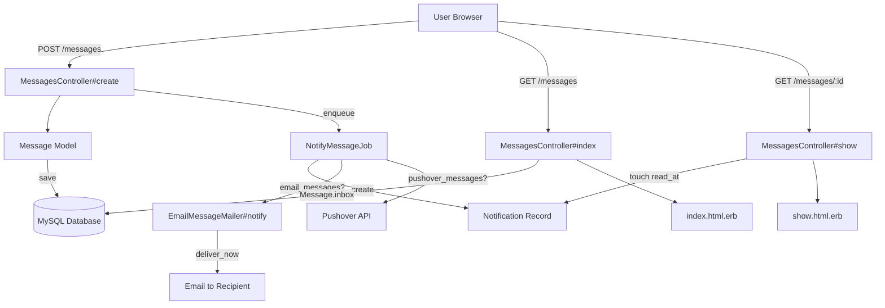
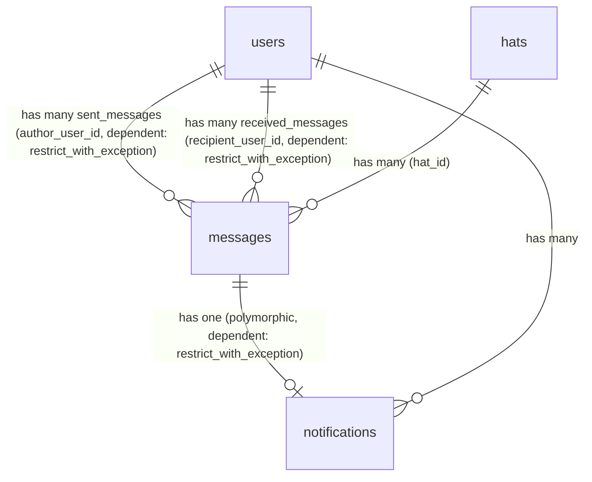
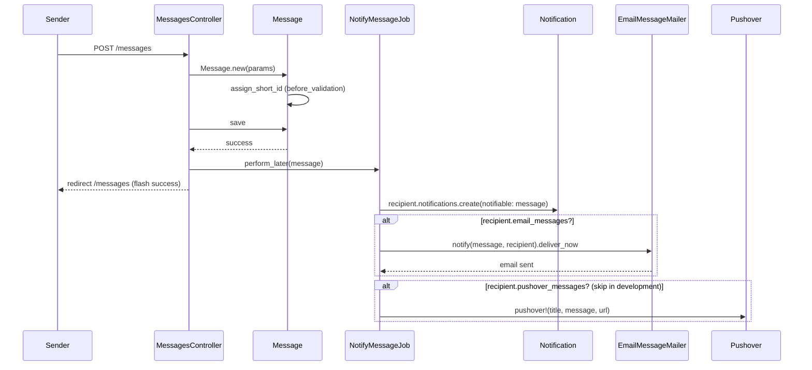
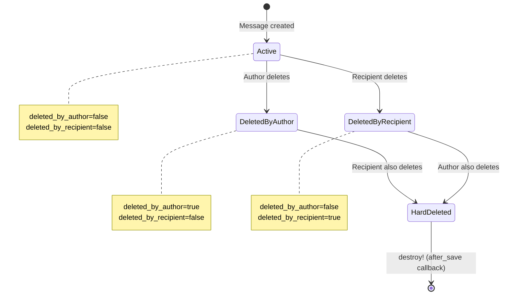

# Messages

> **Status**: Active
> **Generated**: 2026-06-13T00:00:00Z
> **Last Updated**: 2026-06-13T00:00:00Z

---

## Overview

### What It Does
The Messages feature provides private one-to-one messaging between Lobsters users. Users can compose, send, receive, read, reply to, and delete private messages. Messages support optional hat (flair) attribution and moderator-to-user mod notes. The system delivers notifications via the in-app notification system, email, and Pushover push notifications based on each recipient's preferences.

### Why It Exists
Community members need a private communication channel separate from public comments and stories. Moderators also use messages to communicate privately with users about policy matters, with the ability to attach mod notes for internal record-keeping.

### Key Capabilities
- Send and receive private messages between users
- Reply to messages with auto-populated recipient and prefixed subject
- Attach a hat (flair) to messages for official/role-based communication
- Soft-delete messages independently per sender and recipient; hard-delete when both parties delete
- Batch-delete multiple messages at once
- Mark messages as unread ("Keep As New")
- Moderator-only: flag a message as a ModNote for internal moderation records
- Email and Pushover notification delivery based on user preferences
- JSON API for inbox and sent messages

---

## Architecture

### High-Level Design


### Components

#### Backend Components
| Component | File Path | Purpose |
|-----------|-----------|---------|
| MessagesController | `app/controllers/messages_controller.rb` | Handles all message CRUD operations, batch delete, keep-as-new, and mod note actions |
| Message | `app/models/message.rb` | Core model for private messages with soft-delete, scopes, and JSON serialization |
| EmailMessageMailer | `app/mailers/email_message_mailer.rb` | Sends email notifications for new private messages |
| NotifyMessageJob | `app/jobs/notify_message_job.rb` | Async job that creates notification records and dispatches email/Pushover alerts |
| InboxMailbox | `app/mailboxes/inbox_mailbox.rb` | Action Mailbox handler for inbound email replies (processes comment replies, not private messages) |

#### View Components
| Component | File Path | Purpose |
|-----------|-----------|---------|
| index.html.erb | `app/views/messages/index.html.erb` | Lists inbox or sent messages in a table with batch-delete checkboxes and compose form |
| show.html.erb | `app/views/messages/show.html.erb` | Displays a single message with delete, keep-as-new, mod-note actions, and reply form |
| _form.html.erb | `app/views/messages/_form.html.erb` | Shared compose/reply form with recipient, subject, body, hat selector, and mod-note checkbox |
| _subnav.html.erb | `app/views/messages/_subnav.html.erb` | Sub-navigation tabs: Inbox, Unread, Messages, Sent, ModMail |
| notify.text.erb | `app/views/email_message_mailer/notify.text.erb` | Plain-text email template for message notifications |

### Technology Stack
- **Backend**: Ruby on Rails (controllers, models, Active Job, Action Mailer, Action Mailbox)
- **Frontend**: Server-rendered ERB templates
- **Database**: MySQL (utf8mb4)
- **External Services**: Pushover (push notifications), SMTP (email delivery)

---

## Model Details

### Message

#### Associations
```ruby
# Source: app/models/message.rb
belongs_to :recipient,
  class_name: "User",
  foreign_key: "recipient_user_id",
  inverse_of: :received_messages
belongs_to :author,
  class_name: "User",
  foreign_key: "author_user_id",
  inverse_of: :sent_messages,
  optional: true
belongs_to :hat,
  optional: true
has_one :notification,
  as: :notifiable,
  dependent: :restrict_with_exception
```

The `author` association is `optional: true` because system-generated messages (e.g., automated notifications) have no author. The `notification` uses `dependent: :restrict_with_exception`, meaning a message cannot be destroyed if it still has an associated notification record.

#### User-side Associations (in `app/models/user.rb`)
```ruby
# Source: app/models/user.rb:8-17
has_many :sent_messages,
  class_name: "Message",
  foreign_key: "author_user_id",
  inverse_of: :author,
  dependent: :restrict_with_exception
has_many :received_messages,
  class_name: "Message",
  foreign_key: "recipient_user_id",
  inverse_of: :recipient,
  dependent: :restrict_with_exception
```

#### Concerns
| Concern | Purpose |
|---------|---------|
| `Token` | Generates an immutable, unique `token` (TypeID-based) on `after_initialize` for new records. Validates presence, uniqueness, and max length of 255. |

#### Callbacks
| Callback | Method | Purpose |
|----------|--------|---------|
| `before_validation` (on: :create) | `:assign_short_id` | Generates a unique `short_id` via `ShortId.new(self.class).generate` |
| `after_save` | `:check_for_both_deleted` | Destroys the record permanently if both `deleted_by_author` and `deleted_by_recipient` are true |
| `after_initialize` (from Token) | block | Sets `self.token` to a new TypeID if the record is new |

#### Validations
```ruby
# Source: app/models/message.rb:24-34
validates :subject, length: {in: 1..100}
validates :body, length: {maximum: 70_000}, on: :update # for weird old data
validates :body, length: {within: 5..8_192}, on: :create # max from 2024-10-28 on, min changed 2026-01-12
validates :short_id, presence: true, uniqueness: {case_sensitive: false}, length: {maximum: 30}
validates :deleted_by_author, :deleted_by_recipient, inclusion: {in: [true, false]}
validate :hat do
  next if hat.blank?
  if author.blank? || author.wearable_hats.exclude?(hat)
    errors.add(:hat, "not wearable by author")
  end
end
```

Note the dual body validation: `on: :update` allows legacy messages up to 70,000 characters, while `on: :create` enforces the newer 5-8,192 character limit.

#### Scopes
```ruby
# Source: app/models/message.rb:36-47
scope :inbox, ->(user) {
  where(
    recipient: user,
    deleted_by_recipient: false
  ).preload(:author, :hat, :notification, :recipient).order(id: :asc)
}
scope :outbox, ->(user) {
  where(
    author: user,
    deleted_by_author: false
  ).preload(:author, :hat, :notification, :recipient).order(id: :asc)
}
```

Both scopes eagerly load all related records to avoid N+1 queries in the message list view.

#### Key Methods
| Method | Returns | Purpose | Notes |
|--------|---------|---------|-------|
| `assign_short_id` | `String` | Generates a unique short ID for URL identification | Called `before_validation` on create |
| `check_for_both_deleted` | `nil` | Permanently destroys the record when both parties have soft-deleted | Called `after_save` |
| `recipient_username=(username)` | `String` | Looks up user by username and sets `recipient_user_id`; adds validation error if user not found | Custom setter |
| `author_username` | `String` | Returns author's username or `"System"` for authorless messages | |
| `linkified_body` | `String` | Renders body as HTML via Markdowner | Uses `created_at` for date-aware markdown |
| `plaintext_body` | `String` | Returns raw body text | Has a TODO comment about linkifying then stripping tags |
| `as_json` | `Hash` | Custom JSON serialization with `short_id`, timestamps, subject, body, deletion flags, and usernames | |
| `to_param` | `String` | Returns `short_id` for URL generation | |

---

## Database Schema

### messages

| Column | Type | Default | Notes |
|--------|------|---------|-------|
| `id` | `bigint unsigned` | auto-increment | Primary key |
| `created_at` | `datetime` | `nil` | No precision specified |
| `author_user_id` | `bigint unsigned` | `NULL` | FK to `users.id`; nullable for system messages |
| `recipient_user_id` | `bigint unsigned` | NOT NULL | FK to `users.id` |
| `subject` | `string(100)` | `NULL` | Max 100 characters |
| `body` | `mediumtext` | `NULL` | Up to ~16MB storage; app validates 5-8,192 on create |
| `short_id` | `string(30)` | `""` | NOT NULL; unique URL slug |
| `deleted_by_author` | `boolean` | `false` | NOT NULL; soft-delete flag for sender |
| `deleted_by_recipient` | `boolean` | `false` | NOT NULL; soft-delete flag for recipient |
| `hat_id` | `bigint unsigned` | `NULL` | FK to `hats.id`; optional flair |
| `token` | `string` | NOT NULL | Immutable TypeID token from Token concern |

#### Indexes
| Name | Columns | Unique |
|------|---------|--------|
| `index_messages_on_author_user_id` | `author_user_id` | No |
| `index_messages_on_hat_id` | `hat_id` | No |
| `messages_recipient_user_id_fk` | `recipient_user_id` | No |
| `random_hash` | `short_id` | Yes |
| `index_messages_on_token` | `token` | Yes |

### notifications (related)

| Column | Type | Default | Notes |
|--------|------|---------|-------|
| `id` | `bigint unsigned` | auto-increment | Primary key |
| `user_id` | `bigint unsigned` | NOT NULL | FK to `users.id` |
| `notifiable_type` | `string` | NOT NULL | Polymorphic type (`"Message"`) |
| `notifiable_id` | `bigint unsigned` | NOT NULL | Polymorphic FK to `messages.id` |
| `read_at` | `datetime` | `NULL` | NULL = unread |
| `token` | `string` | NOT NULL | Unique TypeID |
| `created_at` | `datetime` | NOT NULL | |
| `updated_at` | `datetime` | NOT NULL | |

### Relationships


---

## API Endpoints

| Method | Path | Action | Description | Notes |
|--------|------|--------|-------------|-------|
| `GET` | `/messages` | `index` | List inbox messages | Supports HTML and JSON formats |
| `GET` | `/messages/sent` | `sent` | List sent messages | Supports HTML and JSON formats; renders `index` template |
| `POST` | `/messages` | `create` | Send a new message | Enqueues `NotifyMessageJob`; creates ModNote if moderator + mod_note flag |
| `GET` | `/messages/:id` | `show` | View a single message | Marks notification as read; prepares reply form |
| `DELETE` | `/messages/:id` | `destroy` | Soft-delete a message | Sets `deleted_by_author` or `deleted_by_recipient` based on current user |
| `POST` | `/messages/batch_delete` | `batch_delete` | Delete multiple messages | Processes checkbox params `delete_<short_id>=1` |
| `POST` | `/messages/:message_id/keep_as_new` | `keep_as_new` | Mark message as unread | Sets `notification.read_at` to nil |
| `POST` | `/messages/:message_id/mod_note` | `mod_note` | Create ModNote from message | Moderator-only; calls `ModNote.create_from_message` |

---

## Authorization

Lobsters does not use Pundit. Authorization is handled via controller `before_action` filters and instance-level checks:

| Check | Location | Conditions | Notes |
|-------|----------|------------|-------|
| `require_logged_in_user` | `before_action` (all actions) | User must be logged in | Inherited from ApplicationController |
| `require_logged_in_moderator` | `before_action` (`:mod_note` only) | User must be a moderator | Restricts mod_note creation |
| `find_message` | `before_action` (`:show`, `:destroy`, `:keep_as_new`, `:mod_note`) | Current user must be the author OR recipient | Redirects with error if message not found or not authorized |
| Ownership check in `destroy` | `MessagesController#destroy` | Sets `deleted_by_author` or `deleted_by_recipient` based on whether current user is author or recipient | Both flags can be set if user is both (not possible in practice) |
| Ownership check in `batch_delete` | `MessagesController#batch_delete` | Same per-message author/recipient check | Skips message if user is neither author nor recipient |
| `mod_note` param whitelist | `message_params` | Only permits `:mod_note` param if `@user.is_moderator?` | Non-moderators cannot set the mod_note flag |

---

## Configuration

### User Settings (stored in `users.settings` JSON column)
| Setting | Type | Default | Purpose |
|---------|------|---------|---------|
| `email_messages` | boolean | `false` | When true, recipient gets an email notification for each new private message |
| `pushover_messages` | boolean | `false` | When true, recipient gets a Pushover push notification for each new private message |

No environment variables are specific to the messages feature. Email delivery uses the app-wide SMTP configuration; Pushover uses the user's `pushover_user_key` setting.

---

## Notification Flow



---

## Soft-Delete Lifecycle



When either party deletes a message, a soft-delete flag is set. The `check_for_both_deleted` callback (fired `after_save`) permanently destroys the record once both flags are true. The `inbox` and `outbox` scopes filter out soft-deleted messages for the respective party.

---

## Usage Examples

### Sending a Message (Controller)
```ruby
# Source: app/controllers/messages_controller.rb:51-71
def create
  @title = "Messages"

  @new_message = Message.new(message_params)
  @new_message.author_user_id = @user.id
  @new_message.hat = @user.wearable_hats.find_by(short_id: params[:message][:hat_id])

  @direction = :out

  if @new_message.save
    if @user.is_moderator? && @new_message.mod_note
      ModNote.create_from_message(@new_message, @user)
    end
    flash[:success] = "Your message has been sent to #{@new_message.recipient.username}."
    NotifyMessageJob.perform_later(@new_message)
    redirect_to "/messages"
  else
    @messages = Message.inbox(@user).load
    render action: "index"
  end
end
```

### Creating a ModNote from a Message
```ruby
# Source: app/models/mod_note.rb:44-57
def self.create_from_message(message, moderator)
  user = (moderator.id == message.recipient.id && message.author) ?
           message.author : message.recipient

  ModNote.create!(
    moderator: moderator,
    user: user,
    created_at: message.created_at,
    note: <<~NOTE
      *#{message.author ? message.author.username : "(System)"} #{message.hat&.to_txt}-> #{message.recipient.username}*: #{message.subject}

      #{message.body}
    NOTE
  )
end
```

### Notification Job Delivery
```ruby
# Source: app/jobs/notify_message_job.rb:10-34
def deliver_message_notifications(message)
  read_at = message.notification&.read_at
  message.recipient.notifications.create(notifiable: message, read_at: read_at)

  if message.recipient.email_messages?
    begin
      EmailMessageMailer.notify(message, message.recipient).deliver_now
    rescue => e
      # Rails.logger.error "error e-mailing #{recipient.email}: #{e}"
    end
  end

  return if Rails.env.development?

  if message.recipient.pushover_messages?
    message.recipient.pushover!(
      title: "#{Rails.application.name} message from " \
        "#{message.author_username}: #{message.subject}",
      message: message.plaintext_body,
      url: Routes.message_url(message),
      url_title: (message.author ? "Reply to #{message.author_username}" :
        "View message")
    )
  end
end
```

---

## Testing

### Test Files
- `spec/models/message_spec.rb` — Model validations: short_id generation, hat wearability validation
- `spec/requests/messages_spec.rb` — Request specs: message creation, hat assignment on messages
- `spec/controllers/messages_controller_spec.rb` — Controller specs: notification read marking, keep-as-new, job enqueuing on create
- `spec/jobs/notify_message_job_spec.rb` — Job spec: notification creation, email delivery

---

## Known Issues & Caveats

| Issue | Location | Description |
|-------|----------|-------------|
| Swallowed email errors | `app/jobs/notify_message_job.rb:17-18` | Email delivery failures are silently rescued with a commented-out logger line: `# Rails.logger.error "error e-mailing #{recipient.email}: #{e}"`. Failures are invisible. |
| Pushover skipped in development | `app/jobs/notify_message_job.rb:22` | `return if Rails.env.development?` short-circuits before Pushover check, which also means the method returns early and skips any future logic that might be added after the Pushover block. |
| TODO in plaintext_body | `app/models/message.rb:103-105` | `plaintext_body` has a TODO comment: "linkify then strip tags and convert entities back". Currently just returns `body.to_s` without any processing. |
| Dual body length validation | `app/models/message.rb:25-26` | Different max lengths on create (8,192) vs update (70,000) to accommodate legacy data. Could be confusing if editing old messages were ever allowed. |
| InboxMailbox is for comments, not messages | `app/mailboxes/inbox_mailbox.rb` | Despite being cataloged under the messages feature, `InboxMailbox` processes inbound email replies to stories/comments, not private messages. It creates `Comment` records, not `Message` records. |
| Notification re-creation risk | `app/jobs/notify_message_job.rb:12` | The job calls `message.recipient.notifications.create(notifiable: message)` but the notifications table has a unique index on `[user_id, notifiable_type, notifiable_id]`, so running the job twice for the same message would raise a uniqueness error. |
| Variable reference error in rescue | `app/jobs/notify_message_job.rb:18` | The commented-out error message references `recipient` but the local variable is `message.recipient`. If uncommented as-is, it would raise `NameError`. |

---

## Performance

### Database Optimization
- **Indexes on foreign keys**: `author_user_id`, `recipient_user_id`, `hat_id` are all indexed for efficient joins and lookups
- **Unique index on `short_id`** (`random_hash`): Fast lookups by URL slug
- **Unique index on `token`**: Fast token-based lookups
- **Eager loading in scopes**: Both `inbox` and `outbox` scopes use `.preload(:author, :hat, :notification, :recipient)` to prevent N+1 queries when rendering the message list

### Caching
- **Unread count cache**: `MessagesController#show` invalidates `Rails.cache.delete("user:#{@user.id}:unread_replies")` when a message is viewed, keeping the unread badge count in sync

---

## Troubleshooting

### Common Issues

#### Issue: Message not appearing in recipient's inbox
**Symptoms:**
- Sender sees success flash but recipient has no message

**Cause:**
The `recipient_username=` setter silently sets `recipient_user_id` to nil if the username is invalid, but adds a validation error. If the form submission somehow bypasses validation display, the message may appear saved but was never persisted.

**Solution:**
Check that the recipient username exactly matches an existing user. The setter in `app/models/message.rb:88-97` performs `User.find_by(username: username)` which is case-sensitive.

#### Issue: Cannot delete a message (restrict_with_exception)
**Symptoms:**
- `ActiveRecord::DeleteRestrictionError` when trying to destroy a message

**Cause:**
The `has_one :notification, dependent: :restrict_with_exception` association prevents destruction if the notification record still exists.

**Solution:**
The `check_for_both_deleted` callback calls `destroy!` which will raise if a notification exists. In practice, this is handled by the soft-delete flow -- messages are only hard-deleted via the callback when both parties have deleted, and by that point notifications should be cleaned up through normal lifecycle.

---

## Related Features

- **[Inbox Notifications](inbox-notifications.md)** — Unified inbox that aggregates message notifications alongside comment reply notifications; shares the `notifications` polymorphic table
- **[Mod Mail](mod-mail.md)** — Separate moderator group mail system (distinct from private messages); appears alongside messages in the subnav
- **[Hats](hats.md)** — Users can attach a hat to messages for role-based attribution
- **[Moderation](moderation.md)** — ModNote creation from messages feeds into the moderation audit trail

---

**Generated:** 2026-06-13T00:00:00Z
**Last Updated:** 2026-06-13T00:00:00Z
**Status:** Active
