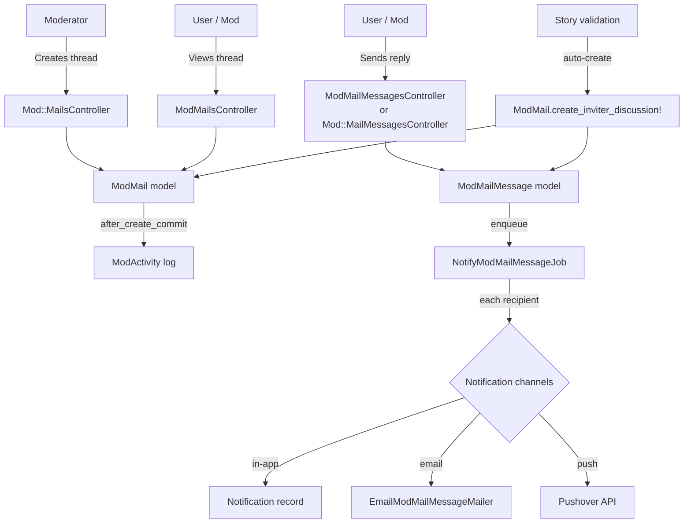
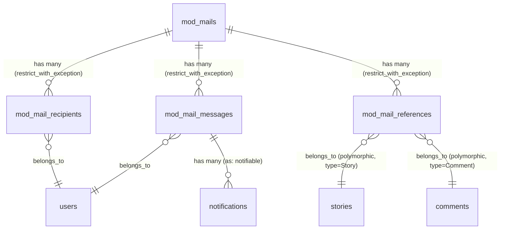
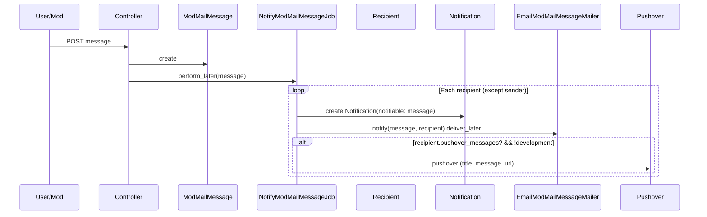

# Mod Mail

> **Status**: Active
> **Generated**: 2026-06-13T00:00:00Z
> **Last Updated**: 2026-06-13T00:00:00Z

---

## Overview

### What It Does
Mod Mail provides a group messaging system for moderator-to-user and moderator-to-moderator communication within Lobsters. It supports threaded conversations with a subject line, multiple recipients, and the ability to reference specific stories or comments. Messages are delivered in-app via the unified inbox/notification system, by email, and optionally via Pushover push notifications.

### Why It Exists
Moderators need a private, auditable communication channel to discuss content issues with users (and their inviters). The system is also used automatically by the new-user acculturation workflow: when a new user triggers a story submission rule (unseen domain, bug tracker link, or restricted tag), a mod mail thread is created between the user, their inviter, and the system user so the inviter can mentor the new user.

### Key Capabilities
- Moderators can create new mod mail threads with a subject, recipients, and optional story/comment references
- Recipients and moderators can view and reply to threads
- Automatic mod mail creation during new-user acculturation (three distinct story validation triggers)
- Email and Pushover push notification delivery for new messages
- In-app inbox integration with unread tracking
- Polymorphic references to stories and comments for contextual discussion
- Mod activity log entry created automatically when a new mod mail thread is started

---

## Architecture

### High-Level Design



### Components

#### Backend Components

| Component | File Path | Purpose |
|-----------|-----------|---------|
| ModMailsController | `app/controllers/mod_mails_controller.rb` | User-facing index and show for mod mail threads |
| ModMailMessagesController | `app/controllers/mod_mail_messages_controller.rb` | User-facing message creation (reply) |
| Mod::MailsController | `app/controllers/mod/mails_controller.rb` | Moderator CRUD for mod mail threads |
| Mod::MailMessagesController | `app/controllers/mod/mail_messages_controller.rb` | Moderator message creation (reply) |
| ModMail | `app/models/mod_mail.rb` | Thread model with references, recipients, short_id |
| ModMailMessage | `app/models/mod_mail_message.rb` | Individual message within a thread |
| ModMailRecipient | `app/models/mod_mail_recipient.rb` | Join table: mod_mail <-> user |
| ModMailReference | `app/models/mod_mail_reference.rb` | Polymorphic join table: mod_mail <-> Story/Comment |
| EmailModMailMessageMailer | `app/mailers/email_mod_mail_message_mailer.rb` | Email notification for new messages |
| NotifyModMailMessageJob | `app/jobs/notify_mod_mail_message_job.rb` | Async job dispatching notifications to all recipients |

#### Frontend Components (Views)

| Component | File Path | Purpose |
|-----------|-----------|---------|
| User index | `app/views/mod_mails/index.html.erb` | Lists user's mod mail threads with last message info |
| User show | `app/views/mod_mails/show.html.erb` | Displays a thread (delegates to `_mail` partial) |
| User mail partial | `app/views/mod_mails/_mail.html.erb` | Thread detail: subject, references, recipients, messages, compose form |
| User message form | `app/views/mod_mail_messages/_form.html.erb` | Reply form for users |
| Mod index | `app/views/mod/mails/index.html.erb` | Lists all mod mail threads (mod dashboard) |
| Mod show | `app/views/mod/mails/show.html.erb` | Thread detail with edit/back links |
| Mod mail partial | `app/views/mod/mails/_mail.html.erb` | Thread detail (mod version, identical layout to user partial) |
| Mod new | `app/views/mod/mails/new.html.erb` | New thread creation page |
| Mod edit | `app/views/mod/mails/edit.html.erb` | Edit thread metadata |
| Mod form partial | `app/views/mod/mails/_form.html.erb` | Form for subject, references, recipients |
| Mod message partial | `app/views/mod/mail_messages/_mail_message.html.erb` | Single message display with avatar and timestamp |
| Mod message form | `app/views/mod/mail_messages/_form.html.erb` | Reply form for moderators |
| Inbox partial | `app/views/inbox/_mod_mail_message.html.erb` | Mod mail message rendering in the unified inbox |
| Email template | `app/views/email_mod_mail_message_mailer/notify.text.erb` | Plain-text email notification body |

### Technology Stack
- **Backend**: Ruby on Rails (controllers, models, ActiveJob, ActionMailer)
- **Database**: MySQL (utf8mb4, InnoDB)
- **Notifications**: In-app (Notification model), Email (ActionMailer), Pushover (push)
- **Markdown**: Markdowner (for linkified message rendering)

---

## Model Details

### ModMail

**File:** `app/models/mod_mail.rb`

#### Associations
```ruby
has_many :mod_mail_references, dependent: :restrict_with_exception
has_many :comment_references, through: :mod_mail_references, source: :reference, source_type: "Comment"
has_many :story_references, through: :mod_mail_references, source: :reference, source_type: "Story"
has_many :mod_mail_recipients, dependent: :restrict_with_exception
has_many :recipients, through: :mod_mail_recipients, source: :user, class_name: "User", dependent: :restrict_with_exception
has_many :mod_mail_messages, dependent: :restrict_with_exception
has_one :mod_activity, inverse_of: :item
```

Note: All `dependent:` options are `:restrict_with_exception`, meaning a ModMail cannot be deleted if it has any messages, recipients, or references. There is no destroy action in any controller, consistent with this design.

#### Validations
```ruby
validates :short_id, length: {maximum: 10}, presence: true, uniqueness: true
validates :recipients, :subject, presence: true
validates :subject, length: {maximum: 255}
```

#### Callbacks
| Callback | Method | Purpose |
|----------|--------|---------|
| `before_validation` (on: :create) | `:assign_short_id` | Generates a unique short_id via `ShortId` module |
| `after_create_commit` | lambda | Creates a `ModActivity` record for the mod activity log |

#### Key Methods
| Method | Returns | Purpose | Notes |
|--------|---------|---------|-------|
| `assign_short_id` | `String` | Generates unique short_id for URL-friendly identification | Uses shared `ShortId` utility |
| `comment_reference_short_ids` | `String` | Space-separated short_ids of referenced comments | Used by form for display/edit |
| `story_reference_short_ids` | `String` | Space-separated short_ids of referenced stories | Used by form for display/edit |
| `recipient_usernames` | `String` | Space-separated usernames of recipients | Used by form for display/edit |
| `to_param` | `String` | Returns `short_id` for URL generation | Overrides default `id` |
| `self.create_inviter_discussion!` | `ModMail` | Creates a mod mail between a user and their inviter with a system message | Called by story validations for new user acculturation |

#### `create_inviter_discussion!` Detail
```ruby
# Source: app/models/mod_mail.rb:38
def self.create_inviter_discussion! user:, message:
  inviter = user.invited_by_user || User.system_user

  mail = ModMail.create! recipients: [user, inviter], subject: "New user story submission"
  mail.mod_mail_messages.create! user: User.system_user, message: message
  mail
end
```

This is called from three places in `app/models/story.rb`:
1. **Line 338** (`check_not_new_domain_from_new_user`) -- when a new user submits a link to a domain not previously seen
2. **Line 385** (`check_not_tracker_from_new_user`) -- when a new user submits a link to a project bug tracker
3. **Line 616** (`check_tags`) -- when a new user uses tags restricted from new users

---

### ModMailMessage

**File:** `app/models/mod_mail_message.rb`

#### Associations
```ruby
belongs_to :mod_mail
belongs_to :user
has_many :notifications, as: :notifiable, dependent: :restrict_with_exception
```

#### Validations
```ruby
validates :message, presence: true, length: {within: 20..8_192}
```

#### Key Methods
| Method | Returns | Purpose | Notes |
|--------|---------|---------|-------|
| `linkified_message` | `String` (HTML) | Renders message body as HTML via Markdowner | Uses `created_at` as the "as_of" date |
| `plaintext_message` | `String` | Returns raw message text | Has a TODO comment: "linkify then strip tags and convert entities back" -- currently just calls `.to_s` |

---

### ModMailRecipient

**File:** `app/models/mod_mail_recipient.rb`

#### Associations
```ruby
belongs_to :mod_mail
belongs_to :user
```

A simple join model with no validations, callbacks, or custom methods.

---

### ModMailReference

**File:** `app/models/mod_mail_reference.rb`

#### Associations
```ruby
belongs_to :mod_mail
belongs_to :reference, polymorphic: true
```

#### Validations
```ruby
validates :reference_type, inclusion: {in: %w[Comment Story]}, length: {maximum: 255}
```

---

### User Model (relevant associations)

**File:** `app/models/user.rb` (lines 72-74)

```ruby
has_many :mod_mail_recipients, dependent: :restrict_with_exception
has_many :mod_mails, through: :mod_mail_recipients, dependent: :restrict_with_exception
has_many :mod_mail_messages, dependent: :restrict_with_exception
```

---

## Database Schema

### mod_mails

| Column | Type | Default | Notes |
|--------|------|---------|-------|
| `id` | `bigint` | auto-increment | Primary key |
| `subject` | `string` | — | NOT NULL |
| `remind_mods_at` | `datetime` | NULL | Optional reminder timestamp (not used in controllers) |
| `created_at` | `datetime` | — | NOT NULL |
| `updated_at` | `datetime` | — | NOT NULL |
| `short_id` | `string(10)` | — | NOT NULL, unique index |

**Indexes:**
- `index_mod_mails_on_short_id` (unique)

### mod_mail_messages

| Column | Type | Default | Notes |
|--------|------|---------|-------|
| `id` | `bigint` | auto-increment | Primary key |
| `mod_mail_id` | `bigint` | — | NOT NULL, FK to mod_mails |
| `message` | `mediumtext` | — | NOT NULL |
| `user_id` | `bigint` (unsigned) | — | NOT NULL, FK to users |
| `created_at` | `datetime` | — | NOT NULL |
| `updated_at` | `datetime` | — | NOT NULL |

**Indexes:**
- `index_mod_mail_messages_on_mod_mail_id`
- `fk_rails_40fa20cab5` (user_id)

**Foreign Keys:**
- `mod_mail_id` -> `mod_mails.id`
- `user_id` -> `users.id`

### mod_mail_recipients

| Column | Type | Default | Notes |
|--------|------|---------|-------|
| `id` | `bigint` | auto-increment | Primary key |
| `mod_mail_id` | `bigint` | — | NOT NULL, FK to mod_mails |
| `user_id` | `bigint` (unsigned) | — | NOT NULL, FK to users |
| `created_at` | `datetime` | — | NOT NULL |
| `updated_at` | `datetime` | — | NOT NULL |

**Indexes:**
- `index_mod_mail_recipients_on_mod_mail_id`
- `fk_rails_7a6d5232be` (user_id)

**Foreign Keys:**
- `mod_mail_id` -> `mod_mails.id`
- `user_id` -> `users.id`

### mod_mail_references

| Column | Type | Default | Notes |
|--------|------|---------|-------|
| `id` | `bigint` | auto-increment | Primary key |
| `mod_mail_id` | `bigint` | — | NOT NULL, FK to mod_mails |
| `reference_type` | `string` | — | NOT NULL (polymorphic type: "Comment" or "Story") |
| `reference_id` | `bigint` | — | NOT NULL (polymorphic id) |
| `created_at` | `datetime` | — | NOT NULL |
| `updated_at` | `datetime` | — | NOT NULL |

**Indexes:**
- `index_mod_mail_references_on_mod_mail_id`
- `index_mod_mail_references_on_reference` (reference_type, reference_id)

**Foreign Keys:**
- `mod_mail_id` -> `mod_mails.id`

### Relationships



---

## API Endpoints

### User-Facing Routes

| Method | Path | Action | Controller | Description |
|--------|------|--------|------------|-------------|
| `GET` | `/mod_mails` | `index` | `ModMailsController` | List current user's mod mail threads |
| `GET` | `/mod_mails/:id` | `show` | `ModMailsController` | View a single mod mail thread |
| `POST` | `/mod_mail_messages` | `create` | `ModMailMessagesController` | Reply to a mod mail thread |

### Moderator Routes (under `/mod` namespace)

| Method | Path | Action | Controller | Description |
|--------|------|--------|------------|-------------|
| `GET` | `/mod/mails` | `index` | `Mod::MailsController` | List all mod mail threads |
| `GET` | `/mod/mails/new` | `new` | `Mod::MailsController` | Form to create a new thread |
| `POST` | `/mod/mails` | `create` | `Mod::MailsController` | Create a new mod mail thread |
| `GET` | `/mod/mails/:id` | `show` | `Mod::MailsController` | View a single mod mail thread |
| `GET` | `/mod/mails/:id/edit` | `edit` | `Mod::MailsController` | Edit thread metadata (subject, recipients, references) |
| `PATCH/PUT` | `/mod/mails/:id` | `update` | `Mod::MailsController` | Update thread metadata |
| `POST` | `/mod/mail_messages` | `create` | `Mod::MailMessagesController` | Reply to a thread (mod context) |

Note: No `destroy` action exists for mod mails or messages. The route definition uses `except: [:destroy]` and all model `dependent:` options are `:restrict_with_exception`.

---

## Authorization

Mod mail uses two distinct authorization strategies rather than Pundit policies:

| Controller | Guard | Mechanism | Notes |
|------------|-------|-----------|-------|
| `ModMailsController` | `require_logged_in_user` | `before_action` from ApplicationController | All actions require login |
| `ModMailsController#show` | `require_recipient_or_mod` | Custom `before_action` | User must be a recipient OR a moderator |
| `ModMailMessagesController` | `require_logged_in_user` | `before_action` from ApplicationController | Any logged-in user can post (if they have mod_mail_id) |
| `Mod::MailsController` | `require_logged_in_moderator` | `before_action` from `Mod::ModController` | All actions restricted to moderators |
| `Mod::MailMessagesController` | `require_logged_in_moderator` | `before_action` from `Mod::ModController` | All actions restricted to moderators |

The `require_recipient_or_mod` method in `ModMailsController`:

```ruby
# Source: app/controllers/mod_mails_controller.rb:22
def require_recipient_or_mod
  unless @mod_mail.recipients.include?(@user) || @user.is_moderator?
    redirect_to :root, error: "You are not authorized to access that resource."
  end
end
```

---

## Notification Flow



The job (`NotifyModMailMessageJob`) iterates over all recipients of the parent mod mail thread, skipping the sender. For each recipient it:

1. Creates an in-app `Notification` record (polymorphic, `notifiable_type: "ModMailMessage"`)
2. Sends an email via `EmailModMailMessageMailer#notify`
3. If not in development and the recipient has Pushover enabled (`pushover_messages?`), sends a push notification

Email subject format: `[AppName] Mod Mail Message from {sender_username}: {thread_subject}`

---

## Configuration

No environment variables are specific to mod mail. The feature relies on:

- **Application name**: `Rails.application.name` (used in email subject and Pushover title)
- **Pushover**: Configured per-user via user settings (the `pushover_messages?` flag)
- **Email delivery**: Standard ActionMailer configuration

---

## Usage Examples

### Automatic Thread Creation (New User Acculturation)

When a new user submits a story with an unseen domain, the system automatically creates a mod mail thread:

```ruby
# Source: app/models/story.rb:338
self.new_user_acculturation_error = ModMail.create_inviter_discussion! user: user, message: <<~MESSAGE
  Hi,

  #{user.username}: This has a high false-positive rate, but we don't allow new users to submit links to domains we haven't seen before.
  This is to give you a time to learn about topicality and to discourage immediate self-promotion.

  #{user.invited_by_user&.username}: This is a good opportunity for you to introduce #{user.username} to the [site guideline](https://lobste.rs/about#guidelines) around topicality and self-promo.

  If you need, you can talk to the mods in this conversation, but we'll probably stay out of it unless asked.

  #{submission_markdown}
MESSAGE
```

### Moderator Creating a New Thread

Via `Mod::MailsController#create`, moderators fill in a form with:
- **Subject** (text field, required)
- **Comment reference short_ids** (space-separated)
- **Story reference short_ids** (space-separated)
- **Recipient usernames** (space-separated, labeled "To")

The `parse_references_and_recipients` callback resolves these strings into ActiveRecord associations:

```ruby
# Source: app/controllers/mod/mails_controller.rb:56
def parse_references_and_recipients
  @mod_mail.recipients = User.where(username: params.dig("mod_mail", "recipient_usernames")&.split(" "))
  @mod_mail.comment_references = Comment.where(short_id: params.dig("mod_mail", "comment_reference_short_ids")&.split(" "))
  @mod_mail.story_references = Story.where(short_id: params.dig("mod_mail", "story_reference_short_ids")&.split(" "))
end
```

---

## Testing

No dedicated test files for mod mail were found in the repository. The `test/` directory contains no files matching `*mod_mail*`.

---

## Known Issues & Caveats

| Issue | Location | Description |
|-------|----------|-------------|
| `plaintext_message` is a stub | `app/models/mod_mail_message.rb:14` | Has a TODO: "linkify then strip tags and convert entities back" -- currently just returns `message.to_s` with no processing |
| Swallowed email exceptions | `app/jobs/notify_mod_mail_message_job.rb:19` | `rescue => e` catches all exceptions during email delivery and silently discards them (the `Rails.logger.error` line is commented out) |
| TODO on notification idempotency | `app/jobs/notify_mod_mail_message_job.rb:15` | Comment says "Should this be a find or create by??" -- currently always creates a new notification, which could create duplicates if the job is retried |
| `remind_mods_at` column unused | `db/schema.rb` (mod_mails table) | The `remind_mods_at` datetime column exists in the schema but is never referenced in any model, controller, or view |
| No test coverage | — | No test files exist for any mod mail model, controller, job, or mailer |
| Mod index view is sparse | `app/views/mod/mails/index.html.erb:8` | Has a TODO: "Add last message and last message author" -- the mod index only shows subjects, unlike the user index which shows last message info |
| User index query issue | `app/views/mod_mails/index.html.erb:15` | Uses `.order(created_at: :desc).last` which orders descending then takes the last record -- this returns the **oldest** message, not the newest. Should likely be `.order(created_at: :desc).first` or `.order(created_at: :asc).last` |
| No CSRF/authorization on message replies | `app/controllers/mod_mail_messages_controller.rb` | Only checks `require_logged_in_user`; any logged-in user who knows a `mod_mail_id` can post a message to that thread even if they are not a recipient |

---

## Performance

### Database Optimization

**Indexes on mod_mails:**
- `index_mod_mails_on_short_id` (unique) -- enables fast lookup by short_id in `find_by(short_id:)`

**Indexes on mod_mail_messages:**
- `index_mod_mail_messages_on_mod_mail_id` -- enables fast lookup of messages for a thread
- `fk_rails_40fa20cab5` (user_id) -- foreign key index

**Indexes on mod_mail_recipients:**
- `index_mod_mail_recipients_on_mod_mail_id` -- enables fast lookup of recipients for a thread
- `fk_rails_7a6d5232be` (user_id) -- foreign key index

**Indexes on mod_mail_references:**
- `index_mod_mail_references_on_mod_mail_id` -- enables fast lookup of references for a thread
- `index_mod_mail_references_on_reference` (reference_type, reference_id) -- composite polymorphic index

### Async Processing
- Message notifications are dispatched via `NotifyModMailMessageJob` (ActiveJob, `queue_as :default`), keeping the HTTP response fast
- Email delivery within the job uses `deliver_later`, adding another layer of async processing

---

## Troubleshooting

### Common Issues

#### Issue: User Cannot See a Mod Mail Thread
**Symptoms:**
- User is redirected to the homepage with "You are not authorized to access that resource."

**Cause:**
The user is not in the `mod_mail_recipients` list for that thread and is not a moderator. The `require_recipient_or_mod` before_action in `ModMailsController` enforces this.

**Solution:**
A moderator can edit the thread via `/mod/mails/:id/edit` and add the user's username to the recipients field.

#### Issue: Notification Email Not Received
**Symptoms:**
- Recipient does not receive an email for a new mod mail message

**Cause:**
The `NotifyModMailMessageJob` silently rescues all email delivery exceptions (line 19). Check application logs for job failures, but note that the error logging line is commented out.

**Solution:**
Uncomment the logging line in `app/jobs/notify_mod_mail_message_job.rb:20` to enable error visibility:
```ruby
# Currently commented out:
# Rails.logger.error "error e-mailing #{recipient.email}: #{e}"
```

---

## Related Features

- **[moderation](./catalog.md)** -- Mod mail threads create `ModActivity` entries that appear in the moderation activity log; `Mod::ModController` is the base class for mod-namespaced controllers
- **[messages](./catalog.md)** -- The private messaging feature shares UI patterns (the user-facing mod mail index renders the messages subnav partial)
- **[inbox-notifications](./catalog.md)** -- Mod mail messages create `Notification` records that appear in the unified inbox; the inbox has a dedicated `_mod_mail_message.html.erb` partial
- **[stories](./catalog.md)** -- The `Story` model triggers automatic mod mail creation via `create_inviter_discussion!` during new-user acculturation checks
- **[users](./catalog.md)** -- The `User` model has `has_many :mod_mails` and `has_many :mod_mail_messages` associations

---

**Generated:** 2026-06-13T00:00:00Z
**Last Updated:** 2026-06-13T00:00:00Z
**Status:** Active
