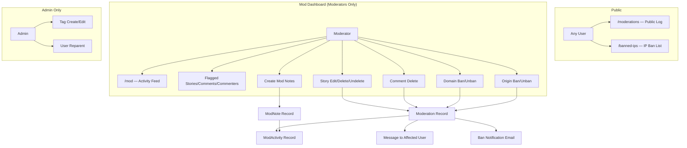
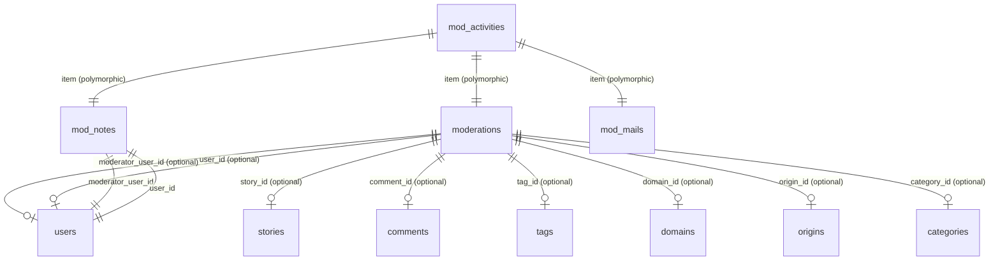
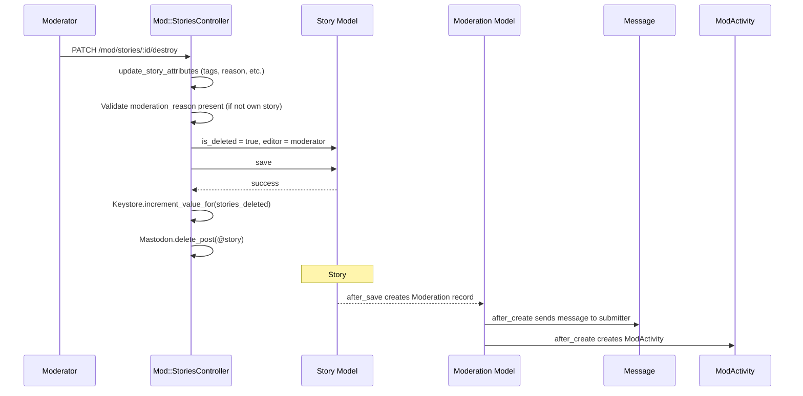
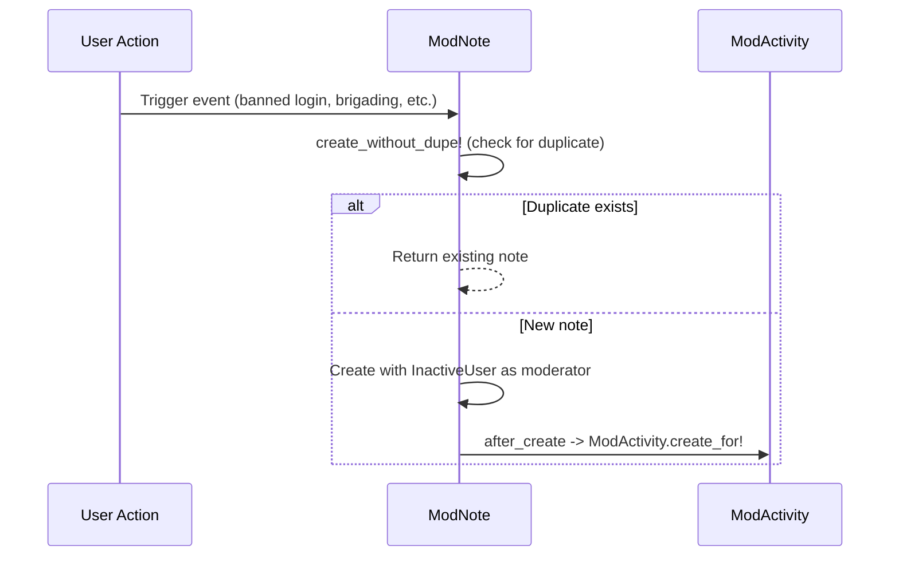

# Moderation

> **Status**: Active
> **Generated**: 2026-06-13T00:00:00Z
> **Last Updated**: 2026-06-13T00:00:00Z

---

## Overview

### What It Does
The moderation feature provides a comprehensive suite of tools for site moderators and administrators to manage content and users on Lobsters. It includes a public moderation log visible to all users, a moderator-only dashboard with activity feeds and flagged content views, tools for editing/deleting stories and comments, domain and origin banning, tag management, user reparenting, moderator notes, and IP ban tracking.

### Why It Exists
Lobsters prioritizes transparency in moderation. Every moderation action is logged publicly so the community can hold moderators accountable. The mod dashboard consolidates flagged content and activity streams so moderators can efficiently review and act on community-reported problems. Automated "tattle" notes track suspicious user behavior (banned login attempts, brigading, domain abuse) without requiring manual moderator intervention.

### Key Capabilities
- **Public moderation log** (`/moderations`) filterable by moderator, action type, and paginated
- **Mod dashboard** (`/mod`) with unified activity feed combining moderations, mod notes, and mod mail
- **Flagged content views** for stories, comments, and statistically flagged commenters
- **Story editing/deletion/undeletion** by moderators with mandatory moderation reasons
- **Comment deletion** by moderators with reason tracking
- **Domain and origin banning/unbanning** with moderation log entries
- **Tag creation and editing** (admin-only)
- **User reparenting** in the invitation tree (admin-only)
- **Moderator notes** on users, including automated "tattle" notes for suspicious behavior
- **IP ban listing** from iptables rules (read-only, public)
- **Ban notification emails** sent to banned users
- **Automated messaging** to users whose content is moderated

---

## Architecture

### High-Level Design



### Components

#### Backend Components

| Component | File Path | Purpose |
|-----------|-----------|---------|
| ModerationsController | `app/controllers/moderations_controller.rb` | Public moderation log with filtering and pagination |
| BannedIpsController | `app/controllers/banned_ips_controller.rb` | Displays IP bans from iptables rules files |
| Mod::ModController | `app/controllers/mod/mod_controller.rb` | Base controller for all `/mod` routes; enforces moderator auth |
| Mod::ActivitiesController | `app/controllers/mod/activities_controller.rb` | Mod activity dashboard (last 3 months) |
| Mod::FlaggedController | `app/controllers/mod/flagged_controller.rb` | Flagged stories, flagged comments, and flagged commenters views |
| Mod::NotesController | `app/controllers/mod/notes_controller.rb` | Create moderator notes on users |
| Mod::CommentsController | `app/controllers/mod/comments_controller.rb` | Moderator comment deletion |
| Mod::StoriesController | `app/controllers/mod/stories_controller.rb` | Moderator story editing, deletion, and undeletion |
| Mod::DomainsController | `app/controllers/mod/domains_controller.rb` | Domain creation, editing (selector/replacement) |
| Mod::DomainsBanController | `app/controllers/mod/domains_ban_controller.rb` | Domain banning and unbanning |
| Mod::OriginsController | `app/controllers/mod/origins_controller.rb` | Origin editing, banning, and unbanning |
| Mod::ReparentsController | `app/controllers/mod/reparents_controller.rb` | Admin-only user reparenting in invitation tree |
| Mod::TagsController | `app/controllers/mod/tags_controller.rb` | Admin-only tag creation and editing |
| JobsModController | `app/controllers/jobs_mod_controller.rb` | Base controller for MissionControl::Jobs engine auth |
| Moderation | `app/models/moderation.rb` | Core model recording every moderation action |
| ModActivity | `app/models/mod_activity.rb` | Polymorphic activity feed unifying moderations, notes, and mail |
| ModNote | `app/models/mod_note.rb` | Moderator notes on users (manual and automated) |
| FlaggedCommenters | `app/models/flagged_commenters.rb` | Statistical analysis of most-flagged commenters |
| BanNotificationMailer | `app/mailers/ban_notification_mailer.rb` | Sends email to banned users |

---

## Model Details

### Moderation

#### Associations
```ruby
# Source: app/models/moderation.rb
belongs_to :moderator,
  class_name: "User",
  foreign_key: "moderator_user_id",
  inverse_of: :moderations,
  optional: true
belongs_to :comment,
  optional: true
belongs_to :domain,
  optional: true
belongs_to :origin,
  optional: true
belongs_to :story,
  optional: true
belongs_to :tag,
  optional: true
belongs_to :user,
  optional: true
belongs_to :category,
  optional: true
```

#### Concerns
| Concern | Purpose |
|---------|---------|
| `Token` | Generates a unique, immutable `token` (TypeID) on initialization; validates presence and uniqueness |

#### Scopes
| Scope | Purpose |
|-------|---------|
| `for_user(user)` | Returns up to 20 moderations related to a user (by user_id, story submitter, or comment author), ordered by id desc |
| `for_story(story)` | Returns up to 20 moderations related to a story, its submitter, or its commenters, ordered by id desc |

#### Callbacks
| Callback | Method | Purpose |
|----------|--------|---------|
| `after_create` | `:send_message_to_moderated` | Sends a private message to the affected user (story submitter or comment author) explaining the moderation action |
| `after_create` | `-> { ModActivity.create_for! self }` | Creates a corresponding ModActivity record for the unified activity feed |

#### Validations
| Validation | Field | Rule |
|------------|-------|------|
| `validates` | `:action` | `presence: true, length: { maximum: 16_777_215 }` |
| `validates` | `:reason` | `length: { maximum: 16_777_215 }` |
| `validates` | `:is_from_suggestions` | `inclusion: { in: [true, false] }` |
| `validate` | (custom) | `one_foreign_key_present` — exactly one of `comment_id`, `domain_id`, `origin_id`, `story_id`, `category_id`, `tag_id`, `user_id` must be set |

#### Constants
```ruby
# Source: app/models/moderation.rb:53-64
# A bug mistakenly recorded 10 users who doffed hats as moderators. To be able to say we don't
# edit or remove modlog entries without adding a caveat, I've listed the tokens for those and the
# frontend can explain that error when they appear. https://github.com/lobsters/lobsters/issues/1591
BAD_DOFFING_ENTRIES = %w[
  moderation_01j6ax48wpfb4vas8qgv8vmg20
  moderation_01j79djrajfa5a56bbpmb6msde
  moderation_01j8myn90rey8axkbw0hntxfqe
  moderation_01j8n06kdrf5n92txy802evnz3
  moderation_01jajsjdd5fva8qdwgmc2es9gp
  moderation_01jat93zq7fgmr8dm6fc411g2c
  moderation_01jdgt4btvfvear3hphy79104f
  moderation_01jhzbz2mafxrsbmmr3trh760c
  moderation_01jmsbwaqxf2bbwws92cv8688k
  moderation_01jnywh2rxekqa61seqmk8z3f7
].freeze
```

#### Key Methods
| Method | Returns | Purpose | Notes |
|--------|---------|---------|-------|
| `send_message_to_moderated` | `nil` | Sends a private Message to the story submitter or comment author explaining the moderation action and reason. Marks the message as `deleted_by_author` so it does not fill moderator inboxes. Skips if the moderation targets a user (not story/comment) or if the moderator is the affected user. | Called via `after_create` |
| `one_foreign_key_present` | `nil` | Custom validation ensuring exactly one foreign key is set among `comment_id`, `domain_id`, `origin_id`, `story_id`, `category_id`, `tag_id`, `user_id` | `protected` method |

---

### ModActivity

#### Associations
```ruby
# Source: app/models/mod_activity.rb
belongs_to :item, polymorphic: true
```

#### Concerns
| Concern | Purpose |
|---------|---------|
| `Token` | Generates a unique, immutable `token` (TypeID) on initialization |

#### Scopes
| Scope | Purpose |
|-------|---------|
| `with_item` | Left-outer-joins to `moderations`, `mod_notes`, and `mod_mails` tables with eager-loaded items |
| `user(user)` | Filters activities related to a specific user across moderations (direct, story submitter, comment author), mod notes, and mod mail recipients |

#### Validations
| Validation | Field | Rule |
|------------|-------|------|
| `validates` | `:item_id` | `uniqueness: { scope: [:item_type] }` |
| `validates` | `:item_type` | `presence: true, length: { maximum: 255 }` |

#### Key Methods
| Method | Returns | Purpose | Notes |
|--------|---------|---------|-------|
| `self.create_for!(item)` | `ModActivity` | Creates a ModActivity record linked to the given polymorphic item, copying its `created_at` and `updated_at` timestamps | Class method |

---

### ModNote

#### Associations
```ruby
# Source: app/models/mod_note.rb
belongs_to :moderator,
  class_name: "User",
  foreign_key: "moderator_user_id",
  inverse_of: :moderations
belongs_to :user,
  inverse_of: :mod_notes
```

#### Concerns
| Concern | Purpose |
|---------|---------|
| `Token` | Generates a unique, immutable `token` (TypeID) on initialization |
| `TimeAgoInWords` (extended) | Provides `how_long_ago` class method for human-readable time durations |

#### Scopes
| Scope | Purpose |
|-------|---------|
| `recent` | Notes created within the last week, ordered by `created_at desc` |
| `for(user)` | Notes for a specific user, includes moderator, ordered by `created_at desc` |

#### Callbacks
| Callback | Method | Purpose |
|----------|--------|---------|
| `after_create` | `-> { ModActivity.create_for! self }` | Creates a corresponding ModActivity record for the unified activity feed |

#### Validations
| Validation | Field | Rule |
|------------|-------|------|
| `validates` | `:note` | `presence: true, length: { maximum: 65_535 }` |
| `validates` | `:markeddown_note` | `presence: true, length: { maximum: 65_535 }` |

#### Key Methods
| Method | Returns | Purpose | Notes |
|--------|---------|---------|-------|
| `username=(username)` | `String` | Looks up user by username; sets `user_id` or adds validation error | Setter override |
| `note=(n)` | `String` | Sets note text and auto-generates `markeddown_note` via Markdowner | Setter override |
| `generated_markeddown` | `String` | Converts note markdown to HTML using `Markdowner.to_html` | |
| `self.create_from_message(message, moderator)` | `ModNote` | Creates a mod note from a private message, preserving message metadata | Class method |
| `self.record_reparent!(reparent_user, mod, reason)` | `ModNote` | Creates two mod notes: one on the reparented user, one on the original inviter | Class method |
| `self.tattle_on_banned_login(user)` | `ModNote` | Auto-creates note when a banned user attempts to log in | Class method |
| `self.tattle_on_brigading!(story)` | `ModNote` | Auto-creates note when user submits a URL to a project's bug tracker or discussion | Class method |
| `self.tattle_on_deleted_login(user)` | `ModNote` | Auto-creates note when a deleted-account user attempts to log in | Class method |
| `self.tattle_on_invited(redeemer, invitation_code)` | `ModNote` | Auto-creates notes on both the redeemer and the invitation sender when a logged-in user tries to redeem an invitation | Class method |
| `self.tattle_on_max_depth_limit(user, parent_comment)` | `ModNote` | Auto-creates note when user hits max comment nesting depth | Class method |
| `self.tattle_on_story_domain!(story, reason)` | `ModNote` | Auto-creates note when user submits from a banned/problematic domain | Class method |
| `self.tattle_on_traffic_attribution!(story)` | `ModNote` | Auto-creates note when user submits a URL with traffic attribution parameters | Class method |
| `self.create_without_dupe!(attrs)` | `ModNote` | Deduplicates notes by checking if the latest note for the user has the same moderator and text; prevents duplicates from story validation previews | Class method |

---

### FlaggedCommenters

A plain Ruby class (not an ActiveRecord model) that statistically identifies the most heavily flagged commenters. Requires flags spread across multiple comments and stories to surface only consistent problems, not one-off disagreements.

#### Key Attributes
| Attribute | Type | Purpose |
|-----------|------|---------|
| `interval` | `String` | Time interval parameter (e.g. "1m", "3m") |
| `period` | `Time` | Computed cutoff time |
| `cache_time` | `Duration` | Cache TTL (default: 30 minutes) |

#### Key Methods
| Method | Returns | Purpose | Notes |
|--------|---------|---------|-------|
| `aggregates` | `Hash` | Returns `{ stddev:, sum:, avg:, n_comments:, n_commenters: }` across all active commenters | Cached via `Rails.cache` |
| `commenters` | `Hash` | Returns hash of `user_id => { username:, rank:, sigma:, n_comments:, n_stories:, n_flags:, average_flags:, percent_flagged: }` | Cached; limited to 30 users; requires `n_comments > 4`, `n_stories > 1`, `n_flags >= 10`, `percent_flagged > 10` |
| `check_list_for(showing_user)` | `Hash/nil` | Returns commenter data for a specific user, or nil if not flagged | |

---

## Database Schema

### moderations

| Column | Type | Default | Notes |
|--------|------|---------|-------|
| `id` | `bigint` | auto | Primary key, unsigned |
| `created_at` | `datetime` | — | `null: false` |
| `updated_at` | `datetime` | — | `null: false` |
| `moderator_user_id` | `bigint` | — | FK to users, unsigned, optional (null when from user suggestions) |
| `story_id` | `bigint` | — | FK to stories, unsigned, optional |
| `comment_id` | `bigint` | — | FK to comments, unsigned, optional |
| `user_id` | `bigint` | — | FK to users, unsigned, optional |
| `action` | `text (long)` | — | `null: false`, max 16MB |
| `reason` | `text (medium)` | — | Optional, max 16MB |
| `is_from_suggestions` | `boolean` | `false` | `null: false` |
| `tag_id` | `bigint` | — | FK to tags, unsigned, optional |
| `domain_id` | `bigint` | — | FK to domains, optional |
| `category_id` | `bigint` | — | FK to categories, optional |
| `origin_id` | `bigint` | — | FK to origins, optional |
| `token` | `string` | — | `null: false`, unique |

**Indexes:** `category_id`, `comment_id`, `created_at`, `domain_id`, `moderator_user_id`, `origin_id`, `story_id`, `tag_id`, `token` (unique), `user_id`

### mod_activities

| Column | Type | Default | Notes |
|--------|------|---------|-------|
| `id` | `bigint` | auto | Primary key |
| `item_type` | `string` | — | `null: false`, polymorphic type (Moderation, ModNote, ModMail) |
| `item_id` | `bigint` | — | `null: false`, unsigned, polymorphic id |
| `token` | `string` | — | `null: false`, unique |
| `created_at` | `datetime` | — | `null: false` |
| `updated_at` | `datetime` | — | `null: false` |

**Indexes:** `[item_type, item_id]` (unique), `token` (unique)

### mod_notes

| Column | Type | Default | Notes |
|--------|------|---------|-------|
| `id` | `bigint` | auto | Primary key, unsigned |
| `moderator_user_id` | `bigint` | — | `null: false`, unsigned, FK to users |
| `user_id` | `bigint` | — | `null: false`, unsigned, FK to users |
| `note` | `text` | — | `null: false`, raw markdown |
| `markeddown_note` | `text` | — | `null: false`, rendered HTML |
| `created_at` | `datetime` | — | `null: false` |
| `token` | `string` | — | `null: false`, unique |

**Indexes:** `[id, user_id]`, `moderator_user_id`, `token` (unique), `user_id`

### Relationships



---

## API Endpoints

### Public Routes

| Method | Path | Controller#Action | Description | Notes |
|--------|------|-------------------|-------------|-------|
| `GET` | `/moderations` | `moderations#index` | Public moderation log with filtering | Paginated, 50 per page |
| `GET` | `/moderations/page/:page` | `moderations#index` | Paginated moderation log | |
| `GET` | `/banned-ips` | `banned_ips#index` | Lists IP bans from iptables | Cached for non-logged-in users |

### Mod Dashboard Routes (Moderator Only)

| Method | Path | Controller#Action | Description | Notes |
|--------|------|-------------------|-------------|-------|
| `GET` | `/mod` | `mod/activities#index` | Mod activity feed (last 3 months) | |
| `GET` | `/mod/flagged_stories/:period` | `mod/flagged#flagged_stories` | Flagged stories filtered by period | Periods: 1d, 2d, 3d, 1w, 1m |
| `GET` | `/mod/flagged_comments/:period` | `mod/flagged#flagged_comments` | Flagged comments filtered by period | Requires flags >= 2 and > 2 non-Me-Too downvotes |
| `GET` | `/mod/commenters/:period` | `mod/flagged#commenters` | Statistically most-flagged commenters | Periods: 1m, 2m, 3m, 6m |
| `POST` | `/mod/notes` | `mod/notes#create` | Create a mod note on a user | |
| `GET` | `/mod/notes(/:period)` | — | Redirects to `/mod/` | Redirect only |

### Mod Story Management (Moderator Only)

| Method | Path | Controller#Action | Description | Notes |
|--------|------|-------------------|-------------|-------|
| `GET` | `/mod/stories/:id/edit` | `mod/stories#edit` | Edit story form with merge, unavailable, and mod reason fields | |
| `PATCH` | `/mod/stories/:id` | `mod/stories#update` | Update story attributes | Sets `editor` to current moderator |
| `PATCH` | `/mod/stories/:story_id/undelete` | `mod/stories#undelete` | Undelete a deleted story | Decrements user's `stories_deleted` counter |
| `PATCH` | `/mod/stories/:story_id/destroy` | `mod/stories#destroy` | Moderator-delete a story | Requires `moderation_reason` if not own story; increments `stories_deleted`; deletes Mastodon post |

### Mod Comment Management (Moderator Only)

| Method | Path | Controller#Action | Description | Notes |
|--------|------|-------------------|-------------|-------|
| `DELETE` | `/mod/comments/:id` | `mod/comments#destroy` | Delete a comment by moderator | Supports XHR; delegates to `comment.delete_by_moderator` |

### Mod Domain Management (Moderator Only)

| Method | Path | Controller#Action | Description | Notes |
|--------|------|-------------------|-------------|-------|
| `POST` | `/mod/domains` | `mod/domains#create` | Create a new domain record | |
| `GET` | `/mod/domains/:id/edit` | `mod/domains#edit` | Edit domain (selector/replacement) | |
| `PATCH` | `/mod/domains/:id` | `mod/domains#update` | Update domain attributes | |
| `PATCH` | `/mod/domains_ban/:id` | `mod/domains_ban#update` | Ban or unban a domain | Requires reason; toggles ban state |
| `POST` | `/mod/domains_ban/:id` | `mod/domains_ban#create_and_ban` | Create a domain and immediately ban it | |

### Mod Origin Management (Moderator Only)

| Method | Path | Controller#Action | Description | Notes |
|--------|------|-------------------|-------------|-------|
| `GET` | `/mod/origins/:identifier/edit` | `mod/origins#edit` | Edit origin ban form | |
| `PATCH` | `/mod/origins/:identifier` | `mod/origins#update` | Ban or unban an origin | Ban/unban determined by submit button text |

### Mod Tag Management (Admin Only)

| Method | Path | Controller#Action | Description | Notes |
|--------|------|-------------------|-------------|-------|
| `GET` | `/mod/tags/new` | `mod/tags#new` | New tag form | `before_action :require_logged_in_admin` |
| `POST` | `/mod/tags` | `mod/tags#create` | Create a tag | |
| `GET` | `/mod/tags/:id/edit` | `mod/tags#edit` | Edit tag form | |
| `PATCH` | `/mod/tags/:id` | `mod/tags#update` | Update tag attributes | Sets `edit_user_id` to current admin |

### User Reparenting (Admin Only)

| Method | Path | Controller#Action | Description | Notes |
|--------|------|-------------------|-------------|-------|
| `GET` | `/mod/reparents/new` | `mod/reparents#new` | Reparent form | `before_action :require_logged_in_admin` |
| `POST` | `/mod/reparents` | `mod/reparents#create` | Reparent user to current admin in invitation tree | Creates moderation record + mod notes + cache invalidation |

---

## Authorization

Lobsters does not use Pundit. Authorization is handled via controller `before_action` filters defined in the `Authenticatable` concern.

| Filter | Checks | Used By |
|--------|--------|---------|
| `require_logged_in_moderator` | `@user.is_moderator?` | `Mod::ModController` (base for all `/mod` controllers), `JobsModController` |
| `require_logged_in_admin` | `@user.is_admin?` | `Mod::TagsController`, `Mod::ReparentsController` |
| (none) | Public access | `ModerationsController`, `BannedIpsController` |

```ruby
# Source: app/controllers/concerns/authenticatable.rb:26-37
def require_logged_in_moderator
  require_logged_in_user

  if @user
    if @user.is_moderator?
      true
    else
      flash[:error] = "You are not authorized to access that resource."
      redirect_to "/"
    end
  end
end
```

The `Mod::ModController` base class enforces this for all mod namespace controllers:
```ruby
# Source: app/controllers/mod/mod_controller.rb:3-4
class Mod::ModController < ApplicationController
  before_action :require_logged_in_moderator
```

A custom RuboCop cop (`CustomCops/InheritsModeratorController`) enforces that all controllers under `/mod` inherit from `Mod::ModController`, preventing accidental auth bypass.

---

## Configuration

### Environment-Dependent Behavior

- **BannedIpsController** reads iptables rules from:
  - Production: `/etc/iptables/rules.v4` and `/etc/iptables/rules.v6`
  - Other environments: `fixtures/iptables/rules.v4` and `fixtures/iptables/rules.v6`

### Caching
- **BannedIpsController** uses `caches_page :index` for non-logged-in users (controlled by `CACHE_PAGE` proc)
- **FlaggedCommenters** caches aggregate statistics and commenter lists via `Rails.cache` with a default TTL of 30 minutes

---

## Usage Examples

### Automated Moderation Message to Story Submitter
When a moderation record is created for a story, the system sends a private message to the story's submitter:

```ruby
# Source: app/models/moderation.rb:74-126
def send_message_to_moderated
  m = Message.new
  m.author_user_id = moderator_user_id

  # mark as deleted by author so they don't fill up moderator message boxes
  m.deleted_by_author = true

  if story
    m.recipient_user_id = story.user_id
    m.subject = "Your story has been edited by " +
      (is_from_suggestions? ? "user suggestions" : "a moderator")
    m.body = "Your story [#{story.title}](" \
      "#{Routes.title_url(story)}) has been edited with the following " \
      "changes:\n" \
      "\n" \
      "> *#{action}*\n"

    if reason.present?
      m.body << "\n" \
        "The reason given:\n" \
        "\n" \
        "> *#{reason}*\n" \
        "\n" \
        "Maybe the guidelines on topicality are useful: https://lobste.rs/about#topicality"
    end

  elsif comment
    m.recipient_user_id = comment.user_id
    m.subject = "Your comment has been moderated"
    m.body = "Your comment on [#{comment.story.title}](" \
      "#{Routes.title_url comment.story}) has been moderated:\n" \
      "\n" <<
      comment.comment.split("\n").map { |l| "> #{l}" }.join("\n")

    if reason.present?
      m.body << "\n" \
        "The reason given:\n" \
        "\n" \
        "> *#{reason}*\n"
    end

  else
    # no point in alerting deleted users, they can't login to read it
    return
  end

  return if m.recipient_user_id == m.author_user_id

  m.body << "\n" \
    "*This is an automated message.*"

  m.save!
end
```

### Moderator Story Deletion with Moderation Reason

```ruby
# Source: app/controllers/mod/stories_controller.rb:41-58
def destroy
  update_story_attributes

  if @story.user_id != @user.id && @story.moderation_reason.blank?
    @story.errors.add(:moderation_reason, message: "is required")
    return render action: "edit"
  end

  @story.is_deleted = true
  @story.editor = @user

  if @story.save
    Keystore.increment_value_for("user:#{@story.user.id}:stories_deleted")
    Mastodon.delete_post(@story)
  end

  redirect_to Routes.title_path @story
end
```

### Automated Tattle Note for Banned Domain Submission

```ruby
# Source: app/models/mod_note.rb:149-162
def self.tattle_on_story_domain!(story, reason)
  create_without_dupe!(
    moderator: InactiveUser.inactive_user,
    user: story.user,
    created_at: Time.current,
    note: "Attempted to post a story from a #{reason} domain:\n" \
      "- user joined: #{how_long_ago(story.user.created_at)}\n" \
      "- url: #{story.url}\n" \
      "- title: #{story.title}\n" \
      "- user_is_author: #{story.user_is_author}\n" \
      "- tags: #{story.tags.map(&:tag).join(" ")}\n" \
      "- description: #{story.description}\n"
  )
end
```

### Flagged Commenters Statistical Query

```ruby
# Source: app/models/flagged_commenters.rb:55-89
def commenters
  Rails.cache.fetch("flagged_commenters_#{interval}_#{cache_time}",
    expires_in: cache_time) {
    rank = 0
    User.active.joins(:comments)
      .where("comments.created_at >= ?", period)
      .group("comments.user_id")
      .select("
        users.id, users.username,
        (sum(flags) - #{avg_sum_flags})/#{stddev_sum_flags} as sigma,
        count(distinct if(flags > 0, comments.id, null)) as n_comments,
        count(distinct if(flags > 0, story_id, null)) as n_stories,
        sum(flags) as n_flags,
        sum(flags)/count(distinct comments.id) as average_flags,
        (
          count(distinct if(flags > 0, comments.id, null)) /
          count(distinct comments.id)
        ) * 100 as percent_flagged")
      .having("n_comments > 4 and n_stories > 1 and n_flags >= 10 and percent_flagged > 10")
      .order(sigma: :desc)
      .limit(30)
      .each_with_object({}) { |u, hash|
        hash[u.id] = {
          username: u.username,
          rank: rank += 1,
          sigma: u.sigma,
          n_comments: u.n_comments,
          n_stories: u.n_stories,
          n_flags: u.n_flags,
          average_flags: u.average_flags,
          stddev: 0,
          percent_flagged: u.percent_flagged
        }
      }
  }
end
```

---

## Moderation Flow Diagrams

### Story Moderation Flow



### Automated Tattle Note Flow



---

## Known Issues & Caveats

| Issue | Location | Description |
|-------|----------|-------------|
| Bad doffing entries | `app/models/moderation.rb:52-64` | 10 moderation log entries incorrectly list users who doffed hats as moderators due to a bug (GitHub issue #1591). The tokens are listed in `BAD_DOFFING_ENTRIES` and the view annotates the page when they appear. Entries are intentionally NOT edited or removed. |
| Half-assed error handling | `app/controllers/mod/notes_controller.rb:12` | The error message for invalid mod notes literally says "Invalid note and Peter half-assed the error handling". The comment notes this needs to change if notes ever have non-trivial validation. |
| SQL injection risk in FlaggedCommenters | `app/models/flagged_commenters.rb:25-42` | The `aggregates` method uses string interpolation (`#{period}`) in a raw SQL query. While `period` is derived from parsed/validated input via `time_interval`, the pattern is fragile. |
| SQL interpolation in FlaggedCommenters select | `app/models/flagged_commenters.rb:63-64` | `avg_sum_flags` and `stddev_sum_flags` are interpolated into a `.select()` string. These are floats derived from cached aggregate queries, not user input, but the pattern departs from parameterized queries. |
| Typo in file comment | `app/controllers/mod/tags_controller.rb:1` | Comment says `# typeed: false` instead of `# typed: false` |
| Cache invalidation hardcoded | `app/controllers/mod/reparents_controller.rb:24` | `Rails.cache.delete("users_tree_#{User.last.id}")` uses `User.last.id` as part of cache key which is fragile and may not invalidate the correct cache entry if users are created concurrently |
| Grammar error in flash message | `app/controllers/mod/reparents_controller.rb:26` | Flash message reads "User been has reparented to you." instead of "User has been reparented to you." |

---

## Performance

### Optimization Strategies
- **Eager loading in ModerationsController**: The public moderation log uses `eager_load` on all 8 associations (moderator, story, comment with story/user, tag, user, domain, origin, category) to avoid N+1 queries
- **Fragment caching in mod activity feed**: The `_table.html.erb` partial uses nested `cache` blocks keyed on `[mod_activities.first, @user.id]` and `[ma, ma.item, @user]`

### Caching
- **Page caching**: `BannedIpsController#index` is page-cached for anonymous users
- **Rails.cache**: `FlaggedCommenters` caches both aggregates and commenter lists with 30-minute TTL, keyed by interval

### Database Optimization
- **Indexes on moderations**: `created_at`, `moderator_user_id`, `story_id`, `comment_id`, `user_id`, `tag_id`, `domain_id`, `origin_id`, `category_id`, `token` (unique)
- **Indexes on mod_activities**: `[item_type, item_id]` (unique), `token` (unique)
- **Indexes on mod_notes**: `[id, user_id]`, `moderator_user_id`, `user_id`, `token` (unique)

---

## Troubleshooting

### Common Issues

#### Issue: IP ban files not found
**Symptoms:**
- Flash error "IP ban files not found" on `/banned-ips`

**Cause:**
The controller reads iptables rules from `/etc/iptables/rules.v4` and `rules.v6` in production, or `fixtures/iptables/` in other environments. Files may not exist.

**Solution:**
Ensure the appropriate iptables rules files exist at the expected path. In development, create `fixtures/iptables/rules.v4` and `rules.v6`.

#### Issue: Moderation log shows "Unknown object moderated"
**Symptoms:**
- A moderation entry displays "Unknown object moderated" instead of linking to the moderated item

**Cause:**
The moderated object (story, comment, user, tag, domain, origin, category) has been deleted from the database, but the moderation record remains.

**Solution:**
This is expected behavior. Moderation records are never deleted to maintain transparency.

---

## Related Features

- **[comments](./comments.md)** — Comments can be deleted by moderators via `Mod::CommentsController`; comment flags feed into the flagged content views
- **[stories](./stories.md)** — Stories can be edited, deleted, and undeleted by moderators; story flags feed into flagged content views
- **[tags-categories](./tags-categories.md)** — Tags are created and edited via the mod namespace (admin-only)
- **[domains-origins](./domains-origins.md)** — Domains and origins can be banned/unbanned by moderators
- **[users](./users.md)** — User banning triggers `BanNotificationMailer`; user profiles display mod notes and moderation history
- **[mod-mail](./mod-mail.md)** — Mod mail threads appear in the unified mod activity feed alongside moderations and notes
- **[messages](./messages.md)** — Moderation actions auto-send private messages to affected users; messages can be converted to mod notes
- **[signup-invitations](./signup-invitations.md)** — Invitation abuse is tracked via automated tattle notes; reparenting changes the invitation tree

---

**Generated:** 2026-06-13T00:00:00Z
**Last Updated:** 2026-06-13T00:00:00Z
**Status:** Active
