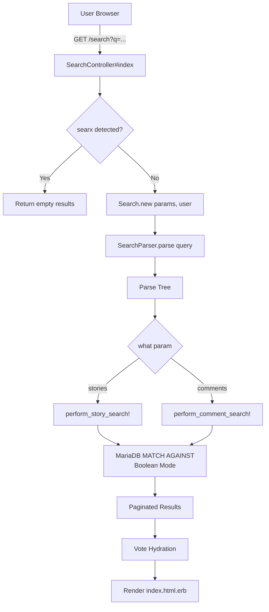
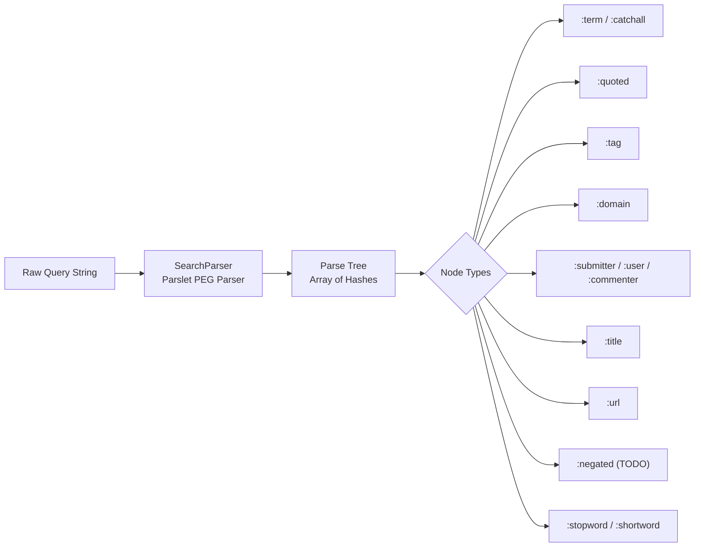
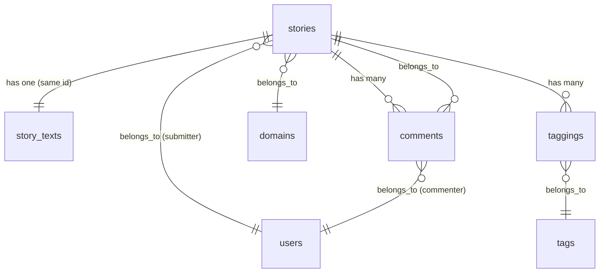

# Search

> **Status**: ✅ Active
> **Generated**: 2026-06-13T00:00:00Z
> **Last Updated**: 2026-06-13T00:00:00Z

---

## Overview

### What It Does
Full-text search for stories and comments on the Lobsters link aggregation site. Users enter a query string that is parsed into a structured search tree supporting terms, quoted phrases, operators (tag, domain, submitter, commenter, title, URL), and negation. The system translates this into MariaDB full-text boolean mode queries with pagination and multiple sort orders.

### Why It Exists
Allows users to find previously submitted stories and comments across the site's history. The search supports structured operators so users can narrow results by metadata (tag, domain, author) in addition to content keywords.

### Key Capabilities
- Full-text search of story titles, descriptions, and bodies
- Full-text search of comment text
- Structured query operators: `tag:`, `domain:`, `submitter:`, `commenter:`, `title:`, `@user`, `~user`, and raw URLs
- Quoted phrase matching
- Negation support (parsed but not yet implemented in query building)
- Three sort orders: newest, relevance, score
- Pagination (20 results per page, max 400 matches)
- Anti-abuse: searx meta-search engine blocking, URL search requires login
- SQL injection prevention via operator stripping and parameterized queries

---

## Architecture

### High-Level Design


### Search Query Parsing Flow


### Components

#### Backend Components
| Component | File Path | Purpose |
|-----------|-----------|---------|
| SearchController | `app/controllers/search_controller.rb` | Handles GET /search requests, initializes Search, hydrates votes |
| Search | `app/models/search.rb` | Query builder: translates parse tree into ActiveRecord/SQL queries |
| SearchParser | `app/models/search_parser.rb` | PEG parser (Parslet) that tokenizes raw query strings into a structured parse tree |
| Search View | `app/views/search/index.html.erb` | Search form, parse tree display, paginated results rendering |

#### Frontend Components
| Component | File Path | Purpose |
|-----------|-----------|---------|
| Search Form | `app/views/search/index.html.erb` (inline) | HTML form with query input, what (stories/comments) radio, order radio |

### Technology Stack
- **Backend**: Ruby on Rails controller + plain Ruby model (not ActiveRecord-backed)
- **Search Engine**: MariaDB full-text indexes with `MATCH ... AGAINST` in boolean mode
- **Parser**: Parslet PEG parser library
- **Database**: MariaDB/MySQL with InnoDB full-text indexes

---

## Model Details

### Search

The `Search` class is a plain Ruby object (not an ActiveRecord model). It encapsulates query parsing, SQL generation, and result pagination.

#### Attributes (via `attr_reader`)
```ruby
# Source: app/models/search.rb:12-13
attr_reader :q, :what, :order, :page, :searcher
attr_reader :invalid_because, :parse_tree
```

#### Key Methods
| Method | Returns | Purpose | Notes |
|--------|---------|---------|-------|
| `initialize(params, user)` | `Search` | Sanitizes params, parses query, sets defaults | `what` defaults to `:comments`, `order` defaults to `:newest` |
| `results` | `ActiveRecord::Relation` | Memoized search execution | Calls `perform!` on first access |
| `results_count` | `Integer` | Total result count for pagination | `-1` means search not yet performed |
| `perform!` | `ActiveRecord::Relation` | Dispatches to story or comment search | Returns `searched_model.none` if query blank |
| `perform_story_search!` | `ActiveRecord::Relation` | Builds story full-text query with all operators | Uses `MATCH(story_texts.title, story_texts.description, story_texts.body)` |
| `perform_comment_search!` | `ActiveRecord::Relation` | Builds comment full-text query with all operators | Uses `MATCH(comment)` |
| `invalid(reason)` | `ActiveRecord::Relation` | Sets error state, returns empty relation | Used for constraint violations (e.g., multiple domains) |
| `flatten_title(tree)` | `String` | Converts title parse node to SQL-safe string | Prevents SQL injection via `quote_string` |
| `strip_operators(s)` | `String` | Removes non-word chars except apostrophes | Prevents boolean mode operator injection |
| `strip_short_terms(s)` | `String` | Removes terms under 3 characters | MariaDB ignores 1-2 char terms anyway |
| `per_page` | `Integer` | Always `20` | Hardcoded |
| `max_matches` | `Integer` | Always `400` (per_page * 20) | Caps pagination depth |
| `page_count` | `Integer` | Number of pages for pagination | Capped at `max_matches` |
| `to_param` | `Hash` | Serializes search state for URL generation | Used by pagination links |
| `searched_model` | `Class` | Returns `Story` or `Comment` based on `what` | |

#### Search Operator Handling (Stories)
| Operator | Parse Node | SQL Effect |
|----------|-----------|------------|
| Plain term | `:term`, `:catchall` | `MATCH(story_texts.title, story_texts.description, story_texts.body) AGAINST('+term' in boolean mode)` |
| `"quoted phrase"` | `:quoted` | Same MATCH but with `+"term1 term2"` |
| `tag:name` | `:tag` | Subquery join on `taggings` + `tags` with `HAVING count(distinct taggings.id) = N` |
| `domain:example.com` | `:domain` | `JOIN domains WHERE domains.domain = 'example.com'` |
| `submitter:user` / `@user` / `~user` | `:submitter`, `:user` | `JOIN users WHERE users.username = 'user'` |
| `title:term` | `:title` | `MATCH(story_texts.title) AGAINST('+term' in boolean mode)` |
| `https://...` | `:url` | `WHERE url = 'url' OR normalized_url = normalize(url)` |
| `-term` | `:negated` | **TODO** -- parsed but not implemented |

#### Search Operator Handling (Comments)
| Operator | Parse Node | SQL Effect |
|----------|-----------|------------|
| Plain term | `:term`, `:catchall` | `MATCH(comment) AGAINST('+term' in boolean mode)` |
| `commenter:user` / `@user` | `:commenter`, `:user` | `JOIN users WHERE users.username = 'user'` |
| `domain:example.com` | `:domain` | `JOIN story -> domains WHERE domains.domain = 'example.com'` |
| `submitter:user` | `:submitter` | `JOIN story -> users WHERE users.username = 'user'` |
| `tag:name` | `:tag` | `WHERE story IN (stories with matching tags)` |
| `title:term` | `:title` | `WHERE story IN (stories matching title)` |
| `https://...` | `:url` | `JOIN story WHERE url = 'url' OR normalized_url = normalize(url)` |

#### Validation Constraints
| Constraint | Error Message |
|-----------|---------------|
| Multiple domains in one query | "A story can't be from multiple domains at once" |
| Multiple submitters in story search | "A story only has one submitter" |
| Multiple commenters in comment search | "A comment only has one commenter" |
| Commenter in story search | "Doesn't make sense to search Stories by commenter" |
| All terms stripped/empty | "No search terms recognized" |

### SearchParser

A Parslet PEG parser that tokenizes search query strings into a structured parse tree (array of hashes).

#### Grammar Rules
```ruby
# Source: app/models/search_parser.rb:8-69
class SearchParser < Parslet::Parser
  rule(:space) { match('\s').repeat(1) }
  rule(:space?) { space.maybe }

  rule(:wordchar) { match('[\p{Word}_\\-\']') }
  rule(:non_wordchar) { match('[^\p{Word}_\\-\']') }
  rule(:eof) { any.absent? }

  rule(:stopword) { Parslet::Atoms::Alternative.new(*MYISAM_STOPWORDS.map { str(it) }).as(:stopword) >> (non_wordchar | eof) >> space? }
  rule(:term) { wordchar.repeat(3).as(:term) >> space? }
  rule(:shortword) { wordchar.repeat(1, 2).as(:shortword) >> space? }
  rule(:quoted) { str('"') >> (term | shortword).repeat(1).as(:quoted) >> str('"') >> space? }

  rule(:commenter) { str("commenter:") >> match("[@~]").repeat(0, 1) >> match("[A-Za-z0-9_\\-]").repeat(1, 24).as(:commenter) >> space? }
  rule(:domain) {
    str("domain:").maybe >>
      (
        (match("[a-z0-9]") >> match("[a-z0-9\\-]").repeat(1, 62) >> str(".")).repeat(1) >>
        Parslet::Atoms::Alternative.new(*FetchIanaTldsJob.tlds.sort_by { -it.length }.map { str(it) })
      ).as(:domain) >> space?
  }
  rule(:submitter) { str("submitter:") >> match("[@~]").repeat(0, 1) >> match("[A-Za-z0-9_\\-]").repeat(1, 24).as(:submitter) >> space? }
  rule(:tag) { str("tag:") >> match("[A-Za-z0-9\\-_+]").repeat(1).as(:tag) >> space? }
  rule(:title) { str("title:") >> (term | quoted).as(:title) >> space? }
  rule(:url) {
    (
      str("http") >> str("s").repeat(0, 1) >> str("://") >>
      match("[A-Za-z0-9\\-_.:@/()%~?&=#]").repeat(1)
    ).as(:url) >> space?
  }
  rule(:user) { match("[@~]") >> match("[A-Za-z0-9_\\-]").repeat(1, 24).as(:user) >> space? }
  rule(:negated) { str("-") >> (domain | tag | quoted | term).as(:negated) >> space? }

  rule(:catchall) { match("\\S").repeat(1).as(:term) >> space? }

  rule(:expression) {
    space.maybe >> (
      commenter |
      domain |
      submitter |
      tag |
      title |
      url |
      user |
      stopword |
      term |
      shortword |
      quoted |
      negated |
      catchall
    ).repeat(1)
  }
  root(:expression)
end
```

#### Stopwords
```ruby
# Source: app/models/search_parser.rb:6
MYISAM_STOPWORDS = %w[a about an are as at be by com de en for from how i in is it la of on or that the this to was what when where who will with und the www].sort_by { it.length }.reverse.freeze
```

---

## Database Schema

Search does not have its own tables. It queries the following existing tables using full-text indexes:

### story_texts

| Column | Type | Default | Notes |
|--------|------|---------|-------|
| `id` | `bigint` | — | Primary key (matches `stories.id`) |
| `title` | `string(150)` | `""` | Story title |
| `description` | `text (medium)` | — | Story description |
| `body` | `text (medium)` | — | Story body text |
| `created_at` | `timestamp` | `current_timestamp() ON UPDATE current_timestamp()` | |

**Full-text indexes:**
- `index_story_texts_on_title` -- FULLTEXT on `title`
- `index_story_texts_on_title_and_description_and_body` -- FULLTEXT on `(title, description, body)`

### comments (search-relevant columns)

| Column | Type | Default | Notes |
|--------|------|---------|-------|
| `id` | `bigint (unsigned)` | — | Primary key |
| `comment` | `text (medium)` | — | Comment body text |
| `story_id` | `bigint (unsigned)` | — | FK to stories |
| `user_id` | `bigint (unsigned)` | — | FK to users (commenter) |
| `score` | `integer` | `1` | Used for score-based ordering |
| `is_deleted` | `boolean` | `false` | Soft delete flag |
| `is_moderated` | `boolean` | `false` | Moderation flag |

**Full-text index:**
- `index_comments_on_comment` -- FULLTEXT on `comment`

### stories (search-relevant columns)

| Column | Type | Default | Notes |
|--------|------|---------|-------|
| `id` | `bigint (unsigned)` | — | Primary key |
| `user_id` | `bigint (unsigned)` | — | FK to users (submitter) |
| `url` | `string(250)` | `""` | Original URL |
| `normalized_url` | `string` | — | Normalized URL for duplicate detection |
| `title` | `string(150)` | `""` | Story title |
| `score` | `integer` | `1` | Used for score-based ordering |
| `is_deleted` | `boolean` | `false` | Soft delete flag |
| `domain_id` | `bigint` | — | FK to domains |

### Relationships


---

## API Endpoints

| Method | Path | Action | Description | Notes |
|--------|------|--------|-------------|-------|
| `GET` | `/search` | `SearchController#index` | Display search form and/or results | |
| `GET` | `/search/:q` | `SearchController#index` | Search with query in URL path | Same action, query in path segment |

### Parameters
| Param | Type | Values | Default | Description |
|-------|------|--------|---------|-------------|
| `q` | `string` | Any | — | Search query string |
| `what` | `string` | `stories`, `comments` | `comments` | Content type to search |
| `order` | `string` | `newest`, `relevance`, `score` | `newest` | Sort order for results |
| `page` | `integer` | 1+ | `1` | Pagination page number |

---

## Authorization

Search has no Pundit policies. Authorization is minimal:
- **Anonymous users**: Can search freely, except URL searches are blocked with an error message (anti-spam measure, see GitHub issue #1814)
- **Logged-in users**: Full search access; results are hydrated with the user's vote state
- **Content visibility**: Story search uses `Story.base(@searcher)` and comment search uses `Comment.accessible_to_user(searcher)`, which filter out deleted/moderated content based on the user's permissions

---

## Configuration

### Environment Variables
None specific to search.

### Dependencies
- **Parslet gem**: PEG parser library used by `SearchParser`
- **MariaDB InnoDB full-text**: The search relies entirely on MariaDB's built-in full-text indexing; there is no external search engine (Elasticsearch, etc.)
- **FetchIanaTldsJob**: The domain parser rule dynamically loads IANA TLDs from a file fetched by this background job. If the TLD list is missing, domain parsing will fail.

---

## Usage Examples

### Basic Search Flow
```ruby
# Source: app/controllers/search_controller.rb:7-31
def index
  @title = "Search"

  @search = Search.new(search_params, @user)

  if !@user && params[:q].to_s.starts_with?("https://")
    flash[:error] = "Sorry, you have to log in to search for a URL. We're getting hammered by a spambot with many thousands of IPs. More info at https://github.com/lobsters/lobsters/issues/1814"
    @results = []
  else
    @results = @search.results
  end

  if @user && @search.results
    if params[:what] == "stories"
      votes = Vote.story_votes_by_user_for_story_ids_hash(@user.id, @search.results.map(&:id))
      @search.results.each do |r|
        r.current_vote = votes.try(:[], r.id)
      end
    end
    @results = if params[:what] == "comments"
      CommentVoteHydrator.new(@search.results, @user)
    else
      @search.results
    end
  end
end
```

### Searx Blocking
```ruby
# Source: app/controllers/search_controller.rb:37-43
def ignore_searx
  return unless params[:utf8] == "\u2713"
  @search = Search.new({results_count: 0}, nil)
  @results = []
  render :index
end
```

### Multi-Tag Story Search (SQL Subquery)
```ruby
# Source: app/models/search.rb:294-304
# This searches tags by subquery because otherwise Rails recognizes the join against tags and
# thinks the .tags association preload is satisfied, so returned stories will only have the
# searched-for tags.
query.joins!(<<~SQL.tr("\n", "")
  inner join (
    select stories.id
    from stories
    join taggings on taggings.story_id = stories.id
    where taggings.tag_id in (#{tags.to_sql})
    group by stories.id
    having count(distinct taggings.id) = #{n_tags}
  ) as stories_with_tags on stories_with_tags.id = stories.id
SQL
            )
```

---

## Testing

### Test Files
- `spec/models/search_spec.rb` -- 25+ tests covering story search, comment search, SQL injection prevention, operator combinations, helper methods
- `spec/models/search_parser_spec.rb` -- Grammar rule tests for every parser rule, parse tree structure validation, edge cases from production
- `spec/requests/search_spec.rb` -- Integration tests: form loading, zero results, finding comments/stories, SQL injection, searx blocking, vote hydration

### Key Test Patterns
- Tests use `before(:all)` / `after(:all)` (not transactions) because MariaDB full-text indexes are not updated within a transaction
- SQL injection tests cover extensive attack vectors including real exploit attempts seen in production
- `StoryText.fill_cache!` or manual `StoryText.create` is required in tests to populate the full-text indexed table

---

## Known Issues & Caveats

| Issue | Location | Description |
|-------|----------|-------------|
| Negation not implemented | `app/models/search.rb:167,262` | `:negated` nodes are parsed by `SearchParser` but both `perform_comment_search!` and `perform_story_search!` have `when :negated` with only a `# TODO` comment -- negated terms are silently ignored |
| Unknown tag not validated | `app/models/search.rb:149,258` | `# TODO unknown tag` comments indicate that searching for a non-existent tag silently returns no results rather than showing a helpful error |
| Stopwords and shortwords silently dropped | `app/models/search.rb:170,276` | Parse nodes of type `:stopword` and `:shortword` have no `when` clause and are silently skipped in query building |
| MariaDB minimum term length | `app/models/search_parser.rb:19` | Terms under 3 characters are classified as `:shortword` and excluded from search. The view explains this to users but it can be surprising (e.g., searching for "Go" language requires `tag:go`) |
| URL search restricted for anonymous users | `app/controllers/search_controller.rb:12-14` | Due to spambot abuse (GitHub issue #1814), anonymous users cannot search by URL |
| Searx detection is fragile | `app/controllers/search_controller.rb:40` | Detection relies solely on `params[:utf8] == "\u2713"` which could match legitimate requests using old Rails UTF-8 form encoding |
| Hardcoded pagination | `app/models/search.rb:57-59` | `per_page` (20) and `max_matches` (400) are hardcoded with no configuration option |
| Raw SQL interpolation | `app/models/search.rb:155,181-183,285-288` | While SQL injection is mitigated by `strip_operators` and `flatten_title`, the MATCH AGAINST clauses use string interpolation rather than parameterized queries |
| n_tags integer interpolation | `app/models/search.rb:193,301` | `#{n_tags}` is interpolated directly into SQL, safe because it is an integer counter but not parameterized |

---

## Performance

### Full-Text Indexes
The search depends entirely on MariaDB InnoDB full-text indexes for performance:

| Table | Index | Columns | Type |
|-------|-------|---------|------|
| `story_texts` | `index_story_texts_on_title` | `title` | FULLTEXT |
| `story_texts` | `index_story_texts_on_title_and_description_and_body` | `title, description, body` | FULLTEXT |
| `comments` | `index_comments_on_comment` | `comment` | FULLTEXT |

### Pagination Depth Cap
- Maximum of 400 results (20 pages x 20 per page) prevents expensive deep pagination queries

### Query Optimization
- Story tag search uses a subquery join rather than a direct tag join to avoid Rails incorrectly treating the search join as satisfying the `.tags` association preload
- `results_count` is computed via `query.dup.count` before applying `LIMIT`/`OFFSET`, which means every search executes two queries (count + results)

---

## Troubleshooting

### Common Issues

#### Issue: Search returns 0 results for short terms
**Symptoms:**
- Searching for "Go", "AI", "ML", "C" returns nothing

**Cause:**
MariaDB full-text search ignores terms shorter than 3 characters (`innodb_ft_min_token_size` default). The parser classifies these as `:shortword` nodes which are excluded from query building.

**Solution:**
Use the tag operator instead: `tag:go`, `tag:ai`, `tag:c`. The view template includes hints for common short programming language names.

#### Issue: Stopwords in queries are ignored
**Symptoms:**
- Words like "the", "for", "how", "what" disappear from the search

**Cause:**
MariaDB InnoDB stopwords list. The parser identifies these as `:stopword` nodes. The view explains this to users and suggests quoting phrases, though MariaDB still ignores stopwords at the start of a quoted phrase.

#### Issue: Domain search not working
**Symptoms:**
- `domain:example.xyz` fails to parse

**Cause:**
The domain parser rule dynamically loads TLDs from `FetchIanaTldsJob::STORAGE_PATH`. If the background job has not run or the TLD file is missing/stale, the TLD will not be recognized.

**Solution:**
Ensure `FetchIanaTldsJob` has run successfully and the TLD list file exists.

---

## Related Features

- **[stories](catalog.md)** -- Story search queries the `stories` and `story_texts` tables; results render using the story list detail partial
- **[comments](catalog.md)** -- Comment search queries the `comments` table; results render using the comment partial
- **[tags-categories](catalog.md)** -- The `tag:` search operator filters results by tag
- **[domains-origins](catalog.md)** -- The `domain:` search operator filters by story domain
- **[users](catalog.md)** -- The `submitter:`, `commenter:`, `@user`, and `~user` operators filter by user

---

**Generated:** 2026-06-13T00:00:00Z
**Last Updated:** 2026-06-13T00:00:00Z
**Status:** ✅ Active
