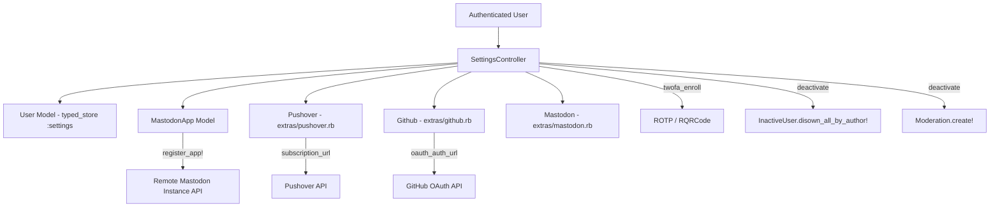
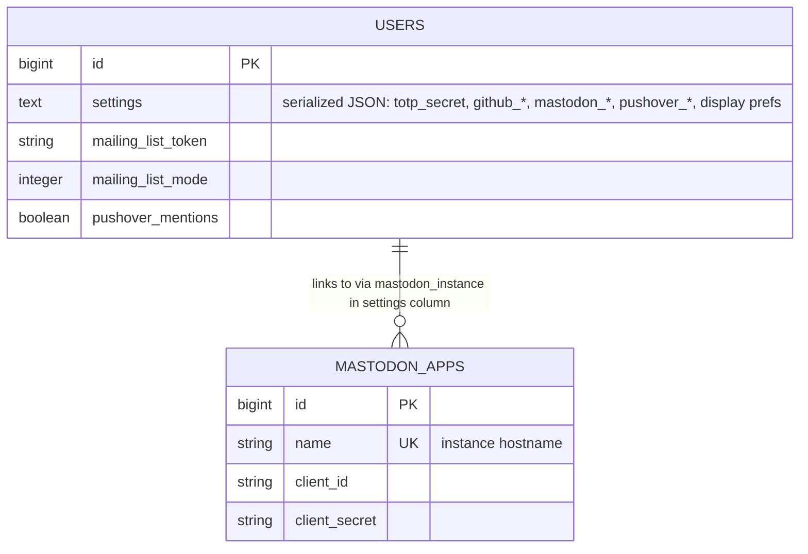
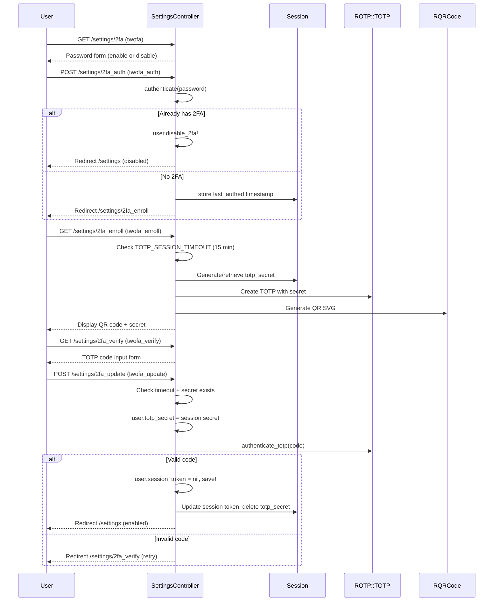
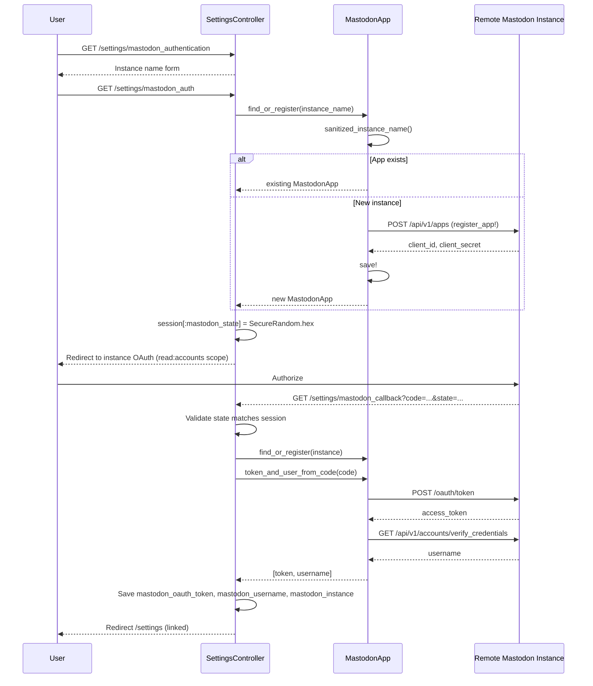
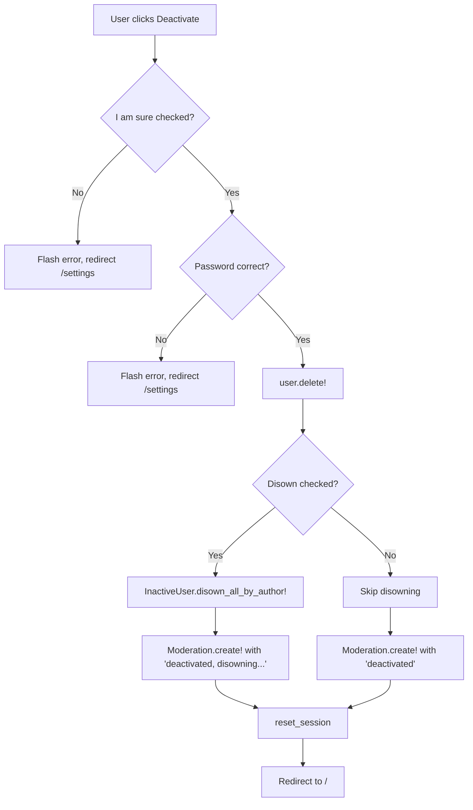

# Settings

> **Status**: Active
> **Generated**: 2026-06-13T00:00:00Z
> **Last Updated**: 2026-06-13T00:00:00Z

---

## Overview

### What It Does
The Settings feature provides authenticated users with a comprehensive page to manage their account profile, security credentials, notification preferences, mailing list enrollment, display preferences, external service integrations (GitHub, Mastodon, Pushover), two-factor authentication (TOTP), and account deactivation.

### Why It Exists
Users need a centralized location to control their identity, security posture, and communication preferences on the site. The feature also serves as the OAuth callback endpoint for linking external accounts and as the enrollment/management interface for TOTP-based two-factor authentication.

### Key Capabilities
- Edit public profile (username, email, homepage, about)
- Change password with session token rotation
- Enroll in / disable TOTP-based two-factor authentication
- Configure notification preferences (email, Pushover) for replies, mentions, and private messages
- Subscribe to mailing list mode (all stories+comments, stories only, or disabled)
- Toggle display preferences (color scheme, contrast, avatars, story previews)
- Link/unlink GitHub account via OAuth
- Link/unlink Mastodon account via OAuth (with dynamic instance registration)
- Subscribe/manage Pushover push notifications
- Deactivate account with optional content disowning

---

## Architecture

### High-Level Design



### Components

#### Backend Components

| Component | File Path | Purpose |
|-----------|-----------|---------|
| SettingsController | `app/controllers/settings_controller.rb` | Handles all settings actions: profile update, 2FA workflow, OAuth flows, deactivation |
| MastodonApp | `app/models/mastodon_app.rb` | Persists per-instance Mastodon OAuth app registrations; handles token exchange and revocation |
| Pushover | `extras/pushover.rb` | Utility class for Pushover API: subscription URL generation and push notifications |
| Github | `extras/github.rb` | Utility class for GitHub OAuth: auth URL, token exchange, token revocation |
| Mastodon | `extras/mastodon.rb` | Utility class for site-level Mastodon bot operations (posting, list sync); `enabled?` check used in views |
| User (typed_store) | `app/models/user.rb` (lines 85-107) | Stores all settings-related attributes in a serialized `settings` text column |

#### Frontend Components (Views)

| Component | File Path | Purpose |
|-----------|-----------|---------|
| Settings index | `app/views/settings/index.html.erb` | Main settings form: profile, security, notifications, mailing list, display, external accounts, deactivation |
| 2FA start | `app/views/settings/twofa.html.erb` | Password verification to begin 2FA enrollment or disable 2FA |
| 2FA enroll | `app/views/settings/twofa_enroll.html.erb` | Displays QR code and TOTP secret for scanning |
| 2FA verify | `app/views/settings/twofa_verify.html.erb` | Final TOTP code verification to enable 2FA |
| Mastodon auth | `app/views/settings/mastodon_authentication.html.erb` | Form to enter Mastodon instance name before OAuth redirect |

### Technology Stack
- **Backend**: Ruby on Rails, `typed_store` gem for serialized settings column, `rotp` gem for TOTP, `rqrcode` gem for QR codes, `oauth` gem for GitHub
- **Frontend**: Server-rendered ERB templates
- **Database**: MySQL (utf8mb4), `mastodon_apps` table for instance registrations, `users.settings` text column for serialized preferences
- **External Services**: GitHub OAuth API, Mastodon OAuth API (per-instance), Pushover subscription API

---

## Model Details

### MastodonApp

#### Associations
None. This is a standalone model with no ActiveRecord associations.

#### Concerns
None included.

#### Validations
```ruby
# Source: app/models/mastodon_app.rb:5-8
validates :name, :client_id, :client_secret,
  presence: true,
  length: {maximum: 255}
validates :name, uniqueness: {case_sensitive: false}
```

#### Callbacks
None.

#### Key Methods

| Method | Returns | Purpose | Notes |
|--------|---------|---------|-------|
| `oauth_auth_url(mastodon_state)` | `String` | Builds Mastodon OAuth authorize URL with `read:accounts` scope | Uses instance `name` as hostname |
| `redirect_uri` | `String` | Builds callback URL: `https://{domain}/settings/mastodon_callback?instance={name}` | |
| `register_app!` | `true` or `nil` | POSTs to `/api/v1/apps` on remote instance to register OAuth app; saves `client_id`/`client_secret` on success; adds errors on failure | Rescues `DNSError`, `NoIPsError`, `JSON::ParserError`, `OpenSSL::SSL::SSLError`, `URI::InvalidURIError` |
| `token_and_user_from_code(code)` | `[token, username]` or `[nil, nil]` | Exchanges authorization code for access token, then fetches `/api/v1/accounts/verify_credentials` to get username | Rescues SSL and JSON errors |
| `revoke_token(token)` | `true` or result of comparison | POSTs to `/oauth/revoke` on the instance; swallows networking errors because indie instances may disappear | Returns `true` if `res` is nil (sponge timeout) |
| `self.find_or_register(instance_name)` | `MastodonApp` or `nil` | Finds existing app by sanitized name or creates+registers a new one | Returns `nil` if sanitized name is blank |
| `self.sanitized_instance_name(instance_name)` | `String` | Extracts hostname from URLs like `https://foo.social/@user` or `@user@foo.social` | Strips protocol, splits on `/` and `@` |

### User (settings-related attributes via `typed_store`)

The `User` model uses `typed_store :settings` to serialize the following attributes into the `settings` text column:

```ruby
# Source: app/models/user.rb:85-107
typed_store :settings do |s|
  s.string :prefers_color_scheme, default: "system"
  s.string :prefers_contrast, default: "system"
  s.boolean :email_notifications, default: false
  s.boolean :email_replies, default: false
  s.boolean :pushover_replies, default: false
  s.string :pushover_user_key
  s.boolean :email_messages, default: false
  s.boolean :pushover_messages, default: false
  s.boolean :email_mentions, default: false
  s.boolean :inbox_mentions, default: true
  s.boolean :show_avatars, default: true
  s.boolean :show_email, default: false
  s.boolean :show_story_previews, default: false
  s.boolean :show_submitted_story_threads, default: false
  s.string :totp_secret
  s.string :github_oauth_token
  s.string :github_username
  s.string :mastodon_instance
  s.string :mastodon_oauth_token
  s.string :mastodon_username
  s.string :homepage
end
```

#### Settings-Related Validations
```ruby
# Source: app/models/user.rb:109-110
validates :prefers_color_scheme, inclusion: %w[system light dark]
validates :prefers_contrast, inclusion: %w[system normal high]
```

#### Settings-Related Methods on User

| Method | Returns | Purpose | Notes |
|--------|---------|---------|-------|
| `has_2fa?` | `Boolean` | Returns `totp_secret.present?` | |
| `disable_2fa!` | `true` | Sets `totp_secret` to nil, calls `save!` | |
| `authenticate_totp(code)` | TOTP result or `nil` | Verifies TOTP code with `drift_behind` and `drift_ahead` set to `totp.interval` | Uses `ROTP::TOTP` |
| `roll_session_token` | `String` | Sets `session_token` to `Utils.random_str(60)` | Called on password change |
| `delete!` | N/A | Deletes negative-score comments, clears messages, sets `deleted_at`, saves | Used by deactivation flow |
| `mastodon_acct` | `String` | Returns `@username@instance` format | Raises if either attribute blank |
| `pushover!(params)` | N/A | Delegates to `Pushover.push` if `pushover_user_key` present | |

---

## Database Schema

### mastodon_apps

| Column | Type | Default | Notes |
|--------|------|---------|-------|
| `id` | `bigint` | auto-increment | Primary key |
| `name` | `string` | — | NOT NULL; Mastodon instance hostname |
| `client_id` | `string` | — | NOT NULL; OAuth client ID from instance |
| `client_secret` | `string` | — | NOT NULL; OAuth client secret from instance |
| `created_at` | `datetime` | — | NOT NULL |
| `updated_at` | `datetime` | — | NOT NULL |

**Indexes:**
- `index_mastodon_apps_on_name` (unique) on `name`

### users (settings-relevant columns only)

The bulk of settings data lives in the serialized `settings` text column. The following columns on the `users` table are directly relevant:

| Column | Type | Default | Notes |
|--------|------|---------|-------|
| `username` | `string(50)` | — | Editable from settings |
| `email` | `string(100)` | — | Editable from settings |
| `password_digest` | `string(75)` | — | Changed via settings |
| `about` | `text(medium)` | — | Editable from settings |
| `settings` | `text(medium)` | — | Serialized JSON via `typed_store`; holds all preferences, OAuth tokens, TOTP secret |
| `show_email` | `boolean` | `false` | NOT NULL; also in typed_store (dual storage) |
| `pushover_mentions` | `boolean` | `false` | NOT NULL; standalone column, not in typed_store |
| `mailing_list_token` | `string(75)` | — | Unique token for mailing list address |
| `mailing_list_mode` | `integer` | `0` | 0=disabled, 1=all stories+comments, 2=stories only |
| `session_token` | `string(75)` | `""` | NOT NULL; re-rolled on password change |
| `password_reset_token` | `string(75)` | — | Used in deactivation/reactivation flow |
| `deleted_at` | `datetime` | — | Set by `delete!` on deactivation |

### Relationships



Note: There is no foreign key between `users` and `mastodon_apps`. The relationship is implicit via the `mastodon_instance` value stored in the user's serialized `settings` column matching `mastodon_apps.name`.

---

## API Endpoints

| Method | Path | Action | Description | Notes |
|--------|------|--------|-------------|-------|
| `GET` | `/settings` | `index` | Display main settings form | |
| `POST` | `/settings` | `update` | Save profile and preference changes | Requires current password if changing password |
| `POST` | `/settings/deactivate` | `deactivate` | Deactivate user account | Requires password + "I am sure" checkbox |
| `GET` | `/settings/2fa` | `twofa` | Show 2FA enrollment/disable entry page | |
| `POST` | `/settings/2fa_auth` | `twofa_auth` | Verify password to begin 2FA enrollment or disable 2FA | |
| `GET` | `/settings/2fa_enroll` | `twofa_enroll` | Show QR code for TOTP enrollment | 15-min session timeout from `twofa_auth` |
| `GET` | `/settings/2fa_verify` | `twofa_verify` | Show TOTP code verification form | 15-min session timeout |
| `POST` | `/settings/2fa_update` | `twofa_update` | Verify TOTP code and enable 2FA | Re-rolls session token on success |
| `POST` | `/settings/pushover_auth` | `pushover_auth` | Redirect to Pushover subscription page | Stores random token in session for CSRF |
| `GET` | `/settings/pushover_callback` | `pushover_callback` | Handle Pushover callback; save user key | Validates session random matches URL param |
| `GET` | `/settings/mastodon_authentication` | `mastodon_authentication` | Show form to enter Mastodon instance name | |
| `GET` | `/settings/mastodon_auth` | `mastodon_auth` | Find/register Mastodon app, redirect to OAuth | Registers app on remote instance if new |
| `GET` | `/settings/mastodon_callback` | `mastodon_callback` | Handle Mastodon OAuth callback; save token + username | Validates state parameter |
| `POST` | `/settings/mastodon_disconnect` | `mastodon_disconnect` | Revoke Mastodon token and clear user fields | Swallows networking errors on revoke |
| `GET` | `/settings/github_auth` | `github_auth` | Redirect to GitHub OAuth authorization | Stores state in session |
| `GET` | `/settings/github_callback` | `github_callback` | Handle GitHub OAuth callback; save token + username | Validates state parameter |
| `POST` | `/settings/github_disconnect` | `github_disconnect` | Revoke GitHub token and clear user fields | Warns user if revocation API errors |

---

## Authorization

There is no Pundit policy for settings. Authorization is handled by the `before_action :require_logged_in_user` callback in `SettingsController`, which is inherited from `ApplicationController`. All actions require an authenticated user session. Users can only modify their own settings (the controller uses `@user` which is the currently logged-in user).

---

## Configuration

### Environment Variables / Credentials

All external service credentials are stored in Rails encrypted credentials (`rails credentials:edit`):

```yaml
# Pushover
pushover:
  api_token: "..."           # Required for Pushover.enabled?
  subscription_code: "..."   # Used in Pushover.subscription_url

# GitHub OAuth
github:
  client_id: "..."           # Required for Github.enabled?
  client_secret: "..."       # Used in OAuth token exchange

# Mastodon (site-level bot, not per-user)
mastodon:
  token: "..."               # Required for Mastodon.enabled?
  instance_name: "..."       # Site's own Mastodon instance
  bot_name: "..."            # Bot account username
  client_id: "..."           # Bot OAuth client ID
  client_secret: "..."       # Bot OAuth client secret
  list_id: "..."             # Mastodon list for user sync
```

Note: Per-user Mastodon OAuth is handled dynamically via `MastodonApp` registrations. The credentials above are for the site's own bot account.

### Constants

```ruby
# Source: app/controllers/settings_controller.rb:6
TOTP_SESSION_TIMEOUT = (60 * 15)  # 15 minutes for 2FA enrollment window
```

---

## Key Flows

### Two-Factor Authentication Enrollment



### Mastodon OAuth Linking



### Account Deactivation



---

## Usage Examples

### Permitted User Params
```ruby
# Source: app/controllers/settings_controller.rb:282-289
def user_params
  params.require(:user).permit(
    :username, :email, :password, :password_confirmation, :homepage, :about,
    :email_replies, :email_messages, :email_mentions, :inbox_mentions,
    :pushover_replies, :pushover_messages, :pushover_mentions,
    :mailing_list_mode, :show_email, :show_avatars, :show_story_previews,
    :show_submitted_story_threads, :prefers_color_scheme, :prefers_contrast
  )
end
```

### Mastodon Instance Name Sanitization
```ruby
# Source: app/models/mastodon_app.rb:141-148
# user may input hostname (foo.social), url (https://foo.social/@user), or user (@user@foo.social)
# extract hostname from possible URL
def self.sanitized_instance_name(instance_name)
  instance_name
    .to_s
    .strip
    .delete_prefix("https://")
    .split("/").first
    .split("@").last
end
```

### Pushover Subscription URL Generation
```ruby
# Source: extras/pushover.rb:30-35
def self.subscription_url(params)
  u = "https://pushover.net/subscribe/#{Rails.application.credentials.pushover.subscription_code}"
  u << "?success=#{CGI.escape(params[:success])}"
  u << "&failure=#{CGI.escape(params[:failure])}"
  u
end
```

---

## Testing

### Test Files
- `spec/requests/settings_spec.rb` -- Request specs covering password update (session token rotation) and 2FA enrollment flow
- `spec/features/settings_spec.rb` -- Feature specs covering account deactivation, reactivation, and disowning

### Key Test Cases

**Request specs (`spec/requests/settings_spec.rb`):**
- Password update rolls the session token and sets a new cookie
- `GET /settings/2fa` returns successfully
- `GET /settings/2fa_enroll` (after auth) returns successfully and sets a 32-char `totp_secret` in session

**Feature specs (`spec/features/settings_spec.rb`):**
- Deactivating and reactivating via password reset
- Deactivating with disown reassigns stories and comments to `inactive-user`
- Deactivating without "I am sure" does not deactivate
- Deactivating without disown keeps stories/comments attributed to original user

---

## Known Issues & Caveats

| Issue | Location | Description |
|-------|----------|-------------|
| Dual `show_email` storage | `db/schema.rb:505` + `user.rb:97` | `show_email` exists both as a standalone boolean column on `users` AND inside the `typed_store :settings` block. The controller permits `show_email` in `user_params`, but it is unclear which storage location takes precedence at read time. |
| `pushover_mentions` not in typed_store | `db/schema.rb:492` | `pushover_mentions` is a standalone boolean column on the `users` table, unlike `pushover_replies` and `pushover_messages` which are in `typed_store :settings`. It is still permitted in `user_params`. |
| `email_notifications` unused | `user.rb:88` | `email_notifications` is declared in `typed_store` with default `false` but is not referenced in the settings controller or any view. Appears to be dead code or a legacy attribute. |
| Typo in update action | `settings_controller.rb:47` | References `@edit_user.changed_atributes[:username]` (note: `atributes` is likely a typo for `attributes`, though it may be a custom method). |
| `mastodon_authentication` action is empty | `settings_controller.rb:189-190` | The `mastodon_authentication` action has no body -- it relies entirely on the convention of rendering `mastodon_authentication.html.erb`. |
| Pushover callback raises on mismatch | `settings_controller.rb:174` | If the `rand` param doesn't match the session value, the controller `raise`s an exception rather than returning a user-friendly error. This would result in a 500 error. |
| Token revocation swallows errors | `mastodon_app.rb:116` | `revoke_token` returns `true` when `res` is nil (sponge timeout), treating network failures as success. This is intentional (indie instances disappear) but means the remote token may still be valid. |
| GitHub disconnect warns but succeeds | `settings_controller.rb:270-271` | If GitHub token revocation fails, the user is shown a notice but the local association is still cleared. The user may need to manually revoke at github.com/settings/applications. |
| No CSRF protection on Mastodon/GitHub auth initiation | `settings_controller.rb:189,241` | `mastodon_auth` and `github_auth` are GET actions that initiate OAuth flows. They rely on the OAuth `state` parameter for security rather than Rails CSRF tokens. |

---

## Performance

### Database Optimization

**mastodon_apps indexes:**
- `index_mastodon_apps_on_name` (unique) -- used by `find_by(name:)` in `find_or_register` and `mastodon_disconnect`

**users indexes (settings-relevant):**
- `session_hash` (unique) on `session_token` -- used after session token rotation
- `mailing_list_enabled` on `mailing_list_mode` -- used to find mailing list subscribers
- `mailing_list_token` (unique) -- used to authenticate inbound mailing list emails

### Caching
No explicit caching is used in the settings feature. All reads come directly from the database.

---

## Troubleshooting

### Common Issues

#### Issue: 2FA enrollment times out
**Symptoms:**
- User sees "Your enrollment period timed out" after scanning QR code

**Cause:**
The `TOTP_SESSION_TIMEOUT` is 15 minutes. If the user takes longer than 15 minutes between the password verification (`twofa_auth`) and completing enrollment (`twofa_update`), the session expires.

**Solution:**
The user must restart the 2FA enrollment process from `/settings/2fa`.

#### Issue: Mastodon instance registration fails
**Symptoms:**
- Error "App registration failed, is {name} a Mastodon instance?"

**Cause:**
The remote instance may be down, not running Mastodon-compatible software, or may have DNS/SSL issues.

**Solution:**
Verify the instance hostname is correct and accessible. The `MastodonApp.register_app!` method provides specific error messages for DNS errors, SSL errors, and JSON parse failures.

#### Issue: Pushover callback returns 500
**Symptoms:**
- Internal server error after returning from Pushover

**Cause:**
The controller raises an exception (rather than flash + redirect) when the `rand` parameter in the callback URL does not match the session value (`settings_controller.rb:174`).

**Solution:**
This typically indicates session expiry between initiating Pushover auth and the callback. The user should try again with a fresh session.

---

## Related Features

- **[Authentication](authentication.md)** -- Login/logout and password reset; 2FA verification at login uses `login#twofa`/`login#twofa_verify`
- **[Users](users.md)** -- User model and profile display; settings edits the same `User` record
- **[Signup & Invitations](signup-invitations.md)** -- The settings page includes an invitation form partial (`users/invitationform`)
- **[Inbox & Notifications](inbox-notifications.md)** -- Notification preferences configured here control what appears in the inbox
- **[Messages](messages.md)** -- Message notification preferences (email, Pushover) are configured in settings
- **[Home Feed](home-feed.md)** -- Mailing list mode configured here affects how users receive content

---

**Generated:** 2026-06-13T00:00:00Z
**Last Updated:** 2026-06-13T00:00:00Z
**Status:** Active
