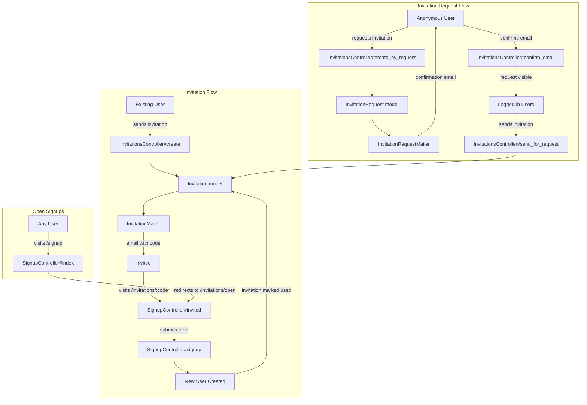
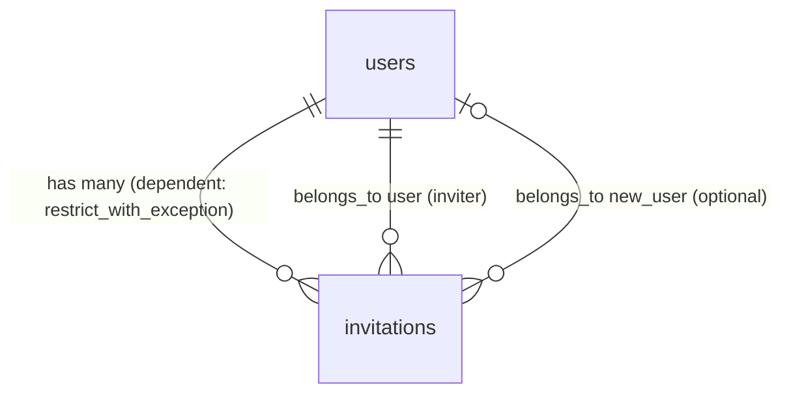

# Signup & Invitations

> **Status**: Active
> **Generated**: 2026-06-13T00:00:00Z
> **Last Updated**: 2026-06-13T00:00:00Z

---

## Overview

### What It Does
The signup-invitations feature implements Lobsters' invite-only user registration system. New users can only create accounts by receiving an invitation from an existing user or, when enabled, by submitting a public invitation request that existing users can fulfill. The system tracks the invitation chain via a user tree, creating accountability between inviters and invitees.

### Why It Exists
Lobsters uses an invitation-only model to combat spam and increase accountability. Every user is linked to the person who invited them, creating a tree of responsibility. If a user causes problems, the inviter shares responsibility. This design choice is a core part of Lobsters' community moderation philosophy.

### Key Capabilities
- Invitation-only signup with unique invitation codes
- Open signups mode (toggle via `OPEN_SIGNUPS` environment variable) for initial site bootstrapping
- Public invitation request system (disabled by default) where non-users can request invitations
- Email verification for invitation requests before they become visible to logged-in users
- Post-signup invitation flow prompting new users to invite others (configurable)
- Moderator controls to disable/enable a user's invitation privileges
- Anti-abuse: tattle system that flags logged-in users attempting to redeem invitation codes

---

## Architecture

### High-Level Design



### Components

#### Backend Components
| Component | File Path | Purpose |
|-----------|-----------|---------|
| SignupController | `app/controllers/signup_controller.rb` | Handles signup page display, invitation landing, and account creation |
| InvitationsController | `app/controllers/invitations_controller.rb` | Manages sending invitations, invitation requests, and request fulfillment |
| Invitation | `app/models/invitation.rb` | Represents an invitation from an existing user to a prospective user |
| InvitationRequest | `app/models/invitation_request.rb` | Represents a public request for an invitation from a non-user |
| InvitationMailer | `app/mailers/invitation_mailer.rb` | Sends invitation emails with signup link |
| InvitationRequestMailer | `app/mailers/invitation_request_mailer.rb` | Sends email confirmation for invitation requests |

#### View Templates
| Component | File Path | Purpose |
|-----------|-----------|---------|
| Signup Index | `app/views/signup/index.html.erb` | Landing page explaining invite-only policy |
| Signup Invited | `app/views/signup/invited.html.erb` | Account creation form for invited users |
| Signup Invite | `app/views/signup/invite.html.erb` | Post-signup prompt to invite others |
| Invitation Form Partial | `app/views/users/_invitationform.html.erb` | Reusable form for sending an invitation (used in settings and post-signup) |
| Invitation Requests List | `app/views/invitations/index.html.erb` | Table of verified invitation requests for logged-in users |
| Request Form | `app/views/invitations/build.html.erb` | Public form for requesting an invitation |
| Invitation Email | `app/views/invitation_mailer/invitation.text.erb` | Plain text invitation email template |
| Request Confirmation Email | `app/views/invitation_request_mailer/invitation_request.text.erb` | Plain text email confirmation for requests |

### Technology Stack
- **Backend**: Ruby on Rails (controllers, models, mailers)
- **Frontend**: Server-rendered ERB templates with Rails form helpers
- **Database**: MySQL (utf8mb4)
- **Email**: ActionMailer with `deliver_now` (synchronous delivery)

---

## Model Details

### Invitation

#### Associations
```ruby
# Source: app/models/invitation.rb
belongs_to :user
belongs_to :new_user, class_name: "User", inverse_of: nil, optional: true
```

#### Concerns
| Concern | Purpose |
|---------|---------|
| `Token` | Generates an immutable `token` field via `TypeID` on `after_initialize`; validates presence, uniqueness, max length 255 |
| `EmailBlocklistValidation` | Validates email against a blocklist of disposable email domains |

#### Scopes
```ruby
# Source: app/models/invitation.rb
scope :used, -> { where.not(used_at: nil) }
scope :unused, -> { where(used_at: nil) }
```

#### Callbacks
| Callback | Method | Purpose |
|----------|--------|---------|
| `before_validation` (on: :create) | `:create_code` | Generates a random 15-character invitation code, retrying up to 10 times on collision |

#### Validations
| Field | Validation | Details |
|-------|-----------|---------|
| `email` | Custom regex | `/\A[^@ ]+@[^ @]+\.[^ @]+\z/` |
| `code` | Length | Maximum 255 characters |
| `email` | Length | Maximum 255 characters |
| `memo` | Length | Maximum 375 characters |
| `token` | Presence, uniqueness, length | From `Token` concern |
| `email` | Blocklist | From `EmailBlocklistValidation` concern |

#### Key Methods
| Method | Returns | Purpose | Notes |
|--------|---------|---------|-------|
| `create_code` | `nil` | Generates `Utils.random_str(15)` code, retries up to 10 times on collision | Raises `"too many hash collisions"` if all 10 attempts collide |
| `send_email` | `Mail::Message` | Sends invitation email via `InvitationMailer.invitation(self).deliver_now` | Synchronous delivery |

---

### InvitationRequest

#### Associations
None declared. This is a standalone model.

#### Concerns
| Concern | Purpose |
|---------|---------|
| `Token` | Generates an immutable `token` field via `TypeID` on `after_initialize` |
| `EmailBlocklistValidation` | Validates email against a blocklist of disposable email domains |

#### Callbacks
| Callback | Method | Purpose |
|----------|--------|---------|
| `before_validation` | `:create_code` | Generates a random 15-character code, retrying up to 10 times on collision |
| `after_create` | `:send_email` | Sends confirmation email via `InvitationRequestMailer` |

#### Validations
| Field | Validation | Details |
|-------|-----------|---------|
| `name` | Presence, length | Maximum 255 characters |
| `email` | Format, presence, length | Regex: `/\A[^@ ]+@[^@ ]+\.[^@ ]+\Z/`, max 255 |
| `memo` | Format, length | Must match `Utils::URL_RE`, max 255 |
| `code` | Length | Maximum 255 characters |
| `ip_address` | Length | Maximum 255 characters |
| `is_verified` | Inclusion | Must be `true` or `false` |
| `token` | Presence, uniqueness, length | From `Token` concern |
| `email` | Blocklist | From `EmailBlocklistValidation` concern |

#### Key Methods
| Method | Returns | Purpose | Notes |
|--------|---------|---------|-------|
| `self.verified_count` | `Integer` | Counts verified invitation requests | Class method |
| `create_code` | `nil` | Generates `Utils.random_str(15)` code | Same pattern as `Invitation#create_code` |
| `markeddown_memo` | `String` (HTML) | Renders memo through Markdowner | Used in the invitation requests list view |
| `send_email` | `Mail::Message` | Sends confirmation email via `InvitationRequestMailer.invitation_request(self).deliver_now` | Synchronous |

---

## Database Schema

### invitations

| Column | Type | Default | Notes |
|--------|------|---------|-------|
| `id` | `bigint` (unsigned) | auto | Primary key |
| `user_id` | `bigint` (unsigned) | — | NOT NULL, FK to `users.id` (the inviter) |
| `email` | `string` | — | Invitee's email address |
| `code` | `string` | — | Unique invitation code (15 random chars) |
| `created_at` | `datetime` | — | NOT NULL |
| `updated_at` | `datetime` | — | NOT NULL |
| `memo` | `text` | — | Optional message from inviter |
| `used_at` | `datetime` | — | Set when invitation is redeemed; NULL = unused |
| `new_user_id` | `bigint` (unsigned) | — | FK to `users.id` (the user who signed up) |
| `token` | `string` | — | NOT NULL, TypeID token |

**Indexes:**
| Name | Columns | Unique |
|------|---------|--------|
| `invitations_new_user_id_fk` | `new_user_id` | No |
| `index_invitations_on_token` | `token` | Yes |
| `invitations_user_id_fk` | `user_id` | No |

### invitation_requests

| Column | Type | Default | Notes |
|--------|------|---------|-------|
| `id` | `bigint` (unsigned) | auto | Primary key |
| `code` | `string` | — | Unique code for email confirmation |
| `is_verified` | `boolean` | `false` | NOT NULL; set to `true` after email confirmation |
| `email` | `string` | — | NOT NULL |
| `name` | `string` | — | NOT NULL; requester's real name (not username) |
| `memo` | `tinytext` | — | URL to verify identity (personal site, GitHub, etc.) |
| `ip_address` | `string` | — | IP address of the requester |
| `created_at` | `datetime` | — | NOT NULL |
| `updated_at` | `datetime` | — | NOT NULL |
| `token` | `string` | — | NOT NULL, TypeID token |

**Indexes:**
| Name | Columns | Unique |
|------|---------|--------|
| `index_invitation_requests_on_token` | `token` | Yes |

### Relationships


---

## API Endpoints

| Method | Path | Action | Description | Auth Required | Notes |
|--------|------|--------|-------------|---------------|-------|
| `GET` | `/signup` | `SignupController#index` | Signup landing page | No | Redirects to `/invitations/open` if open signups enabled |
| `POST` | `/signup` | `SignupController#signup` | Process account creation form | No | Requires valid `invitation_code` param (unless open signups) |
| `GET` | `/signup/invite` | `SignupController#invite` | Post-signup invitation prompt | Yes | Requires `check_new_users` + `check_can_invite` |
| `GET` | `/invitations/:invitation_code` | `SignupController#invited` | Show signup form for invited user | No | Validates invitation code |
| `POST` | `/invitations` | `InvitationsController#create` | Send an invitation | Yes | Requires `can_invite?` |
| `GET` | `/invitations` | `InvitationsController#index` | List verified invitation requests | Yes | Requires `can_see_invitation_requests?` |
| `GET` | `/invitations/request` | `InvitationsController#build` | Show public invitation request form | No | Only if `allow_invitation_requests?` is true |
| `POST` | `/invitations/create_by_request` | `InvitationsController#create_by_request` | Submit an invitation request | No | Only if `allow_invitation_requests?` is true |
| `GET` | `/invitations/confirm/:code` | `InvitationsController#confirm_email` | Confirm invitation request email | No | Sets `is_verified = true` |
| `POST` | `/invitations/send_for_request` | `InvitationsController#send_for_request` | Fulfill an invitation request | Yes | Requires `can_see_invitation_requests?`; creates Invitation, destroys request |
| `POST` | `/invitations/delete_request` | `InvitationsController#delete_request` | Delete a suspicious invitation request | Yes | Requires `can_see_invitation_requests?` |

Additional routes in `users` scope (related but owned by users feature):

| Method | Path | Action | Description |
|--------|------|--------|-------------|
| `POST` | `/~:username/disable_invitation` | `UsersController#disable_invitation` | Moderator disables user's invite privileges |
| `POST` | `/~:username/enable_invitation` | `UsersController#enable_invitation` | Moderator re-enables user's invite privileges |

---

## Authorization

Lobsters does not use Pundit. Authorization is handled via `before_action` callbacks and inline checks in controllers.

### SignupController Authorization
| Check | Method | Conditions |
|-------|--------|------------|
| `require_logged_in_user` | Before action (invite only) | User must be logged in |
| `check_new_users` | Before action (invite only) | If `allow_new_users_to_invite?` is false, new users (< 70 days) are blocked |
| `check_can_invite` | Before action (invite only) | User must pass `can_invite?` |

### InvitationsController Authorization
| Check | Method | Conditions |
|-------|--------|------------|
| `require_logged_in_user` | Before action | Except `build`, `create_by_request`, `confirm_email` (public actions) |
| `can_invite?` | Inline in `create` | `!is_new? && !banned_from_inviting? && can_submit_stories?` |
| `can_see_invitation_requests?` | Inline in `index`, `send_for_request`, `delete_request` | `can_invite? && (is_moderator? \|\| karma >= MIN_KARMA_FOR_INVITATION_REQUESTS)` |

### User Model Permission Methods (relevant)
```ruby
# Source: app/models/user.rb
NEW_USER_DAYS = 70
MIN_KARMA_TO_SUBMIT_STORIES = -4
MIN_KARMA_FOR_INVITATION_REQUESTS = MIN_KARMA_TO_FLAG  # (same as flagging threshold)

def is_new?
  return true unless created_at # unsaved object; in signup flow or a test
  created_at > NEW_USER_DAYS.days.ago
end

def banned_from_inviting?
  disabled_invite_at?
end

def can_invite?
  !is_new? && !banned_from_inviting? && can_submit_stories?
end

def can_submit_stories?
  karma >= MIN_KARMA_TO_SUBMIT_STORIES
end

def can_see_invitation_requests?
  can_invite? && (is_moderator? ||
    (karma >= MIN_KARMA_FOR_INVITATION_REQUESTS))
end
```

---

## Configuration

### Environment Variables
```bash
OPEN_SIGNUPS=true    # Enable open signups (no invitation required). Default: not set (false).
                     # WARNING: Lobsters lacks antispam features for open signups.
                     # Only enable temporarily for bootstrapping a new site.
```

### Application Settings (config/application.rb)
These methods are defined on `Rails.application` singleton and can be overridden in `config/initializers/production.rb`:

```ruby
# Source: config/application.rb:91-107
def allow_invitation_requests?
  false  # When true, anonymous users can submit public invitation requests
end

def allow_new_users_to_invite?
  false  # When true, newly signed-up users are prompted to invite others immediately
end

def open_signups?
  ENV["OPEN_SIGNUPS"] == "true"  # Bypasses invitation requirement entirely
end
```

---

## Usage Examples

### Sending an Invitation (Controller)
```ruby
# Source: app/controllers/invitations_controller.rb:42-69
def create
  if !@user.can_invite?
    flash[:error] = "Your account cannot send invitations"
    redirect_to "/settings"
    return
  end

  i = Invitation.new
  i.user_id = @user.id
  i.email = params[:email].delete_prefix("mailto:").strip
  i.memo = params[:memo]

  begin
    i.save!
    i.send_email
    flash[:success] = "Successfully e-mailed invitation to " <<
      params[:email].to_s << "."
  rescue => e
    flash[:error] = "Could not send invitation, verify the e-mail " \
      "address is valid."
  end

  if params[:return_home]
    redirect_to "/"
  else
    redirect_to "/settings"
  end
end
```

### Signing Up with an Invitation Code
```ruby
# Source: app/controllers/signup_controller.rb:48-78
def signup
  if !Rails.application.open_signups?
    if !(@invitation = Invitation.unused.where(code: params[:invitation_code].to_s).first)
      flash[:error] = "Invalid or expired invitation."
      return redirect_to "/signup"
    end
  end

  @title = "Signup"

  @new_user = User.new(user_params)

  if !Rails.application.open_signups?
    @new_user.invited_by_user_id = @invitation.user_id
  end

  if @new_user.save
    @invitation&.update!(used_at: Time.current, new_user: @new_user)
    session[:u] = @new_user.session_token
    flash[:success] = "Welcome to #{Rails.application.name}, " \
      "#{@new_user.username}!"

    if Rails.application.allow_new_users_to_invite?
      redirect_to signup_invite_path
    else
      redirect_to root_path
    end
  else
    render action: "invited"
  end
end
```

### Fulfilling an Invitation Request
```ruby
# Source: app/controllers/invitations_controller.rb:92-116
def send_for_request
  if !@user.can_see_invitation_requests?
    flash[:error] = "Your account is not permitted to view invitation " \
      "requests."
    return redirect_to "/"
  end

  if !(ir = InvitationRequest.where(code: params[:code].to_s).first)
    flash[:error] = "Invalid or expired invitation request"
    return redirect_to "/invitations"
  end

  i = Invitation.new
  i.user_id = @user.id
  i.email = ir.email
  i.save!
  i.send_email
  ir.destroy!
  flash[:success] = "Successfully e-mailed invitation to " <<
    ir.name.to_s << "."

  redirect_to "/invitations"
end
```

### Tattle System for Suspicious Activity
```ruby
# Source: app/models/mod_note.rb:109-137
def self.tattle_on_invited(redeemer, invitation_code)
  invitation = Invitation.find_by(code: invitation_code)
  return unless invitation
  invitation.update!(used_at: Time.current, new_user: nil)

  sender = invitation.user
  create_without_dupe!(
    moderator: InactiveUser.inactive_user,
    user: redeemer,
    created_at: Time.current,
    note: "Attempted to redeem invitation code #{invitation.code} while logged in:\n" \
      "- sent by: [#{sender.username}](#{Routes.user_url sender})\n" \
      "- created_at: #{invitation.created_at}\n" \
      "- used_at: #{invitation.used_at || "unused"}\n" \
      "- email: #{invitation.email}\n" \
      "- memo: #{invitation.memo}"
  )
  create_without_dupe!(
    moderator: InactiveUser.inactive_user,
    user: sender,
    created_at: Time.current,
    note: "Sent invitation #{invitation.code} another user tried to redeem while logged in:\n" \
      "- attempted redeemer: [#{redeemer.username}](#{Routes.user_url redeemer})\n" \
      "- created_at: #{invitation.created_at}\n" \
      "- used_at: #{invitation.used_at || "unused"}\n" \
      "- email: #{invitation.email}\n" \
      "- memo: #{invitation.memo}"
  )
end
```

---

## Testing

### Test Files
- `spec/models/invitation_spec.rb` — Validates factory, field length limits, code generation
- `spec/models/invitation_request_spec.rb` — Validates factory, field length limits, code generation
- `spec/requests/signup_spec.rb` — Tests tattle system and Username recording on signup
- `spec/factories/invitation.rb` — Factory definition for Invitation
- `spec/factories/invitation_request.rb` — Factory definition for InvitationRequest

### Key Test Cases
| File | Test | What It Verifies |
|------|------|-----------------|
| `invitation_spec.rb` | "has a valid factory" | Factory produces valid Invitation |
| `invitation_spec.rb` | "creates a code before validation" | `create_code` callback overwrites any manually-set code |
| `invitation_spec.rb` | "has a limit on the memo field" | Memo max 375 chars |
| `invitation_request_spec.rb` | "has a limit on the ip_address field" | IP address max 255 chars |
| `signup_spec.rb` | "creates a ModNote" | Visiting invitation URL while logged in creates 2 ModNotes |
| `signup_spec.rb` | "records a Username" | Signup creates a Username record with matching timestamps |

---

## Known Issues & Caveats

| Issue | Location | Description |
|-------|----------|-------------|
| Broad rescue in `create` | `invitations_controller.rb:59` | `rescue => e` catches all exceptions when saving/sending an invitation, but the error variable `e` is unused (commented-out logger line). This swallows unexpected errors silently. |
| Synchronous email delivery | `invitation.rb:33`, `invitation_request.rb:40` | Both mailers use `deliver_now` (synchronous). This blocks the request thread until email is sent. No background job is used. |
| Commented-out logging | `invitations_controller.rb:60`, `invitations_controller.rb:113`, `invitations_controller.rb:132` | Three `Rails.logger` calls are commented out, reducing observability for debugging invitation-related issues. |
| `mailto:` prefix stripping | `invitations_controller.rb:51` | `params[:email].delete_prefix("mailto:").strip` handles a `mailto:` prefix, suggesting this was a real-world issue (possibly from copying email links). |
| Tattle marks invitation used | `mod_note.rb:112` | `tattle_on_invited` calls `invitation.update!(used_at: Time.current, new_user: nil)`, which marks the invitation as used with no new user. This means the invitation is burned even though no one actually signed up with it. |
| No CSRF protection note | `invitations_controller.rb:4` | `build`, `create_by_request`, and `confirm_email` skip `require_logged_in_user`, but `confirm_email` is a GET that mutates state (`is_verified = true`). GET requests that change state can be triggered by link prefetching or browser preloading. |
| `allow_invitation_requests?` defaults to false | `config/application.rb:93` | The invitation request flow (`/invitations/request`) is disabled by default. Must be overridden in production initializer to enable. |
| `allow_new_users_to_invite?` defaults to false | `config/application.rb:97` | Post-signup invite prompt is disabled by default. New users go straight to homepage. |

---

## Performance

### Database Optimization
**Indexes on `invitations`:**
- `invitations_user_id_fk` on `user_id` — lookup by inviter
- `invitations_new_user_id_fk` on `new_user_id` — lookup by invitee
- `index_invitations_on_token` on `token` (unique)

**Indexes on `invitation_requests`:**
- `index_invitation_requests_on_token` on `token` (unique)

**Notable absence:** No index on `invitations.code`. The `Invitation.unused.where(code: ...)` query used during signup relies on a full scan of unused invitations filtered by code. For a site with many invitations, this could be slow. However, Lobsters' invitation volume is likely low enough that this is not a practical concern.

**Notable absence:** No index on `invitation_requests.code`. The `InvitationRequest.where(code: ...)` query used in `confirm_email`, `send_for_request`, and `delete_request` also has no index.

---

## Troubleshooting

### Common Issues

#### Issue: "Invalid or expired invitation"
**Symptoms:**
- User clicks invitation link but sees error message

**Cause:**
- The invitation code has already been used (`used_at` is not NULL)
- The `Invitation.unused` scope filters out used invitations
- A logged-in user may have visited the link, triggering `tattle_on_invited` which marks the invitation as used

**Solution:**
Check the `invitations` table for the code. If `used_at` is set but `new_user_id` is NULL, the tattle system burned the invitation. The inviter needs to send a new one.

#### Issue: "Your account cannot send invitations"
**Symptoms:**
- User tries to send an invitation but is denied

**Cause:**
Three conditions must all be true for `can_invite?`:
1. User is NOT new (account older than 70 days)
2. User is NOT banned from inviting (`disabled_invite_at` is NULL)
3. User has karma >= -4 (`MIN_KARMA_TO_SUBMIT_STORIES`)

**Solution:**
Check `users` table for `created_at`, `disabled_invite_at`, and `karma` columns.

#### Issue: Invitation request not visible to other users
**Symptoms:**
- User submitted an invitation request but no one can see it

**Cause:**
- `is_verified` is still `false` — the user has not clicked the confirmation link in their email
- Or `allow_invitation_requests?` returns `false` in the application config

**Solution:**
Check the `invitation_requests` table for the `is_verified` column. Ensure the confirmation email was delivered.

---

## Related Features

- **[users](./users.md)** — User profiles include `invited_by_user_id`, invitation tree display, and moderator controls for disabling/enabling invitation privileges
- **[authentication](./authentication.md)** — Login system that the signup flow feeds into (session token assignment)
- **[moderation](./moderation.md)** — ModNote tattle system, disable/enable invitation actions logged as moderations
- **[settings](./settings.md)** — The invitation form partial (`_invitationform.html.erb`) is rendered on the settings page

---

**Generated:** 2026-06-13T00:00:00Z
**Last Updated:** 2026-06-13T00:00:00Z
**Status:** Active
