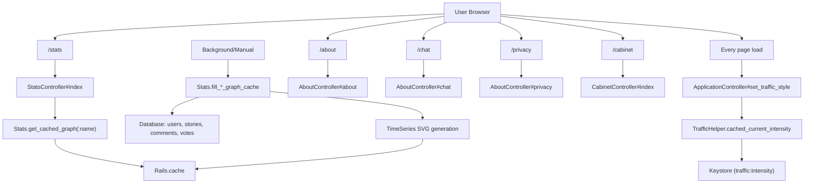
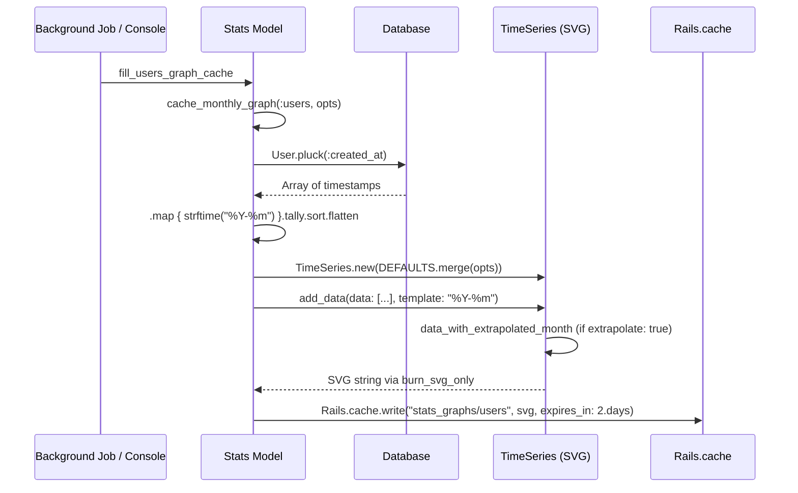

# Stats & About

> **Status**: Active
> **Generated**: 2026-06-13T00:00:00Z
> **Last Updated**: 2026-06-13T00:00:00Z

---

## Overview

### What It Does
Provides public-facing informational and statistical pages for the Lobsters site: monthly activity graphs (users, stories, comments, votes), an about page describing site philosophy and features, a chat page with IRC channel details, a privacy policy page, a 404 error page, and a cabinet page for debugging UI component rendering. It also includes a real-time traffic intensity system that drives the color of the site logo.

### Why It Exists
Community transparency is a core Lobsters value. The stats page gives users and the public visibility into site growth and activity trends. The about page documents site policies, guidelines, and technical features. The traffic intensity system provides a subtle visual indicator of current site activity. The cabinet page aids developers in testing UI components with synthetic data.

### Key Capabilities
- SVG time-series graphs for users, active users, stories, comments, and votes by month, with end-of-month extrapolation
- Cached graph generation using `Rails.cache` with 2-day expiry
- Real-time traffic intensity calculation from votes, comments, and stories in 15-minute periods
- Novelty logo CSS overrides for special dates (Casimir Pulaski Day, Stonewall Day, Christmas)
- Page caching for about and chat pages (for logged-out users without tag filters)
- Time interval parsing helper for safe user input handling
- Cabinet page for visual debugging of UI partials with Faker-generated test data

---

## Architecture

### High-Level Design



### Components

#### Backend Components
| Component | File Path | Purpose |
|-----------|-----------|---------|
| StatsController | `app/controllers/stats_controller.rb` | Renders the stats index page |
| AboutController | `app/controllers/about_controller.rb` | Renders about, chat, privacy, and 404 pages |
| CabinetController | `app/controllers/cabinet_controller.rb` | Renders the component debugging page |
| Stats | `app/models/stats.rb` | Generates and caches monthly SVG graphs from database data |
| TimeSeries | `lib/time_series.rb` | Extends `SVG::Graph::TimeSeries` with timezone fixes, y-axis formatting, and extrapolation |
| TrafficHelper | `app/helpers/traffic_helper.rb` | Calculates real-time traffic intensity and novelty logo CSS |
| IntervalHelper | `app/helpers/interval_helper.rb` | Parses and validates time interval parameters (e.g., "1w", "3d") |
| CabinetHelper | `app/helpers/cabinet_helper.rb` | Provides `debug_render` and `as_user` helpers for the cabinet page |

#### Frontend Components
| Component | File Path | Purpose |
|-----------|-----------|---------|
| Stats index view | `app/views/stats/index.html.erb` | Displays all cached SVG graphs with inline CSS for styling |
| About view | `app/views/about/about.html.erb` | Site description, guidelines, tagging, invitations, transparency, features, trivia |
| Chat view | `app/views/about/chat.html.erb` | IRC channel info (#lobsters on Libera.Chat) |
| Privacy view | `app/views/about/privacy.html.erb` | Minimal privacy policy |
| 404 view | `app/views/about/404.html.erb` | Resource not found page |
| Subnav partial | `app/views/about/_subnav.html.erb` | Shared sub-navigation for About, Chat, Stats, Hats |
| Cabinet index view | `app/views/cabinet/index.html.erb` | Renders story partials with Faker-generated test data |

### Technology Stack
- **Backend**: Ruby on Rails
- **Graphing**: `svg-graph` gem (`SVG::Graph::TimeSeries`) with custom `TimeSeries` subclass
- **Caching**: `Rails.cache` (backed by `solid_cache` gem) for graph SVGs; `actionpack-page_caching` for full page caching
- **Database**: MariaDB/MySQL (raw SQL in TrafficHelper), SQLite (solid_cache)
- **Test data**: `faker` gem (used in cabinet view)

---

## Model Details

### Stats

`Stats` is a plain Ruby class (not an ActiveRecord model). It has no database table, associations, concerns, or callbacks.

#### Constants
| Constant | Value | Purpose |
|----------|-------|---------|
| `FIRST_MONTH` | `Time.new(2012, 7, 3).utc.freeze` | X-axis start date for all graphs |
| `TIMESCALE_DIVISIONS` | `"1 year"` | X-axis division interval |
| `DEFAULTS` | Hash (see below) | Default SVG graph configuration |

#### DEFAULTS Hash
```ruby
# Source: app/models/stats.rb:65-93
DEFAULTS = {
  width: 800,
  height: 300,
  graph_title: "Graph",
  show_graph_title: false,
  extrapolate: true,
  no_css: false,
  key: false,
  scale_x_integers: true,
  scale_y_integers: false,
  show_data_values: false,
  show_x_guidelines: false,
  show_x_title: false,
  x_title: "Time",
  show_y_title: false,
  y_title: "Users",
  y_title_text_direction: :bt,
  stagger_x_labels: false,
  x_label_format: "%Y-%m",
  y_label_format: "%Y-%m",
  min_x_value: FIRST_MONTH,
  timescale_divisions: TIMESCALE_DIVISIONS,
  add_popups: true,
  popup_format: "%Y-%m",
  area_fill: false,
  min_y_value: 0,
  number_format: "%d",
  show_lines: false
}
```

#### Key Methods
| Method | Returns | Purpose | Notes |
|--------|---------|---------|-------|
| `.fill_users_graph_cache` | `nil` | Generates and caches "Users joining by month" SVG | Plucks `User.created_at`, tallies by month |
| `.fill_active_users_graph_cache` | `nil` | Generates and caches "Active users by month" SVG | Combines stories + votes + comments, counts unique user_ids per month; `extrapolate: false` |
| `.fill_stories_graph_cache` | `nil` | Generates and caches "Stories submitted by month" SVG | Plucks `Story.created_at` |
| `.fill_comments_graph_cache` | `nil` | Generates and caches "Comments posted by month" SVG | Plucks `Comment.created_at` |
| `.fill_votes_graph_cache` | `nil` | Generates and caches "Votes cast by month" SVG | Plucks `Vote.updated_at` |
| `.cache_key(name)` | `String` | Returns `"stats_graphs/#{name}"` | Used as Rails.cache key |
| `.get_cached_graph(name)` | `String` | Returns cached SVG or `"<i>No data</i>"` | Called from the view |
| `.cache_monthly_graph(name, opts)` | `nil` | Creates TimeSeries SVG from yielded data and writes to cache | 2-day cache expiry |

#### Graph Data Flow


### TimeSeries (lib/time_series.rb)

Subclass of `SVG::Graph::TimeSeries` from the `svg-graph` gem. Adds:

#### Key Methods
| Method | Returns | Purpose | Notes |
|--------|---------|---------|-------|
| `format(x, y, description)` | `String` | Formats popup text with UTC timezone | Patches gem's lack of timezone awareness |
| `get_x_labels` | `Array<String>` | Formats x-axis labels in UTC | Patches gem's lack of timezone awareness |
| `get_y_labels` | `Array<String>` | Formats y-axis labels with comma delimiters | Uses `number_with_delimiter` |
| `add_data(data:, template:)` | varies | Overrides to inject extrapolated data point | Only when `extrapolate: true` |
| `start_svg` (private) | varies | Adds `extrapolate` CSS class to SVG root element | For styling the extrapolated data point differently |
| `data_with_extrapolated_month` (private) | `Array` | Linearly extrapolates current month's end value | `(current_value / (day / days_in_month)).round` |

---

## Database Schema

This feature does not have its own database tables. It reads from tables owned by other features:

| Table | Columns Used | By |
|-------|-------------|-----|
| `users` | `created_at`, `user_id` | Stats (users graph, active users graph) |
| `stories` | `created_at`, `user_id` | Stats (stories graph, active users graph), TrafficHelper |
| `comments` | `created_at`, `user_id` | Stats (comments graph, active users graph), TrafficHelper |
| `votes` | `updated_at`, `user_id` | Stats (votes graph, active users graph), TrafficHelper |
| `keystores` | `key`, `value` | TrafficHelper (stores `traffic:low`, `traffic:high`, `traffic:intensity`) |

The `keystores` table is a key-value store accessed via the `Keystore` model (owned by the home-feed feature).

---

## API Endpoints

| Method | Path | Action | Description | Notes |
|--------|------|--------|-------------|-------|
| `GET` | `/stats` | `stats#index` | Displays monthly activity graphs | Public, no auth required |
| `GET` | `/about` | `about#about` | Site about page with guidelines, features, trivia | Page-cached for logged-out users |
| `GET` | `/chat` | `about#chat` | IRC channel information | Page-cached for logged-out users |
| `GET` | `/privacy` | `about#privacy` | Privacy policy | Not page-cached |
| `GET` | `/404` | `about#four_oh_four` | 404 error page | Matched via `:via => :all` (all HTTP methods) |
| `GET` | `/cabinet` | `cabinet#index` | Component debugging page | Public, renders Faker test data |

---

## Authorization

No authorization is required for any endpoint in this feature. All pages are publicly accessible. There are no Pundit policies.

The only access control is page caching behavior: the `CACHE_PAGE` proc (defined in `ApplicationController`) enables page caching only when no user is logged in and no tag filter cookie is set:

```ruby
# Source: app/controllers/application_controller.rb:19
CACHE_PAGE = proc { @user.blank? && cookies[TAG_FILTER_COOKIE].blank? }
```

`AboutController` applies this to `about` and `chat` actions:

```ruby
# Source: app/controllers/about_controller.rb:4
caches_page :about, :chat, if: CACHE_PAGE
```

---

## Configuration

### Environment Variables
No feature-specific environment variables.

### Constants & Configuration

| Constant | Location | Value | Purpose |
|----------|----------|-------|---------|
| `Stats::FIRST_MONTH` | `app/models/stats.rb:4` | `2012-07-03 UTC` | Graph x-axis start |
| `Stats::TIMESCALE_DIVISIONS` | `app/models/stats.rb:5` | `"1 year"` | X-axis tick spacing |
| `TrafficHelper::PERIOD_LENGTH` | `app/helpers/traffic_helper.rb:8` | `15` (minutes) | Traffic activity window |
| `TrafficHelper::CACHE_FOR` | `app/helpers/traffic_helper.rb:9` | `5` (minutes) | Declared but not directly used in code |
| `IntervalHelper::PLACEHOLDER` | `app/helpers/interval_helper.rb:4` | `{param: "1w", dur: 1, intv: "Week", ...}` | Default for invalid input |

### Dependencies
- `svg-graph` gem (required as `SVG/Graph/TimeSeries`) -- SVG chart generation
- `rexml` gem -- XML processing for SVG generation (workaround for upstream issue)
- `faker` gem -- generates test data in cabinet view
- `actionpack-page_caching` gem -- `caches_page` support in AboutController

---

## Usage Examples

### Retrieving a cached graph in a view
```erb
<%# Source: app/views/stats/index.html.erb:18 %>
<%= raw Stats.get_cached_graph(:users) %>
```

### Populating the graph cache (typically from console or background task)
```ruby
# Source: app/models/stats.rb:7-13
def self.fill_users_graph_cache
  cache_monthly_graph(:users, {
    graph_title: "Users joining by month",
    scale_y_divisions: 100
  }) {
    User.pluck(:created_at).map { |created_at| created_at.strftime("%Y-%m") }.tally.sort.flatten
  }
end
```

### Active users graph (combines three data sources)
```ruby
# Source: app/models/stats.rb:16-28
def self.fill_active_users_graph_cache
  cache_monthly_graph(:active_users, {
    graph_title: "Active users by month",
    scale_y_divisions: 500,
    extrapolate: false
  }) {
    stories = Story.pluck(:created_at, :user_id).map { |created_at, user_id| [created_at.strftime("%Y-%m"), user_id] }
    votes = Vote.pluck(:updated_at, :user_id).map { |updated_at, user_id| [updated_at.strftime("%Y-%m"), user_id] }
    comments = Comment.pluck(:created_at, :user_id).map { |created_at, user_id| [created_at.strftime("%Y-%m"), user_id] }
    combined = (stories + votes + comments).group_by(&:first).transform_values { |record| record.map(&:last).uniq.count }
    combined.sort.flatten
  }
end
```

### Traffic intensity calculation
```ruby
# Source: app/helpers/traffic_helper.rb:41-49
def self.current_activity
  start_at = PERIOD_LENGTH.minutes.ago.utc
  result = ActiveRecord::Base.connection.select_all <<-SQL
    select
      (SELECT count(1) AS n_votes   FROM votes    WHERE updated_at >= '#{start_at}') +
      (SELECT count(1) AS n_comment FROM comments WHERE created_at >= '#{start_at}') * 10 +
      (SELECT count(1) AS n_stories FROM stories  WHERE created_at >= '#{start_at}') * 20
  SQL
  result.to_a.first.first.second
end
```

### Traffic intensity mapped to logo color
```ruby
# Source: app/controllers/application_controller.rb:143-146
@traffic_intensity = TrafficHelper.cached_current_intensity
# map intensity to 80-255 so there's always a little red
hex = sprintf("%02x", (@traffic_intensity * 1.75 + 80).round)
@traffic_style = "background-color: ##{hex}0000;"
```

### IntervalHelper parsing user input
```ruby
# Source: app/helpers/interval_helper.rb:12-29
def time_interval(param)
  if (m = param.to_s.match(/\A(\d+)([#{TIME_INTERVALS.keys.join}])\z/))
    dur = m[1].to_i
    return PLACEHOLDER unless dur > 0
    return PLACEHOLDER unless TIME_INTERVALS.include? m[2]
    intv = TIME_INTERVALS[m[2]]
    {
      # recreate param with parsed values to prevent passing malicious user input
      param: "#{dur}#{m[2]}",
      dur: dur,
      intv: intv,
      human: "#{dur unless dur == 1} #{intv}".downcase.pluralize(dur).chomp,
      placeholder: false
    }
  else
    PLACEHOLDER
  end
end
```

### CabinetHelper debug rendering
```ruby
# Source: app/helpers/cabinet_helper.rb:2-10
def debug_render *args
  capture do
    concat content_tag(:details,
      content_tag(:summary, "header") +
      content_tag(:pre, word_wrap("render #{args.inspect}")),
      style: "margin-left: 20px")
    concat render(*args)
  end
end

def as_user user
  @user = user
  yield
  @user = nil
end
```

---

## Testing

### Test Files

No dedicated test files exist for this feature. There are no files matching `stats`, `about`, `cabinet`, `traffic`, or `interval` in the `test/` directory.

---

## Known Issues & Caveats

| Issue | Location | Description |
|-------|----------|-------------|
| SQL injection risk (mitigated) | `app/helpers/traffic_helper.rb:14-29,43-48` | Raw SQL uses string interpolation for `start_at` timestamps. The values are generated internally (not from user input), but the pattern is fragile. |
| `CACHE_FOR` constant unused | `app/helpers/traffic_helper.rb:9` | `CACHE_FOR = 5` is declared but never referenced in any method. The actual cache TTL is hardcoded to 60 seconds on line 59. |
| Production guard in about view | `app/views/about/about.html.erb:4` | `raise` in production if `Rails.application.name != 'Lobsters'` -- forces fork operators to write their own about page. A second `raise` on line 272 does the same for mailing list mode. |
| `@homeabout` post-render raise | `app/controllers/about_controller.rb:20` | `raise "Seriously, write your own about page." if @homeabout` is checked AFTER render. `@homeabout` is never set in this controller, so this is dead code -- likely a removed legacy guard. |
| No background job for cache population | `app/models/stats.rb` | The `fill_*_graph_cache` methods must be called manually (e.g., via console or a scheduled task). There is no `StatsJob` in the codebase. Cache expires every 2 days. |
| Active users graph loads entire tables | `app/models/stats.rb:22-24` | `fill_active_users_graph_cache` calls `pluck` on the full `stories`, `votes`, and `comments` tables, loading all rows into memory. This will become expensive as the site grows. |
| Traffic weighting is hardcoded | `app/helpers/traffic_helper.rb:24,47` | Activity formula weights: votes x1, comments x10, stories x20. These are not configurable. |
| Novelty logo dates are hardcoded | `app/helpers/traffic_helper.rb:66-97` | Special logo CSS for specific calendar dates (March Casimir Pulaski Day, June 28 Stonewall, Dec 25 Christmas). |
| Cabinet page exposes test rendering publicly | `app/controllers/cabinet_controller.rb` | No authentication required. Uses `Faker` gem to generate synthetic data. Harmless but unusual for production. |
| IntervalHelper included in all controllers | `app/controllers/application_controller.rb:4` | `include IntervalHelper` is in `ApplicationController`, making `time_interval` available everywhere, though it is not used by this feature's controllers directly. |

---

## Performance

### Optimization Strategies
- **Graph caching**: SVG graphs are pre-generated and stored in `Rails.cache` with a 2-day TTL, so the stats page never hits the database
- **Page caching**: About and chat pages use `caches_page` (via `actionpack-page_caching` gem) for logged-out users, serving static HTML files directly from the web server
- **Traffic intensity caching**: `cached_current_intensity` uses `Rails.cache.fetch` with a 60-second TTL, falling back to Keystore

### Caching
| Cache Key | TTL | Purpose |
|-----------|-----|---------|
| `stats_graphs/users` | 2 days | Users by month SVG |
| `stats_graphs/active_users` | 2 days | Active users by month SVG |
| `stats_graphs/stories` | 2 days | Stories by month SVG |
| `stats_graphs/comments` | 2 days | Comments by month SVG |
| `stats_graphs/votes` | 2 days | Votes by month SVG |
| `traffic:intensity` | 60 seconds (Rails.cache) | Current traffic intensity percentage |
| `traffic:low` | N/A (Keystore) | 90-day low activity baseline |
| `traffic:high` | N/A (Keystore) | 90-day high activity baseline |

### Database Optimization
- Traffic range query uses `floor(UNIX_TIMESTAMP(...)/div)` for period bucketing with a 90-day lookback window
- Graph generation uses `pluck` to avoid instantiating ActiveRecord objects
- No dedicated indexes for this feature (relies on existing timestamp indexes on core tables)

---

## Troubleshooting

### Common Issues

#### Issue: Stats page shows "No data" instead of graphs
**Symptoms:**
- All graph sections display italic "No data" text

**Cause:**
The `Stats.fill_*_graph_cache` methods have not been run, or the cache has expired (2-day TTL).

**Solution:**
Run all graph cache methods from the Rails console:
```ruby
Stats.fill_users_graph_cache
Stats.fill_active_users_graph_cache
Stats.fill_stories_graph_cache
Stats.fill_comments_graph_cache
Stats.fill_votes_graph_cache
```

#### Issue: About page raises error in production on a fork
**Symptoms:**
- 500 error when visiting `/about`

**Cause:**
The about view raises an error if `Rails.application.name != 'Lobsters'` in production. This is intentional -- fork operators must write their own about page.

**Solution:**
Delete `app/views/about/about.html.erb` (as the error message says) and create your own.

#### Issue: Logo is always fully red
**Symptoms:**
- The site logo background never changes intensity

**Cause:**
`TrafficHelper.cache_traffic!` has not been called to populate the Keystore values.

**Solution:**
Run `TrafficHelper.cache_traffic!` periodically (e.g., via a scheduled job or cron).

---

## Related Features

- **[home-feed](home-feed.md)** -- Keystore model used by TrafficHelper to persist traffic range and intensity values
- **[stories](stories.md)** -- Story data used in stats graphs and traffic calculation; story partials rendered in cabinet
- **[comments](comments.md)** -- Comment data used in stats graphs and traffic calculation
- **[hats](hats.md)** -- Linked in the about subnav alongside Stats, About, and Chat

---

**Generated:** 2026-06-13T00:00:00Z
**Last Updated:** 2026-06-13T00:00:00Z
**Status:** Active
