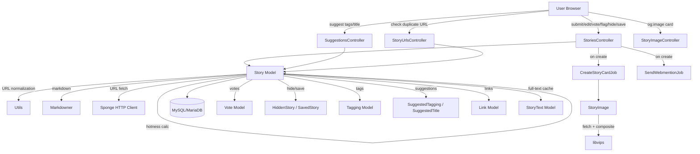
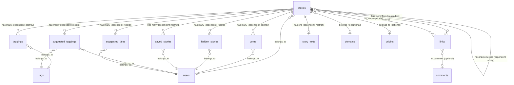
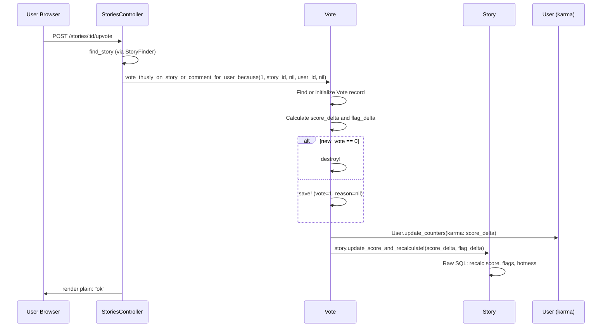
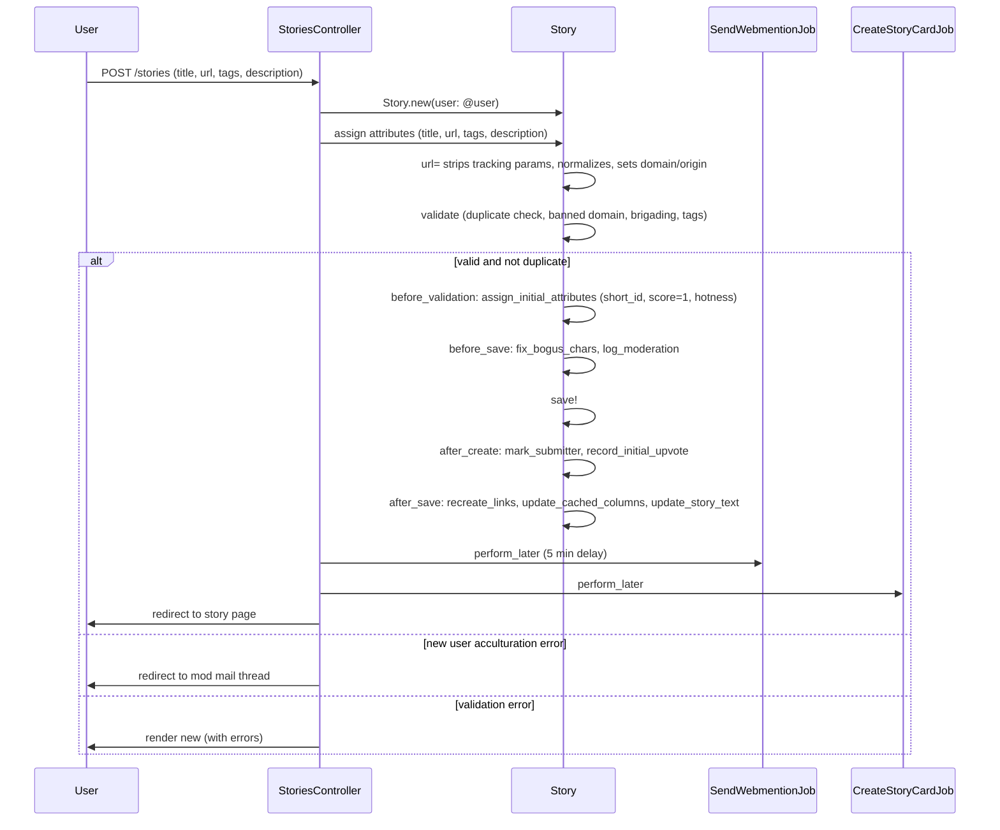

# Stories

> **Status**: Active
> **Generated**: 2026-06-13T00:00:00Z
> **Last Updated**: 2026-06-13T00:00:00Z

---

## Overview

### What It Does
The Stories feature is the core content submission and display system of Lobsters. It handles the full lifecycle of link/text submissions: creating stories with URLs or text bodies, displaying them on the site with voting and flagging, managing tags via user suggestions, hiding/saving stories per-user, detecting duplicate URLs, generating social media card images, and sending webmentions to linked URLs.

### Why It Exists
As a link aggregation site, stories are the fundamental unit of content. Every other feature (comments, feeds, search, moderation) revolves around stories.

### Key Capabilities
- Story submission with URL fetch (auto-title extraction from HTML/PDF), duplicate URL detection, and resubmission flow
- Upvoting, flagging (with reasons), hiding, saving, and disowning stories
- Community-driven tag and title suggestions with quorum-based auto-promotion
- Social card image generation (og:image extraction with Lobsters logo overlay via libvips)
- Webmention sending to story URLs
- Story merging (multiple similar stories into one thread)
- JSON API for story data and similar-URL lookup
- Hotness-ranked scoring algorithm incorporating votes, comment activity, tag modifiers, and author status

---

## Architecture

### High-Level Design



### Components

#### Backend Components

| Component | File Path | Purpose |
|-----------|-----------|---------|
| StoriesController | `app/controllers/stories_controller.rb` | CRUD, voting, flagging, hiding, saving, preview, duplicate check, disown |
| StoryImageController | `app/controllers/story_image_controller.rb` | Serves generated og:image PNG for a story |
| StoryUrlsController | `app/controllers/story_urls_controller.rb` | URL-based story lookup (all matches and latest redirect) |
| SuggestionsController | `app/controllers/suggestions_controller.rb` | Tag and title suggestion submission |
| StoryFinder concern | `app/controllers/concerns/story_finder.rb` | Shared `find_story` / `find_story!` helpers used by controllers |
| Story | `app/models/story.rb` | Core model: validations, scopes, hotness, URL processing, suggestions, JSON API |
| StoryImage | `app/models/story_image.rb` | Fetches og:image, composites Lobsters logo via libvips, caches as PNG |
| StoryText | `app/models/story_text.rb` | Full-text cache of story body (populated by DiffBot cron) |
| StoriesPaginator | `app/models/stories_paginator.rb` | Pagination with vote/hidden/saved hydration |
| HiddenStory | `app/models/hidden_story.rb` | Per-user story hiding with ReadRibbon side-effects |
| SavedStory | `app/models/saved_story.rb` | Per-user story bookmarking |
| Link | `app/models/link.rb` | Tracks URLs in story descriptions and URLs, resolves internal links to stories/comments |
| SuggestedTagging | `app/models/suggested_tagging.rb` | Records a user's tag suggestion for a story |
| SuggestedTitle | `app/models/suggested_title.rb` | Records a user's title suggestion for a story |
| Vote | `app/models/vote.rb` | Voting (upvote/flag) on stories and comments, score/karma updates |
| Tagging | `app/models/tagging.rb` | Join table between stories and tags |
| StoriesHelper | `app/helpers/stories_helper.rb` | `show_guidelines?` helper for submission form |
| SuggestionsHelper | `app/helpers/suggestions_helper.rb` | Empty module (no methods) |
| CreateStoryCardJob | `app/jobs/create_story_card_job.rb` | Background job to generate og:image card |
| SendWebmentionJob | `app/jobs/send_webmention_job.rb` | Background job to discover and send webmentions |

#### View Templates

| Template | File Path | Purpose |
|----------|-----------|---------|
| show | `app/views/stories/show.html.erb` | Single story page with comments, merged stories, similar stories |
| new | `app/views/stories/new.html.erb` | Submission form with preview |
| edit | `app/views/stories/edit.html.erb` | Edit form with delete/undelete buttons |
| _form | `app/views/stories/_form.html.erb` | Shared form partial: URL, title, tags, description, author/follow checkboxes, guidelines |
| _form_errors | `app/views/stories/_form_errors.html.erb` | Validation error display and duplicate URL warnings |
| _listdetail | `app/views/stories/_listdetail.html.erb` | Story row in feed lists (hottest, newest, etc.) |
| _singledetail | `app/views/stories/_singledetail.html.erb` | Story header on single-story page (handles merged stories) |
| _missing | `app/views/stories/_missing.html.erb` | Deleted/gone story display |
| _similar | `app/views/stories/_similar.html.erb` | Similar stories sidebar on show page |
| _subnav | `app/views/stories/_subnav.html.erb` | Story-page sub-navigation |
| suggestions/new | `app/views/suggestions/new.html.erb` | Tag/title suggestion form |
| saved/_subnav | `app/views/saved/_subnav.html.erb` | Saved stories sub-navigation |

### Technology Stack
- **Backend**: Ruby on Rails (MariaDB/MySQL)
- **Image Processing**: ruby-vips (libvips) for og:image card generation
- **HTTP Client**: Sponge (custom wrapper around Net::HTTP)
- **Markdown**: Markdowner (CommonMark-based)
- **Background Jobs**: ActiveJob (Solid Queue)
- **Caching**: Rails page caching on `stories#show`

---

## Model Details

### Story

#### Associations
```ruby
# Source: app/models/story.rb
belongs_to :user
belongs_to :domain, optional: true, counter_cache: true
belongs_to :origin, optional: true, counter_cache: true
belongs_to :merged_into_story,
  class_name: "Story",
  counter_cache: :stories_count,
  foreign_key: "merged_story_id",
  inverse_of: :merged_stories,
  optional: true
has_many :merged_stories,
  class_name: "Story",
  foreign_key: "merged_story_id",
  inverse_of: :merged_into_story,
  dependent: :nullify
has_many :taggings,
  autosave: true,
  dependent: :destroy
has_many :suggested_taggings, dependent: :restrict_with_exception
has_many :suggested_tags, source: :story, through: :suggested_taggings, dependent: :restrict_with_exception
has_many :suggested_titles, dependent: :restrict_with_exception
has_many :suggested_tagging_times,
  -> { group(:tag_id).select("count(*) as times, tag_id").order(times: :desc) },
  class_name: "SuggestedTagging",
  inverse_of: :story
has_many :suggested_title_times,
  -> { group(:title).select("count(*) as times, title").order(times: :desc) },
  class_name: "SuggestedTitle",
  inverse_of: :story
has_many :comments,
  inverse_of: :story,
  dependent: :restrict_with_exception
has_many :tags, -> { order("tags.is_media desc, tags.tag") }, through: :taggings
has_many :votes, -> { where(comment_id: nil) },
  inverse_of: :story,
  dependent: :destroy
has_many :voters, -> { where("votes.comment_id" => nil) },
  through: :votes,
  source: :user
has_many :hidings, class_name: "HiddenStory", inverse_of: :story, dependent: :restrict_with_exception
has_many :savings, class_name: "SavedStory", inverse_of: :story, dependent: :restrict_with_exception
has_one :story_text, foreign_key: :id, dependent: :restrict_with_exception, inverse_of: :story
has_many :links,
  inverse_of: :from_story,
  dependent: :destroy
has_many :incoming_links,
  class_name: "Link",
  inverse_of: :to_story,
  dependent: :restrict_with_exception
has_one :moderation, dependent: :restrict_with_exception
has_many :read_ribbons, dependent: :restrict_with_exception
has_many :saved_stories, dependent: :restrict_with_exception
```

#### Concerns
| Concern | Purpose |
|---------|---------|
| `Token` | Generates a unique `token` attribute via `ShortId`-style generation |

#### Callbacks
| Callback | Method | Purpose |
|----------|--------|---------|
| `before_validation` (on: :create) | `:assign_initial_attributes` | Sets `short_id`, initial `score` (1), `hotness`, and `last_edited_at` |
| `before_save` | `:log_moderation` | Creates a Moderation record if story was edited by moderator or promoted from suggestions |
| `before_save` | `:fix_bogus_chars` | Replaces non-breaking space (char 160) with regular space in title |
| `after_create` | `:mark_submitter` | Increments `Keystore` counter `user:{id}:stories_submitted` |
| `after_create` | `:record_initial_upvote` | Auto-upvotes the story for the submitter |
| `after_save` | `:bust_comment_redirect_cache` | Clears comment short_id redirect cache when `merged_story_id` changes |
| `after_save` | `:recreate_links` | Rebuilds Link records when `url` or `description` changes |
| `after_save` | `:update_cached_columns` | Recalculates `comments_count` and `hotness`; propagates to parent merged story |
| `after_save` | `:update_story_text` | Syncs title/description to StoryText full-text cache |

#### Validations (custom `validate` block)
- URL must match `Utils::URL_RE` if present
- If no URL, description must have text
- Title cannot start with "Ask" when `ask` tag is present
- Title cannot contain emoji/dingbats (`GRAPHICS_RE`)
- Title cannot be all-uppercase ASCII
- Tags must include at least one non-media tag
- New users cannot use tags where `permit_by_new_users == false`
- Privileged tags require moderator status
- URL duplicate check (`check_already_posted_recently?`)
- Banned domain/origin checks
- Anti-brigading check (bug tracker / discussion URLs)
- Specific blocked URL check (`check_not_pushcx_stream`)

#### Constants
| Constant | Value | Purpose |
|----------|-------|---------|
| `COMMENTABLE_DAYS` | 90 | Days after which comments are closed |
| `FLAGGABLE_DAYS` | 14 | Days a story can be flagged |
| `DELETEABLE_DAYS` | 28 | Days after which disown is available (2x FLAGGABLE_DAYS) |
| `FLAGGABLE_MIN_SCORE` | -5 | Minimum score below which flagging is disabled |
| `MAX_EDIT_MINS` | 360 | Minutes (6 hours) after which non-mod users cannot edit |
| `RECENT_DAYS` | 30 | Days a story is considered "recent" for duplicate detection |
| `SUGGESTION_QUORUM` | 2 | Number of users needed for a suggestion to auto-promote |
| `HOTNESS_WINDOW` | 79200 | Seconds (22 hours) for hotness time decay |
| `TITLE_DROP_WORDS` | common words | Words dropped from URL slugs |

#### Key Scopes
| Scope | Purpose |
|-------|---------|
| `base(user, unmerged:)` | Includes hidings, story_text, user; filters deleted and optionally merged |
| `hottest(user, exclude_tags)` | Front page: not hidden, positive score, ordered by hotness |
| `newest(user, exclude_tags)` | All stories ordered by id desc (includes merged) |
| `active(user, exclude_tags)` | Ordered by `last_comment_at` desc |
| `recent(user, exclude_tags)` | Low-scoring stories from last 10 days not on front page |
| `top(user, length, exclude_tags)` | Highest score within time interval |
| `tagged(user, tags)` | Stories matching specific tags |
| `categories(user, categories)` | Stories matching tag categories |
| `saved(user, exclude_tags)` | User's saved stories |
| `hidden(user, exclude_tags)` | User's hidden stories |
| `front_page` | Top 25 hottest stories |
| `to_mastodon` | Stories eligible for Mastodon cross-posting |
| `find_similar_by_url(url)` | Finds stories with same normalized URL |

#### Key Methods
| Method | Returns | Purpose | Notes |
|--------|---------|---------|-------|
| `calculated_hotness` | `Float` | Hotness algorithm: log10(score + comment_points) * sign + tag_mods + time_decay | Author bonus +0.25; comment points capped at score |
| `update_score_and_recalculate!(score_delta, flag_delta)` | void | Raw SQL update of score/flags/hotness from votes table | Excludes flags from users who commented on the story |
| `fetched_attributes` | `Hash` | Fetches URL, parses title from HTML og:title/meta/title or PDF | Strips site name, GitHub owner prefix |
| `url=(u)` | void | Strips tracking params (utm_*, sk, gclid, fbclid, etc.), normalizes, sets domain/origin | Detects and removes standard ports |
| `title=(t)` | void | Strips trailing punctuation `[.,;:!]*$` | |
| `is_editable_by_user?(user)` | `Boolean` | Own story within MAX_EDIT_MINS and not moderated | |
| `is_gone?` | `Boolean` | `is_deleted? \|\| (user.is_banned? && score < 0)` | |
| `save_suggested_tags_for_user!(tags, user)` | void | Records suggestions; auto-promotes if quorum reached | |
| `save_suggested_title_for_user!(title, user)` | void | Records suggestion; auto-promotes if quorum reached | |
| `already_posted_recently?` | `Boolean` | True if similar URL posted within RECENT_DAYS (or any time for new users) | |
| `vote_summary_for(user)` | `String` | Human-readable vote breakdown; mods see usernames | |
| `as_json(options)` | `Hash` | JSON serialization with optional comments | |

### HiddenStory

#### Associations
```ruby
# Source: app/models/hidden_story.rb
belongs_to :user
belongs_to :story
```

#### Concerns
| Concern | Purpose |
|---------|---------|
| `Token` | Generates unique token |

#### Key Methods
| Method | Returns | Purpose |
|--------|---------|---------|
| `self.hide_story_for_user(story, user)` | void | Creates HiddenStory, recalculates hotness, hides ReadRibbon replies |
| `self.unhide_story_for_user(story, user)` | void | Deletes HiddenStory, recalculates hotness, unhides ReadRibbon replies |

### SavedStory

#### Associations
```ruby
# Source: app/models/saved_story.rb
belongs_to :user
belongs_to :story
```

#### Concerns
| Concern | Purpose |
|---------|---------|
| `Token` | Generates unique token |

#### Key Methods
| Method | Returns | Purpose |
|--------|---------|---------|
| `self.save_story_for_user(story_id, user_id)` | void | Creates SavedStory via first_or_initialize |

### Vote

#### Associations
```ruby
# Source: app/models/vote.rb
belongs_to :user
belongs_to :story
belongs_to :comment, optional: true
```

#### Constants
```ruby
# Source: app/models/vote.rb
STORY_REASONS = {
  "O" => "Off-topic",
  "A" => "Already Posted",
  "B" => "Broken Link",
  "S" => "Spam",
  "" => "Cancel"
}.freeze

ALL_STORY_REASONS = STORY_REASONS.merge({
  "Q" => "Low Quality"
}).freeze
```

#### Key Methods
| Method | Returns | Purpose | Notes |
|--------|---------|---------|-------|
| `self.vote_thusly_on_story_or_comment_for_user_because(vote, story_id, comment_id, user_id, reason, update_counters)` | void | Central voting method: creates/updates/destroys vote, updates karma and target score | Score delta: +1 only counts upvotes; flags from users who commented on the story are excluded from score |

### Link

#### Associations
```ruby
# Source: app/models/link.rb
belongs_to :from_story, class_name: "Story", optional: true
belongs_to :from_comment, class_name: "Comment", optional: true
belongs_to :to_story, class_name: "Story", optional: true
belongs_to :to_comment, class_name: "Comment", optional: true
```

#### Key Methods
| Method | Returns | Purpose |
|--------|---------|---------|
| `url=(u)` | void | Normalizes URL, resolves internal Lobsters links to `to_story`/`to_comment` |
| `self.recreate_from_story!(s)` | void | Deletes and re-creates all links from a story |
| `self.recently_linked_from_comments(url)` | ActiveRecord::Relation | Comments linking to a URL within last 7 days |

### Tagging

#### Associations
```ruby
# Source: app/models/tagging.rb
belongs_to :tag, inverse_of: :taggings
belongs_to :story, inverse_of: :taggings
```

### SuggestedTagging

#### Associations
```ruby
# Source: app/models/suggested_tagging.rb
belongs_to :story
belongs_to :tag
belongs_to :user
```

### SuggestedTitle

#### Associations
```ruby
# Source: app/models/suggested_title.rb
belongs_to :story
belongs_to :user
```

### StoryText

#### Associations
```ruby
# Source: app/models/story_text.rb
self.primary_key = :id
belongs_to :story, foreign_key: :id, inverse_of: :story_text
```

#### Key Methods
| Method | Returns | Purpose |
|--------|---------|---------|
| `self.fill_cache!(story)` | `true` | Fetches body via DiffBot and creates StoryText record |
| `self.cached?(story, &blk)` | `Boolean` | Checks if cache exists; yields body to block if given |

### StoryImage (PORO, not ActiveRecord)

#### Key Methods
| Method | Returns | Purpose |
|--------|---------|---------|
| `exists?` | `Boolean` | Checks if cached PNG exists on disk |
| `path` | `Pathname` | `public/story_image/{short_id}.png` |
| `generate(url)` | void | Fetches og:image from URL, composites Lobsters logo via libvips, writes PNG |

### StoriesPaginator (PORO)

| Constant | Value |
|----------|-------|
| `STORIES_PER_PAGE` | 25 |

Paginates a story scope with offset/limit, hydrates `current_vote`, `is_hidden_by_cur_user`, and `is_saved_by_cur_user` per-user.

---

## Database Schema

### stories

| Column | Type | Default | Notes |
|--------|------|---------|-------|
| `id` | `bigint unsigned` | auto | Primary key |
| `created_at` | `datetime` | | |
| `user_id` | `bigint unsigned` | | NOT NULL, FK to users |
| `url` | `varchar(250)` | `""` | |
| `normalized_url` | `varchar(255)` | | For duplicate detection |
| `title` | `varchar(150)` | `""` | NOT NULL |
| `description` | `text` | | |
| `short_id` | `varchar(6)` | `""` | NOT NULL, unique |
| `is_deleted` | `boolean` | `false` | NOT NULL |
| `score` | `integer` | `1` | NOT NULL |
| `flags` | `integer unsigned` | `0` | NOT NULL |
| `is_moderated` | `boolean` | `false` | NOT NULL |
| `hotness` | `decimal(20,10)` | `0.0` | NOT NULL |
| `markeddown_description` | `mediumtext` | | Rendered HTML |
| `comments_count` | `integer` | `0` | NOT NULL, cached counter |
| `merged_story_id` | `bigint unsigned` | | FK to stories (self-referential) |
| `unavailable_at` | `datetime` | | When URL became unavailable |
| `twitter_id` | `varchar(20)` | | Legacy Twitter cross-post ID |
| `user_is_author` | `boolean` | `false` | NOT NULL |
| `user_is_following` | `boolean` | `false` | NOT NULL |
| `domain_id` | `bigint` | | FK to domains |
| `mastodon_id` | `varchar(25)` | | Mastodon cross-post ID |
| `origin_id` | `bigint` | | FK to origins |
| `last_comment_at` | `datetime` | | For "active" sort |
| `stories_count` | `integer` | `0` | NOT NULL, counter cache of merged stories |
| `updated_at` | `datetime` | | NOT NULL |
| `last_edited_at` | `datetime` | | NOT NULL |
| `token` | `varchar(255)` | | NOT NULL, unique |

**Indexes:** `created_at`, `domain_id`, `hotness` (hotness_idx), `(id, is_deleted)`, `last_comment_at`, `mastodon_id`, `merged_story_id`, `normalized_url`, `origin_id`, `score`, `short_id` (unique), `token` (unique), `url` (length: 191), `user_id`

### hidden_stories

| Column | Type | Default | Notes |
|--------|------|---------|-------|
| `id` | `bigint unsigned` | auto | Primary key |
| `user_id` | `bigint unsigned` | | NOT NULL |
| `story_id` | `bigint unsigned` | | NOT NULL |
| `created_at` | `datetime` | | |
| `token` | `varchar(255)` | | NOT NULL, unique |

**Indexes:** `story_id`, `(user_id, story_id)` (unique), `token` (unique)

### saved_stories

| Column | Type | Default | Notes |
|--------|------|---------|-------|
| `id` | `bigint unsigned` | auto | Primary key |
| `created_at` | `datetime` | | NOT NULL |
| `updated_at` | `datetime` | | NOT NULL |
| `user_id` | `bigint unsigned` | | NOT NULL |
| `story_id` | `bigint unsigned` | | NOT NULL |
| `token` | `varchar(255)` | | NOT NULL, unique |

**Indexes:** `story_id`, `(user_id, story_id)` (unique), `token` (unique)

### votes

| Column | Type | Default | Notes |
|--------|------|---------|-------|
| `id` | `bigint unsigned` | auto | Primary key |
| `user_id` | `bigint unsigned` | | NOT NULL |
| `story_id` | `bigint unsigned` | | NOT NULL |
| `comment_id` | `bigint unsigned` | | NULL for story votes |
| `vote` | `tinyint` | | NOT NULL, 1 or -1 |
| `reason` | `varchar(1)` | `""` | NOT NULL, single-char reason code |
| `updated_at` | `datetime` | | NOT NULL |

**Indexes:** `comment_id`, `story_id`, `(user_id, comment_id)`, `(user_id, story_id)`

### taggings

| Column | Type | Default | Notes |
|--------|------|---------|-------|
| `id` | `bigint unsigned` | auto | Primary key |
| `story_id` | `bigint unsigned` | | NOT NULL |
| `tag_id` | `bigint unsigned` | | NOT NULL |

**Indexes:** `(story_id, tag_id)` (unique), `tag_id`

### suggested_taggings

| Column | Type | Default | Notes |
|--------|------|---------|-------|
| `id` | `bigint unsigned` | auto | Primary key |
| `story_id` | `bigint unsigned` | | NOT NULL |
| `tag_id` | `bigint unsigned` | | NOT NULL |
| `user_id` | `bigint unsigned` | | NOT NULL |

**Indexes:** `story_id`, `tag_id`, `user_id`

### suggested_titles

| Column | Type | Default | Notes |
|--------|------|---------|-------|
| `id` | `bigint unsigned` | auto | Primary key |
| `story_id` | `bigint unsigned` | | NOT NULL |
| `user_id` | `bigint unsigned` | | NOT NULL |
| `title` | `varchar(150)` | `""` | NOT NULL |

**Indexes:** `story_id`, `user_id`

### links

| Column | Type | Default | Notes |
|--------|------|---------|-------|
| `id` | `bigint` | auto | Primary key |
| `url` | `varchar(250)` | | NOT NULL |
| `normalized_url` | `varchar(255)` | | NOT NULL |
| `title` | `varchar(255)` | | |
| `from_story_id` | `bigint unsigned` | | |
| `from_comment_id` | `bigint unsigned` | | |
| `to_story_id` | `bigint unsigned` | | |
| `to_comment_id` | `bigint unsigned` | | |

**Indexes:** `from_comment_id`, `from_story_id`, `normalized_url`, `(to_comment_id, from_story_id, from_comment_id)` (unique), `(to_story_id, from_story_id, from_comment_id)` (unique), `(url, from_story_id, from_comment_id)` (unique)

### story_texts

| Column | Type | Default | Notes |
|--------|------|---------|-------|
| `id` | `bigint` | auto | Primary key, same as story.id |
| `title` | `varchar(150)` | `""` | NOT NULL |
| `description` | `mediumtext` | | |
| `body` | `mediumtext` | | Full text fetched via DiffBot |
| `created_at` | `timestamp` | `current_timestamp() ON UPDATE current_timestamp()` | NOT NULL |

**Indexes:** `(title, description, body)` (FULLTEXT), `title` (FULLTEXT)

### Relationships



---

## API Endpoints

### StoriesController

| Method | Path | Action | Description | Notes |
|--------|------|--------|-------------|-------|
| `GET` | `/stories/new` | `new` | Submission form; auto-fetches URL attributes if `?url=` param | Redirects to existing if already posted |
| `POST` | `/stories` | `create` | Submit a new story | Enqueues SendWebmentionJob (5min delay) and CreateStoryCardJob |
| `GET` | `/s/:id(/:title)` | `show` | Display story with comments | Page-cached for anonymous; JSON format available |
| `GET` | `/stories/:id/edit` | `edit` | Edit form | Only within MAX_EDIT_MINS or for mods |
| `PATCH` | `/stories/:id` | `update` | Update story attributes | Re-enqueues CreateStoryCardJob if URL changed |
| `PATCH` | `/stories/:id/destroy` | `destroy` | Soft-delete story | Increments deletion counter; deletes Mastodon post |
| `PATCH` | `/stories/:id/undelete` | `undelete` | Restore deleted story | |
| `POST` | `/stories/:id/upvote` | `upvote` | Upvote a story | Returns plain text "ok" |
| `POST` | `/stories/:id/flag` | `flag` | Flag a story with reason | Requires valid `reason` param from `Vote::STORY_REASONS` |
| `POST` | `/stories/:id/unvote` | `unvote` | Remove vote | |
| `POST` | `/stories/:id/hide` | `hide` | Hide story for current user | JSON and HTML responses |
| `POST` | `/stories/:id/unhide` | `unhide` | Unhide story | |
| `POST` | `/stories/:id/save` | `save` | Save/bookmark story | |
| `POST` | `/stories/:id/unsave` | `unsave` | Remove bookmark | |
| `POST` | `/stories/:id/disown` | `disown` | Transfer ownership to InactiveUser | Only available after DELETEABLE_DAYS |
| `POST` | `/stories/fetch_url_attributes` | `fetch_url_attributes` | AJAX: fetch title from URL | Returns JSON |
| `POST` | `/stories/preview` | `preview` | Preview story before submitting | |
| `POST` | `/stories/check_url_dupe` | `check_url_dupe` | Check for duplicate URL | HTML partial or JSON with similar stories |

### StoryImageController

| Method | Path | Action | Description | Notes |
|--------|------|--------|-------------|-------|
| `GET` | `/story_image/:short_id.png` | `show` | Serve generated og:image card | Falls back to Lobsters logo |

### StoryUrlsController

| Method | Path | Action | Description | Notes |
|--------|------|--------|-------------|-------|
| `GET` | `/stories/url/all` | `all` | JSON: all stories matching a URL | |
| `GET` | `/stories/url/latest` | `latest` | Redirect to most recent story for URL | Falls back to new story form for logged-in users |

### SuggestionsController

| Method | Path | Action | Description | Notes |
|--------|------|--------|-------------|-------|
| `GET` | `/stories/:story_id/suggestions/new` | `new` | Tag/title suggestion form | |
| `POST` | `/stories/:story_id/suggestions` | `create` | Submit tag/title suggestions | Filters inappropriate tags for story author; auto-promotes at quorum |

---

## Authorization

Lobsters does not use Pundit. Authorization is implemented inline in controllers and models.

| Check | Location | Logic |
|-------|----------|-------|
| Can submit stories | `StoriesController#verify_user_can_submit_stories` | `@user.can_submit_stories?` |
| Can edit story | `Story#is_editable_by_user?(user)` | Own story, within 6 hours, not moderated |
| Can edit URL | `Story#url_is_editable_by_user?(user)` | New record, or within 6 hours and not moderated, or moderator |
| Can delete/undelete | `Story#is_undeletable_by_user?(user)` | Moderator, or own story and not moderated |
| Can flag | `Story#is_flaggable?(user)` | Not own story, within 14 days, score > -5 |
| Can suggest | `Story#can_have_suggestions_from_user?(user)` | Not own story, user can offer suggestions, story not moderated, no privileged tags |
| Can disown | `Story#disownable_by_user?(user)` | Own story, created before DELETEABLE_DAYS ago |
| Can see story | `Story#can_be_seen_by_user?(user)` | Not gone, or moderator, or own story |
| Voting/flagging/hiding/saving | `StoriesController` before_action | `require_logged_in_user_or_400` |
| Create/edit/new | `StoriesController` before_action | `require_logged_in_user` |

---

## Configuration

### Constants (hardcoded in Story model)
```ruby
COMMENTABLE_DAYS = 90
FLAGGABLE_DAYS = 14
DELETEABLE_DAYS = 28  # FLAGGABLE_DAYS * 2
MAX_EDIT_MINS = 360   # 6 hours
RECENT_DAYS = 30
SUGGESTION_QUORUM = 2
HOTNESS_WINDOW = 79200  # 22 hours
```

### StoryImage cache directory
```ruby
CACHE_DIR = Rails.public_path.join("story_image").freeze
```

---

## Usage Examples

### Hotness Algorithm
```ruby
# Source: app/models/story.rb:547-577
def calculated_hotness
  base = tags.sum(:hotness_mod) + ((user_is_author? && url.present?) ? 0.25 : 0.0)

  cpoints = if base < 0
    0
  else
    merged_comments.where.not(user_id: user_id).sum("comments.score + 1").to_f * 0.5
  end

  cpoints += merged_stories.map(&:score).inject(&:+).to_f
  cpoints = [self.score, cpoints].min

  order = Math.log([(score + 1).abs + cpoints, 1].max, 10)
  sign = if score > 0
    1
  elsif score < 0
    -1
  else
    0
  end

  -((order * sign) + base + ((created_at || Time.current).to_f / HOTNESS_WINDOW)).round(7)
end
```

### Voting Flow


### Story Submission Flow


### Suggestion Auto-Promotion
```ruby
# Source: app/models/story.rb:889-926
def save_suggested_tags_for_user!(new_tag_names_a, user)
  suggested_taggings.where(user_id: user.id).delete_all

  new_suggested_tags = Tag
    .active
    .where(tag: new_tag_names_a.uniq.compact_blank)
    .map { |t| {user: user, story: self, tag: t} }
  SuggestedTagging.create!(new_suggested_tags)

  # if enough users voted on the same set of replacement tags, do it
  tag_votes = {}
  suggested_taggings.group_by(&:user_id).each do |_u, stg|
    stg.each do |s|
      tag_votes[s.tag.tag] ||= 0
      tag_votes[s.tag.tag] += 1
    end
  end

  final_tags = []
  tag_votes.each do |k, v|
    if v >= SUGGESTION_QUORUM
      final_tags.push k
    end
  end

  if final_tags.any? && (final_tags.sort != tags.map(&:tag).sort)
    self.editor = nil
    self.editing_from_suggestions = true
    self.moderation_reason = "Automatically changed from user suggestions"
    self.tags_was = tags.to_a
    Story.transaction do
      self.tags = Tag.where(tag: final_tags)
      save!
    end
  end
end
```

---

## Testing

### Test Files
- `spec/models/story_spec.rb` — Story model unit tests
- `spec/models/story_image_spec.rb` — StoryImage generation tests
- `spec/models/story_text_spec.rb` — StoryText caching tests
- `spec/models/vote_spec.rb` — Vote model tests
- `spec/models/link_spec.rb` — Link model tests
- `spec/requests/stories_spec.rb` — StoriesController request tests
- `spec/requests/story_urls_spec.rb` — StoryUrlsController request tests
- `spec/requests/merge_stories_spec.rb` — Story merging tests
- `spec/requests/mod/stories_spec.rb` — Moderator story editing tests
- `spec/features/submit_story_spec.rb` — Feature/integration test for story submission
- `spec/features/read_story_spec.rb` — Feature/integration test for reading stories
- `spec/features/story_spec.rb` — General story feature tests
- `spec/jobs/create_story_card_job_spec.rb` — Card generation job tests
- `spec/controllers/story_image_controller_spec.rb` — Image controller tests
- `spec/factories/story.rb` — Story factory
- `spec/factories/vote.rb` — Vote factory
- `spec/factories/hidden_story.rb` — HiddenStory factory

---

## Known Issues & Caveats

| Issue | Location | Description |
|-------|----------|-------------|
| Race condition in voting | `app/models/story.rb:689` | Comment in code: "if two votes arrive at the same time, the second one won't take the first's score change into effect for calculated_hotness" |
| Empty helper module | `app/helpers/suggestions_helper.rb` | `SuggestionsHelper` is completely empty -- no methods defined |
| Hardcoded URL block | `app/models/story.rb:410-412` | `check_not_pushcx_stream` blocks specific push.cx and twitch.tv URLs with a hardcoded lobste.rs link |
| `twitter_id` column still present | `db/schema.rb:387` | Legacy `twitter_id` column remains in the stories table despite Twitter integration likely being deprecated |
| StoryText populated by external cron | `app/models/story_text.rb:16-20` | `fill_cache!` depends on DiffBot external service; not triggered by normal Rails flow |
| Suggestion quorum bypasses mod review | `app/models/story.rb:889-926` | When 2 users suggest the same tags, changes are applied automatically with `editing_from_suggestions = true`, bypassing moderator approval |
| `suggested_tags` association incorrect source | `app/models/story.rb:22` | `has_many :suggested_tags, source: :story` -- the `source: :story` looks incorrect for a `through: :suggested_taggings` that should source `:tag` |
| Flag exclusion for commenters | `app/models/story.rb:693-714` | `update_score_and_recalculate!` excludes flag votes from users who have commented on the story, implemented via raw SQL subquery |

---

## Performance

### Optimization Strategies
- **Page caching**: `stories#show` is page-cached for anonymous users via `caches_page :show, if: CACHE_PAGE`
- **Eager loading**: Extensive use of `includes` / `preload` via scopes (`for_presentation`, `mod_preload?`, `mod_single_preload?`)
- **Batch vote hydration**: `StoriesPaginator#cache_votes` loads all votes, hidden, and saved status in batch queries instead of N+1
- **Counter caches**: `comments_count` on stories, `stories_count` for merged stories, domain/origin counter caches
- **Concurrency limiting**: `CreateStoryCardJob` uses `limits_concurrency to: 1, key: story.short_id, duration: 5.minutes`

### Database Optimization
Key indexes on the `stories` table:
- `hotness_idx` on `hotness` -- critical for front page ordering
- `unique_short_id` on `short_id` (unique) -- primary lookup key
- `index_stories_on_normalized_url` on `normalized_url` -- duplicate detection
- `index_stories_on_created_at` on `created_at` -- newest sort
- `index_stories_on_last_comment_at` on `last_comment_at` -- active sort
- `index_stories_on_score` on `score` -- top sort
- Composite `(id, is_deleted)` index -- filtered queries

---

## Troubleshooting

### Common Issues

#### Issue: Story submission blocked for new users
**Symptoms:**
- New user sees "is an unseen domain from a new user" error
- New user sees "is a project's bug tracker or discussions" error
- New user sees tag restriction error

**Cause:**
New user acculturation system prevents new users from: submitting to unseen domains, linking to bug trackers/discussions (anti-brigading), and using restricted tags.

**Solution:**
All three cases create a ModMail thread between the new user, their inviter, and mods. The inviter is expected to guide the new user. These are intentional restrictions, not bugs.

#### Issue: Story not appearing on front page despite positive score
**Symptoms:**
- Story has score >= 0 but does not appear in hottest feed

**Cause:**
Hotness is a composite value. Tags with negative `hotness_mod` values can push a story off the front page. Also, stories hidden by the viewing user or matching their tag filters are excluded.

**Solution:**
Check `tags.sum(:hotness_mod)` for the story's tags. Check user's tag filters and hidden stories.

---

## Related Features

- **[comments](./comments.md)** -- Comments are threaded under stories; comment count is cached on the story
- **[tags-categories](./tags-categories.md)** -- Stories require at least one non-media tag; tags affect hotness
- **[home-feed](./home-feed.md)** -- Feed pages (hottest, newest, active, etc.) display stories using StoriesPaginator
- **[moderation](./moderation.md)** -- Moderators can edit stories, merge stories, and moderation is logged
- **[search](./search.md)** -- Full-text search uses StoryText records
- **[domains-origins](./domains-origins.md)** -- Stories auto-detect domain and origin from URLs
- **[users](./users.md)** -- Stories belong to users; karma is updated on votes

---

**Generated:** 2026-06-13T00:00:00Z
**Last Updated:** 2026-06-13T00:00:00Z
**Status:** Active
