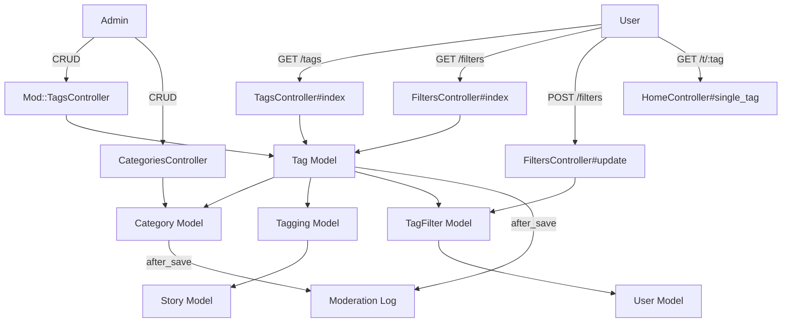
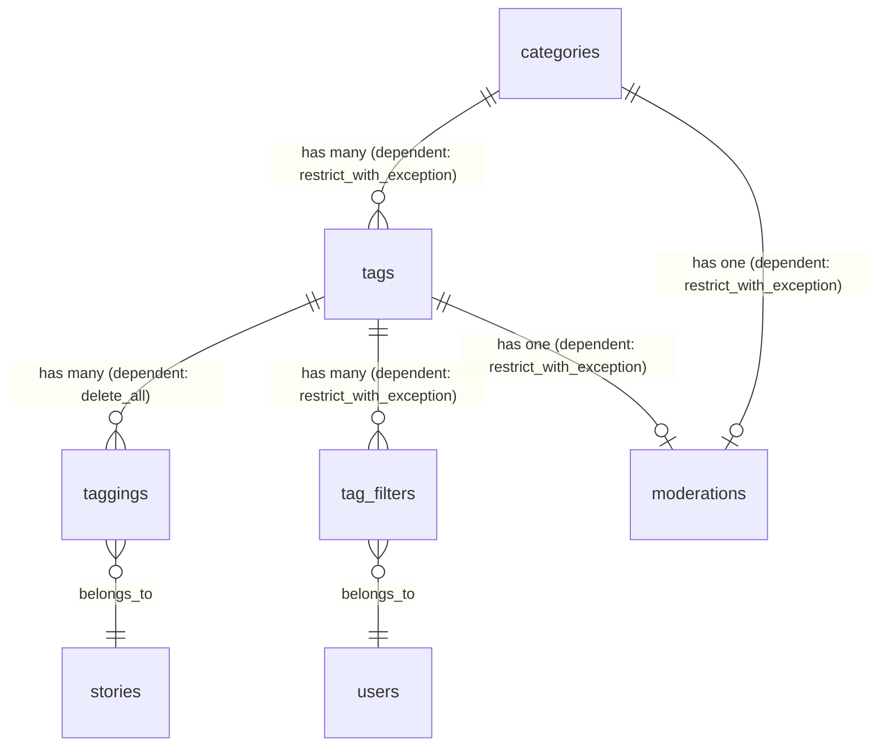
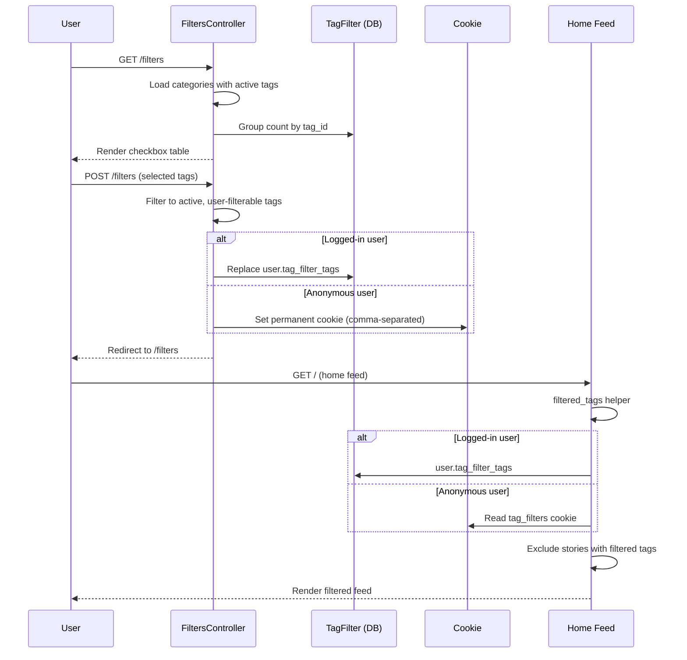

# Tags & Categories

> **Status**: Active
> **Generated**: 2026-06-13T00:00:00Z
> **Last Updated**: 2026-06-13T00:00:00Z

---

## Overview

### What It Does
Tags and categories form the content classification system for Lobsters. Every story must be tagged with one or more tags, and every tag belongs to exactly one category. Users can filter out tags they do not want to see, either via their account or a browser cookie. Administrators can create, edit, and deactivate tags and categories, with all changes logged to the moderation log.

### Why It Exists
A computing-focused link aggregation site needs fine-grained content classification so users can discover stories in their areas of interest and hide topics they do not care about. Categories group related tags (e.g., "programming", "culture", "platforms") so the tag list and filter page remain navigable as the tag count grows.

### Key Capabilities
- Hierarchical classification: categories contain tags, tags classify stories
- User-facing tag filtering (logged-in users persist to DB, anonymous users persist to cookie)
- Admin CRUD for both tags and categories with automatic moderation log entries
- Tag attributes controlling visibility and ranking: `active`, `privileged`, `permit_by_new_users`, `is_media`, `hotness_mod`
- JSON API for the full tag list
- Related-tag discovery via co-occurrence on stories

---

## Architecture

### High-Level Design



### Components

#### Backend Components

| Component | File Path | Purpose |
|-----------|-----------|---------|
| TagsController | `app/controllers/tags_controller.rb` | Public tag index page (HTML + JSON) |
| CategoriesController | `app/controllers/categories_controller.rb` | Admin CRUD for categories |
| Mod::TagsController | `app/controllers/mod/tags_controller.rb` | Admin CRUD for tags |
| FiltersController | `app/controllers/filters_controller.rb` | User tag filter management |
| Tag | `app/models/tag.rb` | Tag model with validations, scopes, and moderation logging |
| TagFilter | `app/models/tag_filter.rb` | Join model between User and Tag for filtering |
| Category | `app/models/category.rb` | Category model grouping tags |
| Tagging | `app/models/tagging.rb` | Join model between Story and Tag |
| ApplicationHelper | `app/helpers/application_helper.rb` | `filtered_tags` and `tag_link` helper methods |
| ApplicationController | `app/controllers/application_controller.rb` | `TAG_FILTER_COOKIE` constant, cookie cleanup logic |

#### View Templates

| Template | File Path | Purpose |
|----------|-----------|---------|
| Tag index | `app/views/tags/index.html.erb` | Lists all tags grouped by category |
| Multi-tag tip | `app/views/tags/_multi_tag_tip.html.erb` | Tip about `/t/tag1,tag2` syntax |
| Category form | `app/views/categories/_form.html.erb` | Shared form partial for new/edit category |
| Category new | `app/views/categories/new.html.erb` | Renders category form |
| Category edit | `app/views/categories/edit.html.erb` | Renders category form |
| Mod tag form | `app/views/mod/tags/_form.html.erb` | Shared form partial for new/edit tag (admin) |
| Mod tag new | `app/views/mod/tags/new.html.erb` | Renders tag form |
| Mod tag edit | `app/views/mod/tags/edit.html.erb` | Renders tag form with link to filter page |
| Filter index | `app/views/filters/index.html.erb` | Checkbox table of all tags for filtering |

### Technology Stack
- **Backend**: Ruby on Rails (ApplicationRecord, ActionController)
- **Database**: MySQL (utf8mb4, InnoDB)
- **Authentication**: Cookie-based (logged-in users) + long-lived `tag_filters` cookie (anonymous users)
- **Moderation Logging**: `Moderation` model via `after_save` callbacks

---

## Model Details

### Tag

**File:** `app/models/tag.rb`

#### Associations
```ruby
belongs_to :category
has_many :taggings, dependent: :delete_all
has_many :stories, through: :taggings
has_many :tag_filters, dependent: :restrict_with_exception
has_many :filtering_users,
  class_name: "User",
  through: :tag_filters,
  source: :user,
  dependent: :delete_all
has_one :moderation, dependent: :restrict_with_exception
has_many :suggested_taggings, dependent: :restrict_with_exception
```

#### Concerns

| Concern | Purpose |
|---------|---------|
| `Token` | Auto-generates a `TypeID`-based immutable token on `after_initialize` for new records; validates presence, uniqueness, max length 255 |

#### Callbacks

| Callback | Method | Purpose |
|----------|--------|---------|
| `after_save` | `:log_modifications` | Creates a `Moderation` record describing what was created or changed |

#### Validations

| Field | Validation |
|-------|------------|
| `tag` | length max 25, presence, uniqueness (case-sensitive), format `/\A[A-Za-z0-9_\-+]+\z/` |
| `description` | length max 100 |
| `hotness_mod` | inclusion in `-10..10` |
| `permit_by_new_users` | inclusion in `[true, false]` |
| `privileged` | inclusion in `[true, false]` |
| `active` | inclusion in `[true, false]` |
| `is_media` | inclusion in `[true, false]` |

#### Scopes

| Scope | Definition |
|-------|------------|
| `active` | `where(active: true)` |
| `not_permitted_for_new_users` | `where(permit_by_new_users: false)` |
| `related(tag)` | Finds top 8 active, non-media tags co-occurring on the same stories, excluding the input tag and tag ID 67 (programming catch-all) |

#### Key Methods

| Method | Returns | Purpose | Notes |
|--------|---------|---------|-------|
| `to_param` | `String` | Returns `tag` (name) for URL generation | |
| `all_with_filtered_counts_for(user)` | `Array<Tag>` | Class method: active tags the user can apply, each with `filtered_count` set | |
| `category_name` | `String` | Delegates to `category.category` | |
| `category_name=(category)` | `Category` | Looks up category by name and assigns | Used in admin form params |
| `css_class` | `String` | Returns `"tag tag_#{tag}"`, appends `" tag_is_media"` if media | |
| `user_can_filter?(user)` | `Boolean` | Active tags can be filtered; privileged tags require moderator | |
| `can_be_applied_by?(user)` | `Boolean` | Privileged tags require moderator; others return true for all | |
| `filtered_count` | `Integer` | Count of TagFilter records for this tag | Memoized via `@filtered_count` |
| `log_modifications` | `Moderation` | Creates moderation log entry describing the create or update | Uses `@edit_user_id` accessor |
| `as_json` | `Hash` | Custom JSON serialization including `category` name | |

---

### TagFilter

**File:** `app/models/tag_filter.rb`

#### Associations
```ruby
belongs_to :tag
belongs_to :user
```

This is a minimal join model with no validations, callbacks, or custom methods beyond the associations.

---

### Category

**File:** `app/models/category.rb`

#### Associations
```ruby
has_many :tags,
  -> { order("tag asc") },
  dependent: :restrict_with_exception,
  inverse_of: :category
has_many :stories, through: :tags
has_one :moderation, dependent: :restrict_with_exception
```

#### Concerns

| Concern | Purpose |
|---------|---------|
| `Token` | Auto-generates a `TypeID`-based immutable token on `after_initialize` |

#### Callbacks

| Callback | Method | Purpose |
|----------|--------|---------|
| `after_save` | `:log_modifications` | Creates a `Moderation` record describing what was created or changed |

#### Validations

| Field | Validation |
|-------|------------|
| `category` | length max 25, presence, uniqueness (case-insensitive), format `/\A[A-Za-z0-9_-]+\z/` |

#### Key Methods

| Method | Returns | Purpose | Notes |
|--------|---------|---------|-------|
| `to_param` | `String` | Returns `category` (name) for URL generation | |
| `log_modifications` | `Moderation` | Creates moderation log entry describing the create or update | Uses `@edit_user_id` accessor |

---

### Tagging

**File:** `app/models/tagging.rb`

#### Associations
```ruby
belongs_to :tag, inverse_of: :taggings
belongs_to :story, inverse_of: :taggings
```

#### Validations

| Field | Validation |
|-------|------------|
| `story_id` | uniqueness scoped to `tag_id` |

---

## Database Schema

### categories

| Column | Type | Default | Notes |
|--------|------|---------|-------|
| `id` | `bigint` | auto-increment | Primary key |
| `category` | `string(25)` | — | NOT NULL |
| `created_at` | `datetime` | — | NOT NULL |
| `updated_at` | `datetime` | — | NOT NULL |
| `token` | `string` | — | NOT NULL |

**Indexes:**
- `index_categories_on_category` UNIQUE on `category`
- `index_categories_on_token` UNIQUE on `token`

### tags

| Column | Type | Default | Notes |
|--------|------|---------|-------|
| `id` | `bigint unsigned` | auto-increment | Primary key |
| `tag` | `string(25)` | — | NOT NULL |
| `description` | `string(100)` | — | |
| `privileged` | `boolean` | `false` | NOT NULL |
| `is_media` | `boolean` | `false` | NOT NULL |
| `active` | `boolean` | `true` | NOT NULL |
| `hotness_mod` | `float` | `0.0` | |
| `permit_by_new_users` | `boolean` | `true` | NOT NULL |
| `category_id` | `bigint` | — | NOT NULL, FK to categories |
| `token` | `string` | — | NOT NULL |
| `created_at` | `datetime` | — | NOT NULL |
| `updated_at` | `datetime` | — | NOT NULL |

**Indexes:**
- `tag` UNIQUE on `tag`
- `index_tags_on_category_id` on `category_id`
- `index_tags_on_token` UNIQUE on `token`

### tag_filters

| Column | Type | Default | Notes |
|--------|------|---------|-------|
| `id` | `bigint unsigned` | auto-increment | Primary key |
| `created_at` | `datetime` | — | NOT NULL |
| `updated_at` | `datetime` | — | NOT NULL |
| `user_id` | `bigint unsigned` | — | NOT NULL, FK to users |
| `tag_id` | `bigint unsigned` | — | NOT NULL, FK to tags |

**Indexes:**
- `user_tag_idx` on `(user_id, tag_id)`
- `tag_filters_tag_id_fk` on `tag_id`

### taggings

| Column | Type | Default | Notes |
|--------|------|---------|-------|
| `id` | `bigint unsigned` | auto-increment | Primary key |
| `story_id` | `bigint unsigned` | — | NOT NULL, FK to stories |
| `tag_id` | `bigint unsigned` | — | NOT NULL, FK to tags |

**Indexes:**
- `story_id_tag_id` UNIQUE on `(story_id, tag_id)`
- `taggings_tag_id_fk` on `tag_id`

### Relationships



---

## API Endpoints

### Public Routes

| Method | Path | Controller#Action | Description | Notes |
|--------|------|-------------------|-------------|-------|
| `GET` | `/tags` | `tags#index` | List all tags grouped by category (HTML) | |
| `GET` | `/tags.json` | `tags#index` | List all tags as JSON | format: json |
| `GET` | `/filters` | `filters#index` | Show tag filter checkboxes | Requires authentication |
| `POST` | `/filters` | `filters#update` | Save tag filter selections | Requires authentication |
| `GET` | `/t/:tag` | `home#single_tag` | Stories filtered to a single tag | Constraint: tag matches `/[^,.\/]+/` |
| `GET` | `/t/:tag/page/:page` | `home#single_tag` | Paginated single-tag stories | |
| `GET` | `/t/:tag` | `home#multi_tag` | Stories filtered to comma-separated tags | Fallback when tag contains commas |
| `GET` | `/t/:tag/page/:page` | `home#multi_tag` | Paginated multi-tag stories | |
| `GET` | `/categories/:category` | `home#category` | Stories in a category | Named route: `category` |

### Admin Routes (under `/mod` namespace)

| Method | Path | Controller#Action | Description | Notes |
|--------|------|-------------------|-------------|-------|
| `GET` | `/mod/tags/new` | `mod/tags#new` | New tag form | `require_logged_in_admin` |
| `POST` | `/mod/tags` | `mod/tags#create` | Create a tag | `require_logged_in_admin` |
| `GET` | `/mod/tags/:id/edit` | `mod/tags#edit` | Edit tag form | `require_logged_in_admin` |
| `PATCH` | `/mod/tags/:id` | `mod/tags#update` | Update a tag | `require_logged_in_admin` |

### Admin Routes (categories, top-level)

| Method | Path | Controller#Action | Description | Notes |
|--------|------|-------------------|-------------|-------|
| `GET` | `/categories/new` | `categories#new` | New category form | `require_logged_in_admin` |
| `POST` | `/categories` | `categories#create` | Create a category | `require_logged_in_admin` |
| `GET` | `/categories/:category_name/edit` | `categories#edit` | Edit category form | `require_logged_in_admin` |
| `POST` | `/categories/:category_name` | `categories#update` | Update a category | `require_logged_in_admin` |

---

## Authorization

Lobsters does not use Pundit. Authorization is handled via `before_action` filters.

| Controller | Filter | Effect |
|------------|--------|--------|
| `TagsController` | none (public) | Anyone can view the tag index |
| `FiltersController` | `authenticate_user` | Logged-in users get DB-backed filters; anonymous users get cookie-based filters |
| `CategoriesController` | `require_logged_in_admin` | Only admins can create/edit categories |
| `Mod::TagsController` | `require_logged_in_admin` | Only admins can create/edit tags |

Additionally, `Tag#privileged` restricts which tags can be applied to stories (moderators only) and which tags can be filtered (moderators only via `user_can_filter?`).

---

## Configuration

### Cookie-Based Tag Filtering (Anonymous Users)

```ruby
# Source: app/controllers/application_controller.rb:18
TAG_FILTER_COOKIE = :tag_filters
```

The `tag_filters` cookie stores a comma-separated list of tag names. It is a `permanent` cookie (set via `cookies.permanent` in `FiltersController#update`). The cookie is explicitly preserved during the `remove_unknown_cookies` cleanup.

### Page Caching Interaction

```ruby
# Source: app/controllers/application_controller.rb:19
CACHE_PAGE = proc { @user.blank? && cookies[TAG_FILTER_COOKIE].blank? }
```

Page caching is bypassed when a `tag_filters` cookie is present, ensuring filtered users see correct content.

---

## Usage Examples

### Retrieving Filtered Tags (ApplicationHelper)

```ruby
# Source: app/helpers/application_helper.rb:85-93
def filtered_tags
  @_filtered_tags ||= if @user
    @user.tag_filter_tags
  else
    Tag.where(
      tag: cookies[ApplicationController::TAG_FILTER_COOKIE].to_s.split(",")
    )
  end
end
```

### Saving Tag Filters (FiltersController#update)

```ruby
# Source: app/controllers/filters_controller.rb:24-37
def update
  new_tags = Tag.active.where(tag: (params[:tags] || {}).keys).to_a
  new_tags.keep_if { |t| t.user_can_filter? @user }

  if @user
    @user.tag_filter_tags = new_tags
  else
    cookies.permanent[TAG_FILTER_COOKIE] = new_tags.map(&:tag).join(",")
  end

  flash[:success] = "Your filters have been updated."

  redirect_to filters_path
end
```

### Moderation Logging on Tag Save

```ruby
# Source: app/models/tag.rb:86-97
def log_modifications
  Moderation.create do |m|
    m.action = if id_previously_changed?
      "Created new tag " + attributes.map { |f, c| "with #{f} '#{c}'" }.join(", ")
    else
      "Updating tag #{tag}, " + saved_changes
        .map { |f, c| "changed #{f} from '#{c[0]}' to '#{c[1]}'" }.join(", ")
    end
    m.moderator_user_id = @edit_user_id
    m.tag_id = id
  end
end
```

### Finding Related Tags

```ruby
# Source: app/models/tag.rb:33-42
scope :related, ->(tag) {
  active
    .joins(:taggings)
    .where(taggings: {story_id: Tagging.where(tag: tag).select(:story_id)})
    .where.not(id: [tag, 67]) # 67 = programming, the catch-all
    .where.not(is_media: true)
    .group(:id)
    .order(Arel.sql("COUNT(*) desc"))
    .limit(8)
}
```

---

## Tag Filter Flow



---

## Testing

No dedicated test files for tags, categories, tag_filters, or the filters controller were found in the `test/` directory.

---

## Known Issues & Caveats

| Issue | Location | Description |
|-------|----------|-------------|
| Hardcoded tag ID | `app/models/tag.rb:37` | The `related` scope excludes tag ID 67 (assumed to be "programming") via a hardcoded integer. If the tag table is re-seeded or the ID changes, this exclusion breaks silently. |
| `as_json` typo | `app/models/tag.rb:108` | The `only:` array includes `:permit_by_new_user` (singular) but the actual column is `permit_by_new_users` (plural). This field will always be `nil` in JSON output. |
| `create!` vs `create` inconsistency | `app/controllers/categories_controller.rb:13` | `CategoriesController#create` uses `create!` which raises on validation failure, yet the next line checks `category.valid?`. The `valid?` check is unreachable on failure because the exception will already have been raised. |
| POST for update | `config/routes.rb:206` | Category update uses `POST` instead of `PATCH`/`PUT`, deviating from Rails REST conventions. |
| No uniqueness index on tag_filters | `db/schema.rb:446` | The `user_tag_idx` index on `(user_id, tag_id)` is not declared unique, so duplicate filter entries are possible at the database level. |
| `dependent: :delete_all` on `filtering_users` | `app/models/tag.rb:12` | The `filtering_users` association declares `dependent: :delete_all`, but this is on a `has_many :through` which typically ignores `dependent:`. The actual cleanup happens via `tag_filters` with `dependent: :restrict_with_exception`, meaning deleting a tag with existing filters will raise an exception. |

---

## Performance

### Query Optimization in FiltersController

The filter index page uses three separate queries instead of a single join with GROUP BY for performance:

```ruby
# Source: app/controllers/filters_controller.rb:18-19
# perf: three queries is much faster than joining, grouping on tags.id for counts
@story_counts = Tagging.group(:tag_id).count
@filter_counts = TagFilter.group(:tag_id).count
```

### Eager Loading in TagsController

```ruby
# Source: app/controllers/tags_controller.rb:9-10
@categories = Category.order(category: :asc).includes(:tags)
@tags = Tag.all.preload(:category)
```

### Database Indexes
- `tag` UNIQUE index on `tags.tag` -- fast lookup by tag name
- `index_tags_on_category_id` on `tags.category_id` -- fast joins to categories
- `story_id_tag_id` UNIQUE index on `taggings(story_id, tag_id)` -- fast story-tag lookups
- `user_tag_idx` on `tag_filters(user_id, tag_id)` -- fast filter lookups per user
- `tag_filters_tag_id_fk` on `tag_filters.tag_id` -- fast filter counts per tag

---

## Troubleshooting

### Issue: New tag not appearing on story submission form

**Symptoms:**
- Admin created a tag, but non-moderator users cannot see it in the tag picker.

**Cause:**
The tag may have `privileged: true`, which restricts it to moderators via `can_be_applied_by?`. Or it may have `active: false`.

**Solution:**
Verify the tag's attributes:
```ruby
Tag.find_by(tag: "your-tag").slice(:active, :privileged, :permit_by_new_users)
```

### Issue: Filtered tags not working for anonymous user

**Symptoms:**
- Stories with filtered tags still appear after setting filters.

**Cause:**
The `tag_filters` cookie may have been cleared by cookie cleanup, or the user is on a different browser/device.

**Solution:**
Check that the `tag_filters` cookie exists and contains the expected comma-separated tag names. The cookie is preserved across cleanup (`remove_unknown_cookies` explicitly skips it).

---

## Related Features

- **[stories](./catalog.md)** -- Stories are classified using tags via the `Tagging` join model
- **[home-feed](./catalog.md)** -- The home feed respects tag filters and supports browsing by single tag (`/t/:tag`), multiple tags, and category
- **[moderation](./catalog.md)** -- Tag and category changes are logged as `Moderation` records; admin tag CRUD lives under the `Mod::` namespace

---

**Generated:** 2026-06-13T00:00:00Z
**Last Updated:** 2026-06-13T00:00:00Z
**Status:** Active
