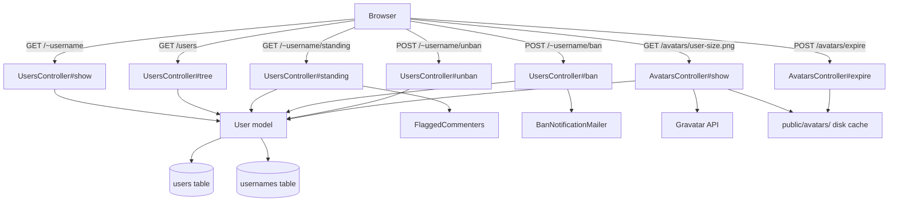
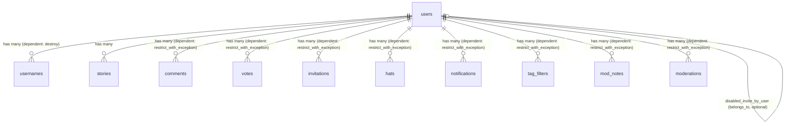

# Users

> **Status**: Active
> **Generated**: 2026-06-13T00:00:00Z
> **Last Updated**: 2026-06-13T00:00:00Z

---

## Overview

### What It Does
The Users feature provides user profile display, the invitation tree visualization, user banning/unbanning by admins, invitation privilege management, user standing/flag statistics, and Gravatar-based avatar serving with on-disk caching. It also tracks username history and provides a mechanism to disown content from inactive/deleted users.

### Why It Exists
Lobsters is an invitation-only community. User profiles serve as public identity pages showing karma, activity stats, hats, and social links. The invitation tree visualizes the trust chain of who invited whom. Moderators and admins need tools to manage user standing, banning, and invitation privileges. The standing page gives flagged users transparency into how their behavior compares to the community.

### Key Capabilities
- Public user profile pages with karma, bio, hats, social links (GitHub, Mastodon, homepage)
- Invitation tree visualization showing the full user hierarchy
- User list views sorted by karma or filtered to moderators/administrators
- Admin-only banning/unbanning with reason tracking and email notification
- Admin-only enable/disable of invitation privileges
- Standing page showing a user's flag statistics relative to the community
- Gravatar-based avatar fetching with on-disk PNG caching and cache expiry
- Username rename history tracking with cooldown enforcement
- Content disowning for inactive/deleted users via `InactiveUser` module
- Anti-enumeration bot detection in profile loading
- JSON API for user profile data

---

## Architecture

### High-Level Design



### Components

#### Backend Components

| Component | File Path | Purpose |
|-----------|-----------|---------|
| UsersController | `app/controllers/users_controller.rb` | Profile display, tree, standing, ban/unban, invite enable/disable |
| AvatarsController | `app/controllers/avatars_controller.rb` | Avatar fetching from Gravatar, disk caching, and cache expiry |
| User | `app/models/user.rb` | Core user model with associations, validations, karma, banning, deletion |
| Username | `app/models/username.rb` | Tracks username history and renames with cooldown enforcement |
| InactiveUser | `app/models/inactive_user.rb` | Module to reassign content from deleted/banned users to a sentinel account |
| UsersHelper | `app/helpers/users_helper.rb` | View helpers for styled user links, karma display, story/comment counts |

#### View Templates

| Template | File Path | Purpose |
|----------|-----------|---------|
| show | `app/views/users/show.html.erb` | User profile page with stats, hats, mod tools |
| tree | `app/views/users/tree.html.erb` | Invitation tree visualization |
| list | `app/views/users/list.html.erb` | Flat user list (by karma or moderators) |
| standing | `app/views/users/standing.html.erb` | Flag statistics breakdown for a user |
| not_found | `app/views/users/not_found.html.erb` | 404 page for missing users |
| _flag_warning | `app/views/users/_flag_warning.html.erb` | Banner warning for heavily flagged users |
| _dev_flag_warning | `app/views/users/_dev_flag_warning.html.erb` | Dev-mode placeholder skipping slow flag queries |
| _invitationform | `app/views/users/_invitationform.html.erb` | Invitation form partial (used on profile/invitation pages) |

### Technology Stack
- **Backend**: Ruby on Rails (ApplicationController, ApplicationRecord)
- **Authentication**: `has_secure_password` (bcrypt), TOTP via ROTP gem
- **Avatars**: Gravatar API with on-disk PNG caching in `public/avatars/`
- **Markdown**: Markdowner (custom library in `extras/`) for user bio rendering
- **HTTP Client**: Sponge (custom library in `extras/`) for Gravatar fetching
- **Typed Settings**: `typed_store` gem for JSON settings column
- **Caching**: Page caching on `tree` action via `caches_page`

---

## Model Details

### User

#### Associations

```ruby
# Source: app/models/user.rb
has_many :stories, -> { includes :user }, inverse_of: :user
has_many :comments,
  inverse_of: :user,
  dependent: :restrict_with_exception
has_many :sent_messages,
  class_name: "Message",
  foreign_key: "author_user_id",
  inverse_of: :author,
  dependent: :restrict_with_exception
has_many :received_messages,
  class_name: "Message",
  foreign_key: "recipient_user_id",
  inverse_of: :recipient,
  dependent: :restrict_with_exception
has_many :tag_filters, dependent: :restrict_with_exception
has_many :tag_filter_tags,
  class_name: "Tag",
  through: :tag_filters,
  source: :tag,
  dependent: :delete_all
belongs_to :invited_by_user,
  class_name: "User",
  inverse_of: false,
  optional: true
belongs_to :banned_by_user,
  class_name: "User",
  inverse_of: false,
  optional: true
belongs_to :disabled_invite_by_user,
  class_name: "User",
  inverse_of: false,
  optional: true
has_many :invitations, dependent: :restrict_with_exception
has_many :mod_notes,
  inverse_of: :user,
  dependent: :restrict_with_exception
has_many :moderations,
  inverse_of: :moderator,
  dependent: :restrict_with_exception
has_one :moderation,
  inverse_of: :user,
  dependent: :restrict_with_exception
has_many :usernames, dependent: :destroy
has_many :votes, dependent: :restrict_with_exception
has_many :voted_stories, -> { where("votes.comment_id" => nil) },
  through: :votes,
  source: :story
has_many :upvoted_stories,
  -> {
    where("votes.comment_id" => nil, "votes.vote" => 1)
      .where("stories.user_id != votes.user_id")
  },
  through: :votes,
  source: :story
has_many :hats, dependent: :restrict_with_exception
has_many :wearable_hats, -> { where(doffed_at: nil) },
  class_name: "Hat",
  inverse_of: :user
has_many :hat_requests, dependent: :restrict_with_exception
has_many :notifications, dependent: :restrict_with_exception
has_many :hidings,
  class_name: "HiddenStory",
  inverse_of: :user,
  dependent: :restrict_with_exception
has_many :read_ribbons, dependent: :restrict_with_exception
has_many :saved_stories, dependent: :restrict_with_exception
has_many :suggested_taggings, dependent: :restrict_with_exception
has_many :suggested_titles, dependent: :restrict_with_exception
has_many :mod_mail_recipients, dependent: :restrict_with_exception
has_many :mod_mails, through: :mod_mail_recipients, dependent: :restrict_with_exception
has_many :mod_mail_messages, dependent: :restrict_with_exception
```

#### Concerns

| Concern | Purpose |
|---------|---------|
| `EmailBlocklistValidation` | Validates email domain against a disposable-email blocklist fetched by `FetchEmailBlocklistJob` |
| `Token` | Auto-generates an immutable `token` (TypeID-based) on record initialization; validates uniqueness and presence |
| `UsernameAttribute` | Validates username format (`/[A-Za-z0-9][A-Za-z0-9_-]{0,24}/`), blocks banned usernames (admin, root, etc.), prevents underscore/dash collisions |

#### Callbacks

| Callback | Method | Purpose |
|----------|--------|---------|
| `before_save` | `:check_session_token` | Generates a session token if blank |
| `before_validation` (on: :create) | `create_rss_token` | Generates RSS token if blank |
| `before_validation` (on: :create) | `create_mailing_list_token` | Generates mailing list token if blank |
| `after_create` | (inline block) | Creates a `Username` record tracking the initial username |
| `after_initialize` | (from `Token` concern) | Auto-assigns an immutable TypeID-based `token` for new records |
| `validate` | (from `EmailBlocklistValidation`) | Checks email domain against blocklist |

#### Typed Store Settings

The `settings` text column stores a JSON hash managed by `typed_store`. Fields:

| Setting | Type | Default | Purpose |
|---------|------|---------|---------|
| `prefers_color_scheme` | string | `"system"` | UI color scheme preference (system/light/dark) |
| `prefers_contrast` | string | `"system"` | UI contrast preference (system/normal/high) |
| `email_notifications` | boolean | `false` | Receive email for notifications |
| `email_replies` | boolean | `false` | Receive email for comment replies |
| `pushover_replies` | boolean | `false` | Pushover notifications for replies |
| `pushover_user_key` | string | nil | Pushover API user key |
| `email_messages` | boolean | `false` | Receive email for messages |
| `pushover_messages` | boolean | `false` | Pushover notifications for messages |
| `email_mentions` | boolean | `false` | Receive email for @mentions |
| `inbox_mentions` | boolean | `true` | Receive inbox notifications for @mentions |
| `show_avatars` | boolean | `true` | Display user avatars |
| `show_email` | boolean | `false` | Show own email on profile |
| `show_story_previews` | boolean | `false` | Show story text previews on listings |
| `show_submitted_story_threads` | boolean | `false` | Show threads on stories the user submitted |
| `totp_secret` | string | nil | TOTP secret for 2FA |
| `github_oauth_token` | string | nil | GitHub OAuth token |
| `github_username` | string | nil | GitHub username for profile display |
| `mastodon_instance` | string | nil | Mastodon instance domain |
| `mastodon_oauth_token` | string | nil | Mastodon OAuth token |
| `mastodon_username` | string | nil | Mastodon username for profile display |
| `homepage` | string | nil | User homepage URL |

#### Constants

| Constant | Value | Purpose |
|----------|-------|---------|
| `NEW_USER_DAYS` | `70` | Days a user is considered "new" |
| `MENTORSHIP_DAYS` | `140` | Days an invitee is considered "mentored" by inviter |
| `MIN_KARMA_TO_SUGGEST` | `10` | Minimum karma to offer title/tag suggestions |
| `MIN_KARMA_TO_FLAG` | `50` | Minimum karma to flag comments |
| `MIN_KARMA_TO_SUBMIT_STORIES` | `-4` | Minimum karma to submit stories |
| `MIN_KARMA_FOR_INVITATION_REQUESTS` | `50` | Minimum karma to process invitation requests |
| `HEAVY_SELF_PROMOTER_PROPORTION` | `0.51` | Threshold ratio of self-authored story submissions |
| `MIN_STORIES_CHECK_SELF_PROMOTION` | `2` | Minimum stories before self-promotion check triggers |

#### Key Methods

| Method | Returns | Purpose | Notes |
|--------|---------|---------|-------|
| `User./("username")` | `User` | Class method to find user by username | Raises if not found |
| `User.system_user` | `User` | Returns the "System" sentinel user | Memoized |
| `as_json` | `Hash` | JSON representation excluding sensitive data | Includes `avatar_url`, `invited_by_user`, social links |
| `authenticate_totp(code)` | `Integer/nil` | Verifies TOTP code with drift tolerance | Uses ROTP gem |
| `avatar_path(size)` | `String` | Returns path to avatar image | Sizes: 16, 32, 100, 200 |
| `avatar_url(size)` | `String` | Returns full URL to avatar image | |
| `ban_by_user_for_reason!(banner, reason)` | `true` | Bans user, sends email, creates moderation log, calls `delete!` | Transactional |
| `unban_by_user!(unbanner, reason)` | `true` | Unbans user, clears ban fields, creates moderation log | |
| `disable_invite_by_user_for_reason!(disabler, reason)` | `true` | Disables invites, sends message, creates moderation log | Transactional |
| `enable_invite_by_user!(mod)` | `true` | Re-enables invites, creates moderation log | Transactional |
| `delete!` | (void) | Soft-deletes: removes negative comments, hides messages, expires invitations, doffs hats, rolls session token | Transactional; calls `good_riddance?` |
| `undelete!` | (void) | Clears `deleted_at` | Transactional |
| `good_riddance?` | (void) | Replaces email with dummy if user has low karma, many deleted posts, or is on flagged list | Prevents easy reactivation for problematic users |
| `grant_moderatorship_by_user!(user)` | `true` | Grants mod status, creates moderation log, grants "Sysop" hat | Transactional |
| `initiate_password_reset_for_ip(ip)` | (void) | Generates reset token and sends email | |
| `is_active?` | `Boolean` | True if not deleted and not banned | |
| `is_banned?` | `Boolean` | True if `banned_at` is set | |
| `is_wiped?` | `Boolean` | True if `password_digest == "*"` | Legacy: users deleted before server move |
| `is_new?` | `Boolean` | True if account younger than `NEW_USER_DAYS` | |
| `is_heavy_self_promoter?` | `Boolean` | True if >51% of stories are self-authored (min 2 stories) | |
| `can_flag?(obj)` | `Boolean` | Checks if user can flag a story or comment | Stories: not new + flaggable; Comments: karma >= 50 |
| `can_invite?` | `Boolean` | Not new, not invite-banned, can submit stories | |
| `can_offer_suggestions?` | `Boolean` | Not new and karma >= 10 | |
| `can_submit_stories?` | `Boolean` | Karma >= -4 | |
| `can_see_invitation_requests?` | `Boolean` | Can invite and (moderator or karma >= 50) | |
| `fetched_avatar(size)` | `String/nil` | Fetches avatar from Gravatar via Sponge HTTP client | 3-second timeout |
| `refresh_counts!` | (void) | Updates Keystore counters for stories/comments | |
| `recent_threads(amount, ...)` | `Array<Integer>` | Returns thread IDs for recent comment threads | Optionally includes submitted story threads |
| `validate_username_timeouts` | (void) | Prevents username change within 1 year and reuse within 5 years | Custom validation |
| `recently_invited_by?(user)` | `Boolean` | True if invited by given user within `MENTORSHIP_DAYS` | |
| `mastodon_acct` | `String` | Returns `@user@instance` Mastodon handle | Raises if either is blank |
| `roll_session_token` | (void) | Generates a new random 60-char session token | |
| `inbox_count` | `Integer` | Count of unread notifications | Memoized |

### Username

#### Associations
```ruby
# Source: app/models/username.rb
belongs_to :user
```

#### Concerns
| Concern | Purpose |
|---------|---------|
| `UsernameAttribute` | Same username format validation as User model |

#### Key Methods

| Method | Returns | Purpose | Notes |
|--------|---------|---------|-------|
| `Username.rename!(user:, from:, to:, by:, at:, reason:)` | (void) | Records a username change: marks old name as `renamed_away_at`, creates new Username record, logs Moderation | Transactional; distinguishes self-rename from mod-rename |
| `Username.username_regex_s` | `String` | Returns JS-compatible regex string for username validation | |

### InactiveUser (Module)

| Method | Returns | Purpose | Notes |
|--------|---------|---------|-------|
| `InactiveUser.inactive_user` | `User` | Returns the "inactive-user" sentinel account | Memoized |
| `InactiveUser.disown!(comment_or_story)` | (void) | Reassigns a single comment/story to inactive-user | Updates `user_id` column directly |
| `InactiveUser.disown_all_by_author!(author)` | (void) | Reassigns all non-deleted stories and active comments to inactive-user | Preserves attribution on deleted content for mod review |
| `InactiveUser.refresh_counts!(user)` | (void) | Refreshes Keystore counters for both the original author and inactive-user | |

---

## Database Schema

### users

| Column | Type | Default | Notes |
|--------|------|---------|-------|
| `id` | `bigint unsigned` | auto-increment | Primary key |
| `username` | `varchar(50)` | | Unique index |
| `email` | `varchar(100)` | | Unique index |
| `password_digest` | `varchar(75)` | | bcrypt hash; `"*"` for wiped accounts |
| `created_at` | `datetime` | | |
| `is_admin` | `boolean` | `false` | NOT NULL |
| `password_reset_token` | `varchar(75)` | | Unique index; nullable |
| `session_token` | `varchar(75)` | `""` | NOT NULL; unique index |
| `about` | `mediumtext` | | User bio (markdown) |
| `invited_by_user_id` | `bigint unsigned` | | FK to users; indexed |
| `is_moderator` | `boolean` | `false` | NOT NULL |
| `pushover_mentions` | `boolean` | `false` | NOT NULL |
| `rss_token` | `varchar(75)` | | Unique index |
| `mailing_list_token` | `varchar(75)` | | Unique index |
| `mailing_list_mode` | `integer` | `0` | Indexed |
| `karma` | `integer` | `0` | NOT NULL |
| `banned_at` | `datetime` | | |
| `banned_by_user_id` | `bigint unsigned` | | FK to users; indexed |
| `banned_reason` | `varchar(256)` | | |
| `deleted_at` | `datetime` | | Soft-delete timestamp |
| `disabled_invite_at` | `datetime` | | |
| `disabled_invite_by_user_id` | `bigint unsigned` | | FK to users; indexed |
| `disabled_invite_reason` | `varchar(200)` | | |
| `settings` | `mediumtext` | | JSON typed_store for all user preferences |
| `show_email` | `boolean` | `false` | NOT NULL |
| `last_read_newest_story` | `datetime` | | |
| `last_read_newest_comment` | `datetime` | | |
| `token` | `string` | | NOT NULL; unique index; TypeID immutable token |

### usernames

| Column | Type | Default | Notes |
|--------|------|---------|-------|
| `id` | `bigint` | auto-increment | Primary key |
| `username` | `varchar` | | NOT NULL |
| `user_id` | `bigint unsigned` | | NOT NULL; FK to users; indexed |
| `created_at` | `datetime` | | NOT NULL |
| `renamed_away_at` | `datetime` | | Set when username is changed away from this value |

### Relationships



---

## API Endpoints

| Method | Path | Action | Description | Auth Required | Notes |
|--------|------|--------|-------------|---------------|-------|
| `GET` | `/~:username` | `users#show` | User profile page (HTML + JSON) | No | JSON via `Accept: application/json`; anti-bot detection on specific user agent |
| `GET` | `/users` | `users#tree` | Invitation tree | No | Page-cached; `?by=karma` for karma list |
| `GET` | `/moderators` | `users#tree` | Moderators/admins list | No | Passes `moderators: true` param |
| `GET` | `/~:username/standing` | `users#standing` | User flag standing page | Yes (user or mod) | Only visible to the user themselves or moderators |
| `POST` | `/~:username/ban` | `users#ban` | Ban a user | Yes (admin) | Requires reason; sends ban notification email |
| `POST` | `/~:username/unban` | `users#unban` | Unban a user | Yes (admin) | |
| `POST` | `/~:username/disable_invitation` | `users#disable_invitation` | Disable invitation privileges | Yes (admin) | Sends automated message to user |
| `POST` | `/~:username/enable_invitation` | `users#enable_invitation` | Re-enable invitation privileges | Yes (admin) | |
| `GET` | `/avatars/:username_size.png` | `avatars#show` | Serve user avatar | No | Fetches from Gravatar, caches to disk; allowed sizes: 16, 32, 100, 200 |
| `POST` | `/avatars/expire` | `avatars#expire` | Expire cached avatar files | Yes (logged in) | Only expires the logged-in user's own cached files |

### Legacy Redirects

| Method | Path | Redirects To | Status |
|--------|------|--------------|--------|
| `GET` | `/u` | `/users` | 301 |
| `GET` | `/u/:username` | `/~:username` | 301 |
| `GET` | `/@:username` | `/~:username` | 301 |
| `GET` | `/u/:username/standing` | `/~:username/standing` | 301 |

---

## Authorization

The Users feature uses `before_action` filters rather than Pundit policies:

| Filter | Actions | Conditions |
|--------|---------|------------|
| `require_logged_in_admin` | `ban`, `unban`, `enable_invitation`, `disable_invitation` | User must be admin |
| `require_logged_in_user` | `standing` | User must be logged in |
| `only_user_or_moderator` | `standing` | Logged-in user must be the profile owner or a moderator |
| `require_logged_in_user` | `avatars#expire` | User must be logged in (can only expire own avatars) |

The `show` and `tree` actions are publicly accessible without authentication.

---

## Configuration

### Avatar Configuration

```ruby
# Source: app/controllers/avatars_controller.rb
ALLOWED_SIZES = [16, 32, 100, 200].freeze
CACHE_DIR = Rails.public_path.join("avatars/").to_s.freeze
```

Avatars are fetched from Gravatar using the user's email MD5 hash with `identicon` as the default fallback. Cached files are written atomically (write to `.username-size.png`, then rename to `username-size.png`). The `Expires` header is set to 1 hour from the time of serving.

### Page Caching

```ruby
# Source: app/controllers/users_controller.rb
caches_page :tree, if: CACHE_PAGE
```

The `tree` action is page-cached (conditional on `CACHE_PAGE`), keyed by the newest user ID to invalidate when new users join.

---

## Usage Examples

### Ban Flow

```ruby
# Source: app/models/user.rb:288-306
def ban_by_user_for_reason!(banner, reason)
  User.transaction do
    self.banned_at = Time.current
    self.banned_by_user_id = banner.id
    self.banned_reason = reason

    BanNotificationMailer.notify(self, banner, reason).deliver_now unless deleted_at?
    delete!

    m = Moderation.new
    m.moderator_user_id = banner.id
    m.user_id = id
    m.action = "Banned"
    m.reason = reason
    m.save!
  end

  true
end
```

### Account Deletion (Soft Delete)

```ruby
# Source: app/models/user.rb:397-419
def delete!
  User.transaction do
    comments
      .where("score < 0")
      .find_each { |c| c.delete_for_user(self) }

    sent_messages.update_all(deleted_by_author: true)
    received_messages.update_all(deleted_by_recipient: true)

    invitations.unused.update_all(used_at: Time.now.utc)
    wearable_hats.where(modlog_use: true).update_all(doffed_at: Time.current)

    roll_session_token

    self.deleted_at = Time.current
    good_riddance?
    save!
  end
end
```

### Anti-Bot Detection in Profile Loading

```ruby
# Source: app/controllers/users_controller.rb:168-191
def load_showing_user
  # This is for the enumerator, a bot that agressively tries to enumerate accounts via Tor + VPNs.
  # At least it's obvious from its outdated user agent? So let's lie to it.
  @showing_user = if request.user_agent == "Mozilla/5.0 (X11; Ubuntu; Linux x86_64; rv:64.0) Gecko/20100101 Firefox/64.0"
    if rand(0..100) == 23
      User.new(username: params[:username], created_at: rand(0..9999).days.ago)
    end
  else
    User.find_by(username: params[:username])
  end
  # ...
end
```

When a specific bot user agent is detected, the controller returns `nil` (triggering a 404) 99% of the time, and fabricates a fake user object 1% of the time to confuse the enumerator.

### Username Rename

```ruby
# Source: app/models/username.rb:9-41
def self.rename!(user:, from:, to:, by:, at: Time.current, reason: nil)
  Username.transaction do
    if by == user
      Moderation.create!({
        is_from_suggestions: true,
        moderator_user_id: nil,
        user: user,
        action: "changed own username from \"#{from}\" to \"#{to}\"",
        reason: reason,
        created_at: at
      })
    else
      Moderation.create!({
        is_from_suggestions: false,
        moderator_user_id: by,
        user: user,
        action: "changed username from \"#{from}\" to \"#{to}\"",
        reason: reason,
        created_at: at
      })
    end

    old_username = Username.where(user_id: user.id).order(created_at: :desc).limit(1).first
    old_username.renamed_away_at = at
    old_username.save!
    Username.create!({
      username: to,
      user_id: user.id,
      created_at: at,
      renamed_away_at: nil
    })
  end
end
```

---

## Testing

### Test Files

- `spec/models/user_spec.rb` — User model validations, methods, state transitions
- `spec/models/username_spec.rb` — Username model and rename logic
- `spec/requests/users_controller_spec.rb` — Controller request specs for profile, tree, ban/unban
- `spec/helpers/users_helper_spec.rb` — Helper method specs
- `spec/routing/user_spec.rb` — Route verification
- `spec/features/user_threads_spec.rb` — Integration tests for user threads display
- `spec/features/user_administration_spec.rb` — Integration tests for admin ban/unban/invite management
- `spec/factories/user.rb` — Factory definitions for test users

---

## Known Issues & Caveats

| Issue | Location | Description |
|-------|----------|-------------|
| Hardcoded bot user agent | `users_controller.rb:171` | Anti-enumeration detection relies on a single hardcoded user agent string (`Firefox/64.0 on Ubuntu`). If the bot changes its user agent, this defense becomes inert. |
| Raw SQL in standing action | `users_controller.rb:139-152` | The `standing` action uses raw SQL with string interpolation for the interval (`#{@interval[:dur]} #{@interval[:intv]}`). While `time_interval` is an internal method, this pattern is fragile. |
| Commented-out logging in AvatarsController | `avatars_controller.rb:14,19` | Debug/error logging for avatar cache expiry is commented out |
| Commented-out logging in User#fetched_avatar | `user.rb:385` | Error logging for Gravatar fetch failures is commented out |
| `good_riddance?` side effect | `user.rb:435-451` | Called inside `delete!` — silently replaces user's email with a dummy address (`username@lobsters.example`) for problematic users, making reactivation require mod assistance. Not obvious from the method name. |
| `usernames` dependent: destroy | `user.rb:46` | Comment in source notes "tests fail if :restrict_with_exception", suggesting the destroy cascade may mask test setup issues |
| No content_type validation on avatar | `avatars_controller.rb:63-65` | Avatar `content_type_for` only checks for JPEG magic bytes; everything else is assumed PNG. No validation that the fetched data is actually a valid image. |
| Self-referential belongs_to | `user.rb:24-35` | Three self-referential `belongs_to` associations (`invited_by_user`, `banned_by_user`, `disabled_invite_by_user`) all use `inverse_of: false`, meaning bidirectional association traversal is not available |

---

## Performance

### Optimization Strategies
- **Selective column loading in tree**: The `tree` action selects only 9 specific columns (`attrs`) instead of loading full User records, reducing memory for 10k+ user sets
- **Page caching**: `tree` action is page-cached (conditional), keyed by newest user ID
- **Keystore counters**: Story/comment counts are stored in `Keystore` (key-value table) rather than computed via `COUNT(*)` queries on every profile view
- **Avatar disk caching**: Avatars are cached as PNG files in `public/avatars/` to avoid repeated Gravatar API calls; served directly by the web server on subsequent requests
- **Atomic avatar writes**: Avatar files are written to a temp name (`.username-size.png`) then renamed, preventing serving of partial files

### Database Optimization

Indexes on `users` table:
- `username` (unique)
- `email` (unique)
- `session_token` (unique)
- `password_reset_token` (unique)
- `rss_token` (unique)
- `mailing_list_token` (unique)
- `mailing_list_mode`
- `token` (unique)
- `invited_by_user_id` (FK)
- `banned_by_user_id` (FK)
- `disabled_invite_by_user_id` (FK)

Indexes on `usernames` table:
- `user_id` (FK)

---

## Troubleshooting

### Common Issues

#### Issue: Avatar not updating after email change
**Symptoms:**
- User changes email in settings but avatar still shows old Gravatar

**Cause:**
Avatars are cached on disk in `public/avatars/`. The web server serves the cached file directly, bypassing Rails entirely.

**Solution:**
User should click the "expire avatar cache" button in settings, which calls `POST /avatars/expire` to delete cached PNG files matching their username.

#### Issue: User shows as "not found" after username change
**Symptoms:**
- Visiting `/~old-username` shows "User not found" page

**Cause:**
Usernames are looked up via `User.find_by(username:)` which only matches the current username, not historical ones.

**Solution:**
The `not_found.html.erb` template directs users to check the moderation log for username changes: `/moderations?moderator=%28Users%29&what%5Busers%5D=users`

#### Issue: User cannot change username
**Symptoms:**
- Validation error "has already been changed in the last year"

**Cause:**
`validate_username_timeouts` enforces a 1-year cooldown between username changes, checked against the `usernames` table. Additionally, a username that was used by anyone in the last 5 years cannot be claimed.

---

## Related Features

- **[Authentication](./authentication.md)** — Login/logout, 2FA, password reset (uses `User#has_secure_password`, `authenticate_totp`, `initiate_password_reset_for_ip`)
- **[Signup & Invitations](./signup-invitations.md)** — User registration and invitation system (uses `User#can_invite?`, `invited_by_user` association, invitation tree)
- **[Settings](./settings.md)** — User settings management (uses `User#typed_store :settings`, avatar expiry)
- **[Hats](./hats.md)** — User flair system (uses `User#hats`, `User#wearable_hats`)
- **[Moderation](./moderation.md)** — Mod tools on profile page (uses `ModActivity`, `ModNote`, `Moderation`, `FlaggedCommenters`)
- **[Comments](./comments.md)** — Comment flagging and standing (uses `User#can_flag?`, standing page)

---

**Generated:** 2026-06-13T00:00:00Z
**Last Updated:** 2026-06-13T00:00:00Z
**Status:** Active
